# Heltec WiFi LoRa 32 V3  Connect  to Snapemu
First of all, users should confirm whether the LoraWan program has been downloaded for Wifi Lora 32. If it has been downloaded, you can skip this step. If not, we will provide you with a download tutorial. 
Preparation
1.Install Arduino IDE. How to install please click here.
2.Install Heltec ESP32 series Arduino development framework. Installation manual please refer to here.
3.Install Heltec_ESP32 Library.
4.An ESP32 + LoRa node.
5.High quality USB cable.
Configure Parameters
1.Connect the development board to the computer through USB data cable.
2.Open the Arduino and in the option, select the appropriate ToolsBoardPort
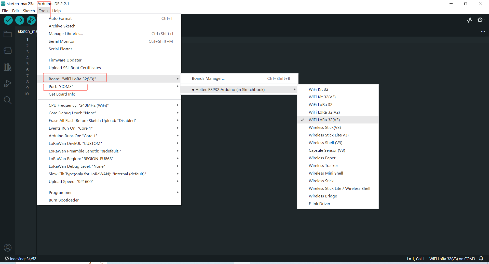
3.In optionare ESP32 chip’s normal option, just keep default. Special notice the ToolsBoardUpload SpeedCPU FrequencyCore Debug LevelPSRAMLoRaWan RegionLoRaWan Debug LevelLoRaWANDEVEUI
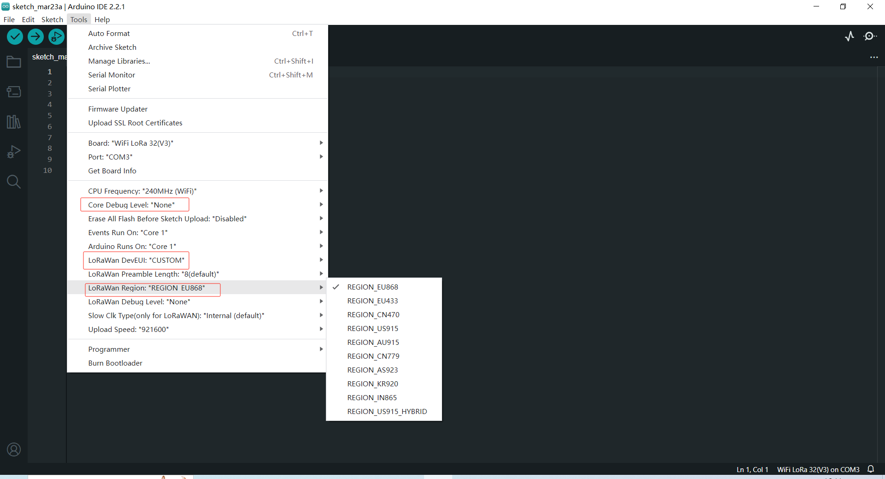
*LoRaWan Region – LoRaWAN protocol region definition, strictly follow LoRaWAN™ 1.0.2 Regional Parameters rB;
*LoRaWan Debug Level – Messages printed via serial.
None – Default;
Freq – Uplink/downlink frequency;
Freq && DIO – Uplink/downlink frequency and DIO interrupt information;
Freq && DIO && PW – Uplink/downlink frequency, DIO interrupt information and low power status.
*LORAWAN_DEVEUI – LoRaWAN Device EUI generate method
CUSTOM – Defined by the user in the DevEui array of the code, 8 bytes;
Generate By ChipID – Generated according to the Chip ID of the chip. Selecting this option will override the setting in the DevEui array in the code.
4.Follow the path shown below to open the LoraWAN demo code.
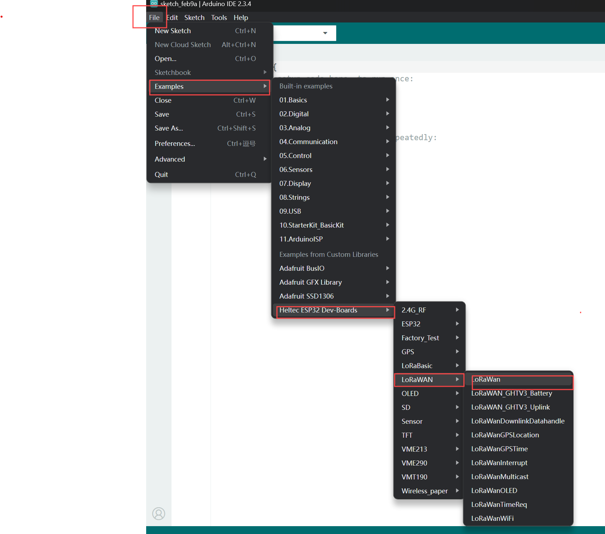
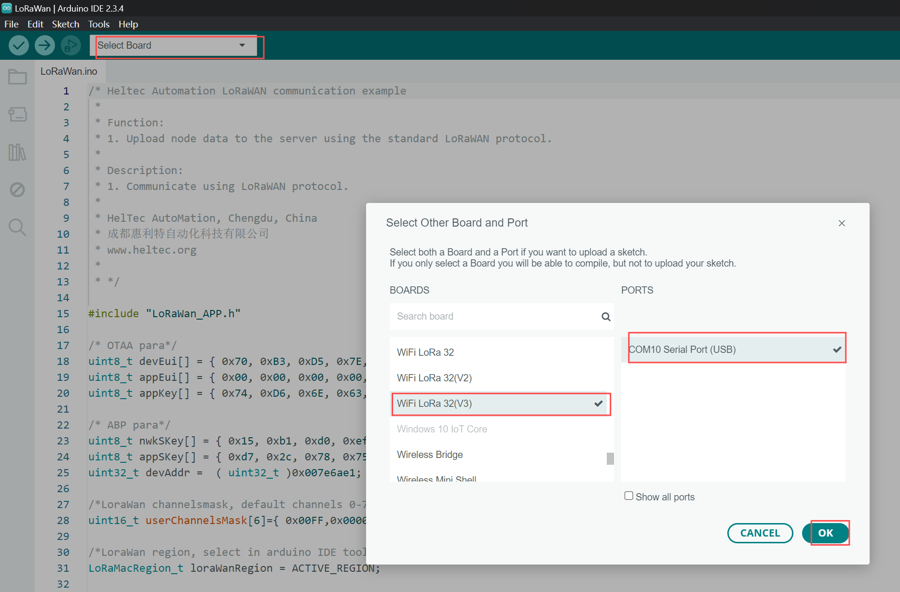
Compile & Upload
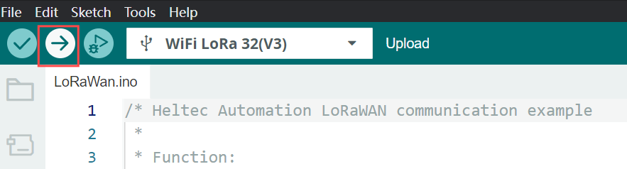
If everything goes well,this interface will be displayed.
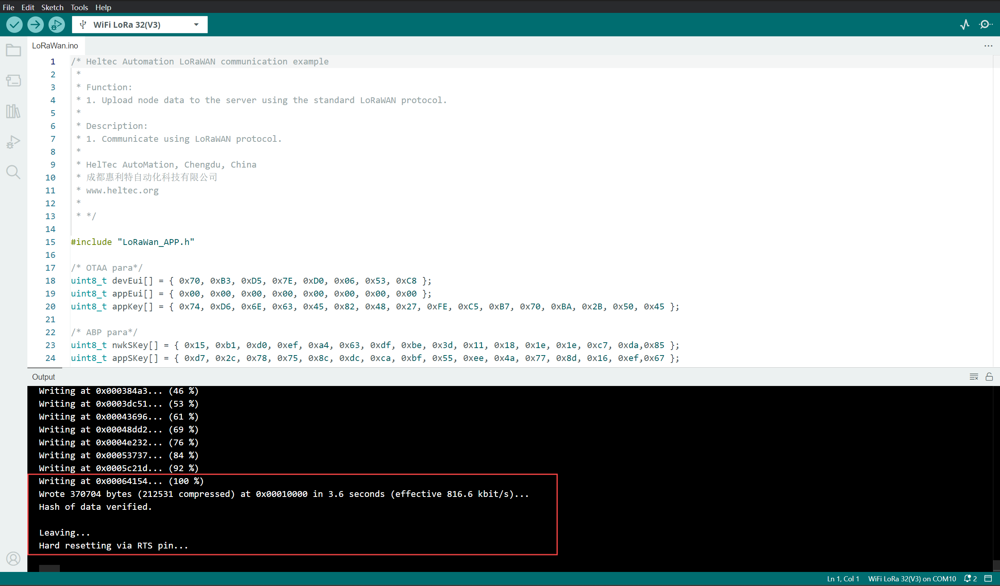
5.Fill in DevEu AppEui AppKey in the following figure  in the example format, which will be used in the website registration.
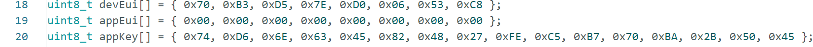
*DevEui – Mote device IEEE EUI (big endian), 8 bytes;
*AppEui – Application IEEE EUI (big endian), 8 bytes;
*AppKey – AES encryption/decryption cipher application key, 16 bytes;

Tip
This example uses the OTAA pattern as an example

Then, users can quickly configure the node according to this document

## Register a LoRa Node in Snapemu

*User log in to [Snapemu](https://platform.snapemu.com/dashboard/) by using their Heltec website account.* 

*User successfully logs in, this interface will be displayed.* 

*Registering the device, click where shown below.*

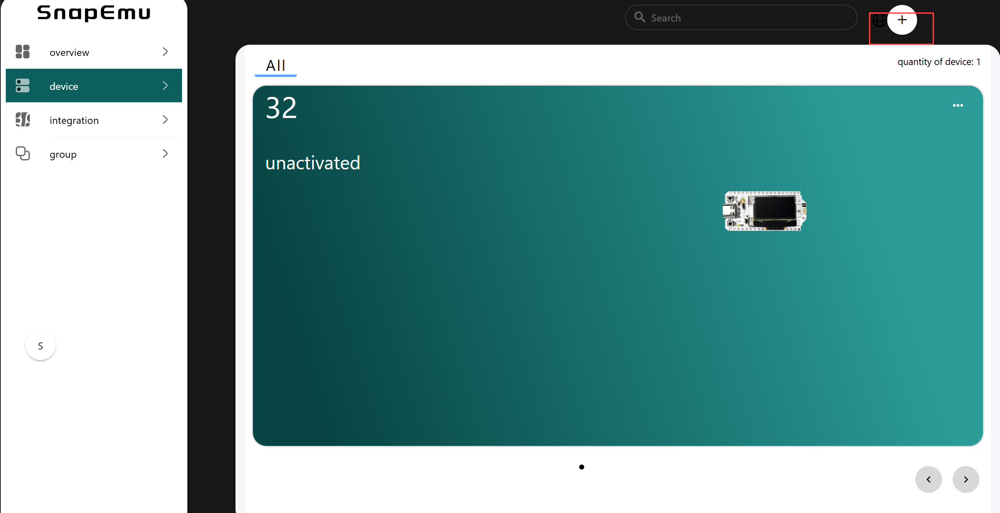
Select device type and fill in configuration information on this interface
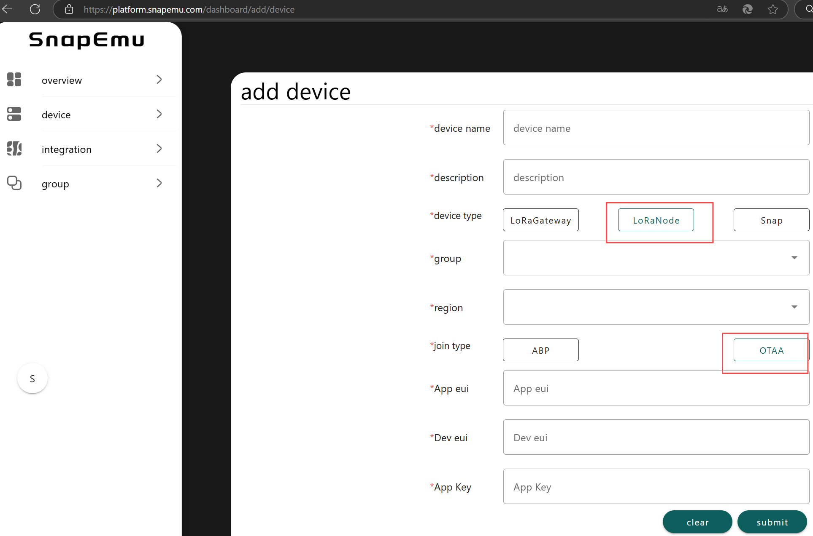
For exampie
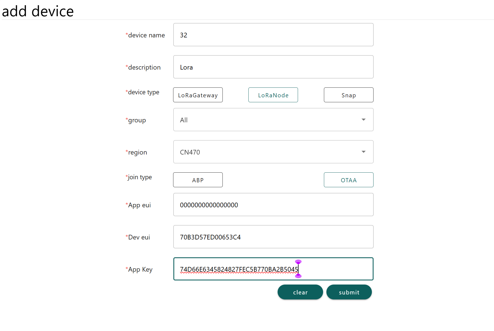
device name and can be filled in freely, and they will become the name and remark of the device displayed on the platform.description
Group denotes the grouping of the device on SnapEmu.
device type This device is a node, so choose “LoRaNode”.
Region Match the frequency band of the node..
DevEUI Node ID,piease follow download tutorial.
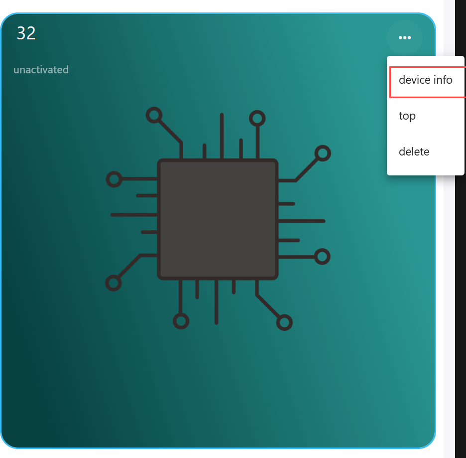

If everything goes well, it will be as shown in two  picturs..
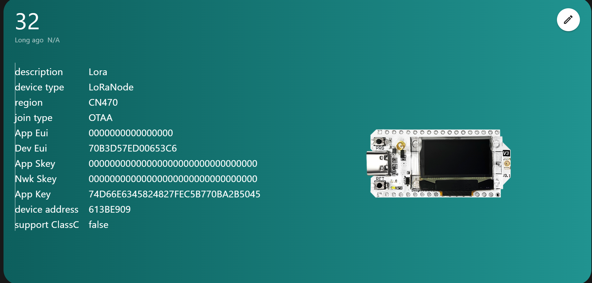
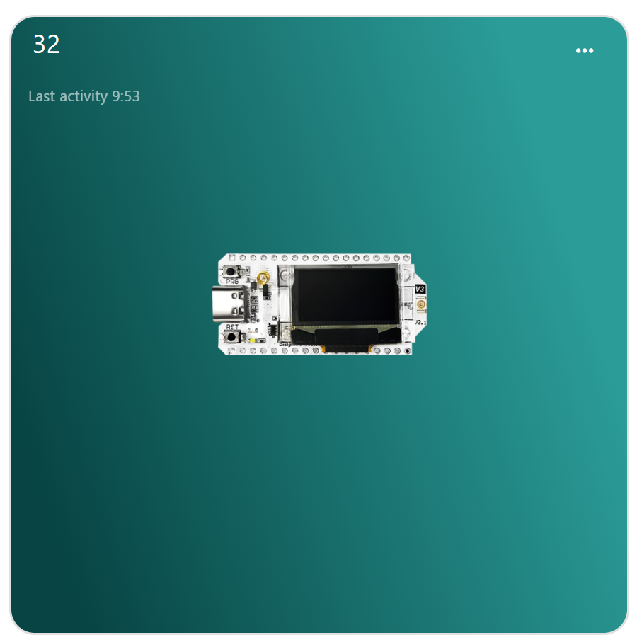

