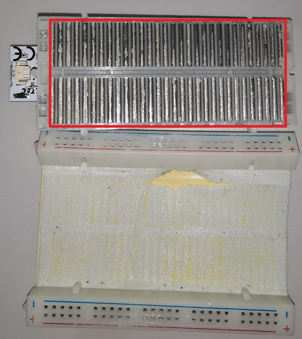

# HeltecTM ESP8266+Arduino Series Frequently Asked Questions
{ht_translation}`[简体中文]:[English]`

This page contains the most frequently questions from user. If this page's detail can't solve your problem, you can also talk in our forum: [community.heltec.cn](http://community.heltec.cn/)

## Orange LED Blink Problem

Annoying orange LED lights are always flashing? It's because the battery management chip MCP73831. with the following control logic:

- Blink -- Power on
- Light -- Charging
- Turn OFF -- Battery filled

Change this capacitor to 220nF to temporarily correct this problem.

We had use the TP4054 to replace MCP73831, the orange LED have new control logic:

- Dim -- Power on
- Light -- Charging
- Turn OFF -- Battery filled

## Note about the device cannot connect to WiFi

We get feedback from some customers: The device can connect to WiFi normally(No peripherals are plugged in) under normal conditions. But once the device is plugged into the breadboard, it **cannot connect** to WiFi normally. We investigated this.

A large number of metal bars built into the breadboard, These metal strips cause a certain degree of **interference** to the WiFi antenna, and eventually cause the device to fail to connect to WiFi normally(please refer the picture).

If you want to use the WiFi function, please try to avoid using the breadboard.

