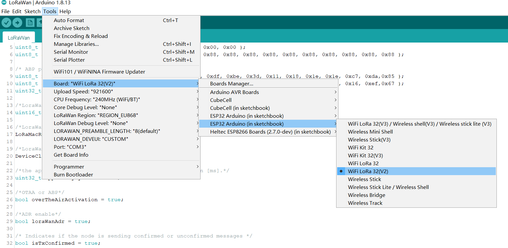
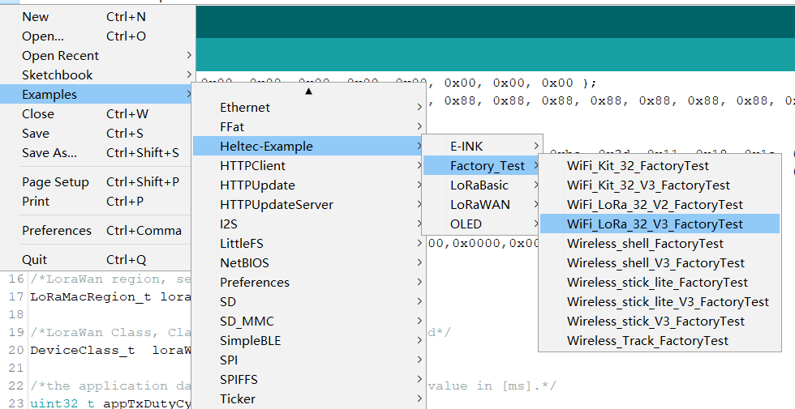
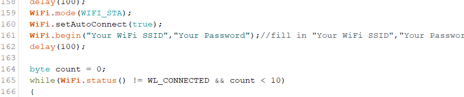

# WiFi LoRa 32 Example Manual

{ht_translation}`[简体中文]:[English]`

## Precondition

The Heltec ESP32 development environment already contains the basic code. For the special codes related to the Heltec ESP32 development board, please refer to: [https://github.com/Heltec-Aaron-Lee/WiFi_Kit_series/tree/master/esp32/libraries/Heltec-Example](https://github.com/Heltec-Aaron-Lee/WiFi_Kit_series/tree/master/esp32/libraries/Heltec-Example) .

+ Confirm whether the `USB driver` , `Git` and `Arduino IDE` has been installed correctly. If not, please refer to this two articles [establish serial connection](https://docs.heltec.org/general/establish_serial_connection.html) and [Install Git and Arduino IDE](https://docs.heltec.org/general/how_to_install_git_and_arduino.html).

+ Confirm that The Heltec ESP32 development environment is installed, please refer to[ESP32+LoRa Quick start](https://docs.heltec.org/en/node/esp32/quick_start.html)

## Example

Open `Arduino IDE` , click `tool`, selmodel, port, RF parameters, etc. As shown below

Follow the path below to find the program and upload it.

Enter your WIFI account and password in the red box below.

This is a test program, can test that your board is functioning correctly.