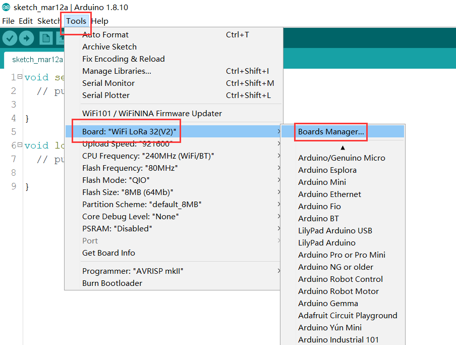
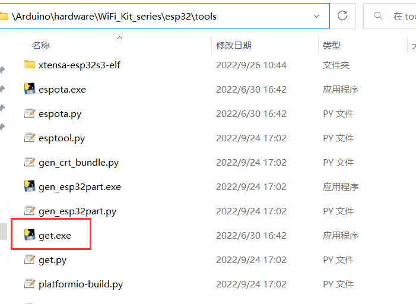
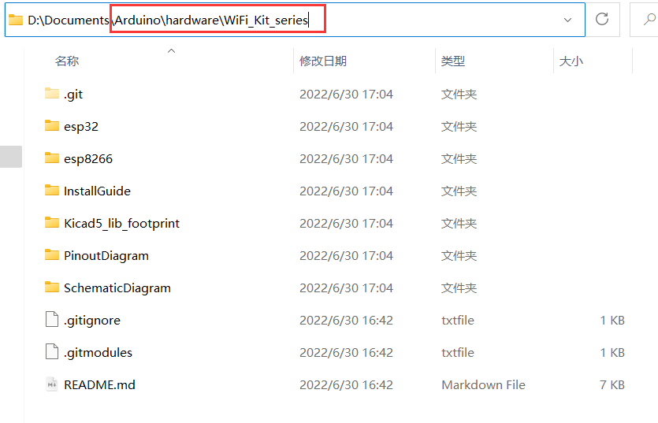

# Heltec ESP32+Arduino Series Quick Start
{ht_translation}`[简体中文]:[English]`

Before all operation, please confirm whether the `USB driver`, `Git` and `Arduino IDE` has been installed correctly. If not, please refer to this two articles [establish serial connection](https://docs.heltec.org/general/establish_serial_connection.html) and [Install Git and Arduino IDE](https://docs.heltec.org/general/how_to_install_git_and_arduino.html).

The Heltec ESP32 development environment already contains the basic code. For the special codes related to the Heltec ESP32 development board, please refer to: [https://github.com/Heltec-Aaron-Lee/WiFi_Kit_series/tree/master/esp32/libraries/Heltec-Example](https://github.com/Heltec-Aaron-Lee/WiFi_Kit_series/tree/master/esp32/libraries/Heltec-Example) .


**There are three methods to install the development framework, choose one of they:**

- [Via Arduino Board Manager](via-arduino-board-manager)
- [Via Git](via-git)

- [Via Local File](via-local-file)

&nbsp;

(via-arduino-board-manager)=
## Via Arduino Board Manager

### Step1. Download Arduino-ESP32 Support

Open Arduino IDE, and click `File`->`Peferences`.


&nbsp;


**Input the last ESP32 package URL:** [https://github.com/Heltec-Aaron-Lee/WiFi_Kit_series/releases/download/0.0.7/package_heltec_esp32_index.json](https://github.com/Heltec-Aaron-Lee/WiFi_Kit_series/releases/download/0.0.7/package_heltec_esp32_index.json)


Click `Tools --> Board --> Boards Manager...`, search `Heltec ESP32` in the new pop-up dialog, then click `install`




The source code of Heltec ESP series (ESP32 & ESP8266) framework available here: [https://github.com/Heltec-Aaron-Lee/WiFi_Kit_series](https://github.com/Heltec-Aaron-Lee/WiFi_Kit_series)

&nbsp;

(via-git)=
## Via Git

After obtaining updates through "**git pull**", please execute "**get. exe**" under the path of "**Arduino\hardware\WiFi_Kit_series\esp32\tools**" to obtain the latest compilation tool.



- For Windows: `https://github.com/Heltec-Aaron-Lee/WiFi_Kit_series/blob/master/InstallGuide/windows.md`
- For MacOS: `https://github.com/Heltec-Aaron-Lee/WiFi_Kit_series/blob/master/InstallGuide/mac.md`
- For Linux
  - Debian/Ubuntu: `https://github.com/Heltec-Aaron-Lee/WiFi_Kit_series/blob/master/InstallGuide/debian_ubuntu.md`
  - Fedora: `https://github.com/Heltec-Aaron-Lee/WiFi_Kit_series/blob/master/InstallGuide/fedora.md`
  - OpenSUSE: `https://github.com/Heltec-Aaron-Lee/WiFi_Kit_series/blob/master/InstallGuide/opensuse.md`

&nbsp;

(via-local-file)=
## Via Local File

Download the development environment. [https://resource.heltec.cn/download/tools/WiFi_Kit_series.zip](https://resource.heltec.cn/download/tools/WiFi_Kit_series.zip)

Open Arduino IDE, and click `File`->`Peferences`.


Go to the folder in the red box.


Create a new "hardware" folder in the Arduino folder. If there is already a "hardware" folder, you don't need to create a new one.


Go to the "hardware" folder and extract "WiFi_Kit_series" into this folder.


Go to the "WiFi_Kit_series" folder, refer to the figure below to confirm whether the path in the red box is correct.



Restart the Arduino IDE to confirm whether the development environment is installed successfully.


&nbsp;

## Example

This section for verifying whether you can program with Arduino or not. Now, The USB cable connects to Heltec ESP32 board, then select your serial port which is connected to Heltec ESP32 board.

Select a demo example, compile and upload.

### Execute an example

Correctly select a board and relevant options in the `Tools` menu:


Then select an example likes `XXXXXX_FactoryTest.ino`


Compile & Upload


### New a Heltec ESP32 program

Open Arduino IDE, create a new  `.ino` file, then copy the below code.

```arduino
#include <heltec.h>

// the setup routine runs once when starts up
void setup(){

  // Initialize the Heltec ESP32 object
  Heltec.begin(true /*DisplayEnable Enable*/, true /*LoRa Disable*/, true /*Serial Enable*/, true /*PABOOST Enable*/, 470E6 /**/);
}

// the loop routine runs over and over again forever
void loop() {

}
```

compile it and upload, the  screen (if this board has a screen) will show and Arduino's serial monitor will print something, it means Heltec ESP32 board is running successfully!
