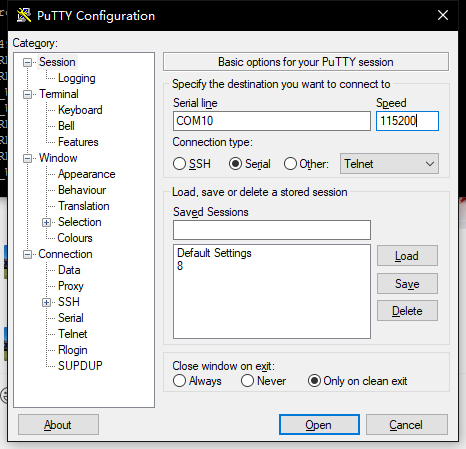
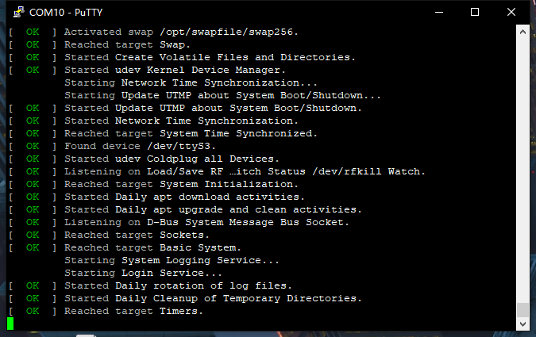

# Getting Started

## Introduction
[Sufficient IoT Hub](https://heltec.org/project/sufficient-iot-hub/) is an easy to use Linux development board with LoRa, Wi-Fi, Ethernet, etc. functions, It can be used as a quick learning tool and can also be used for professional purposes.

 This document trying to make sense how to getting start with Sufficent IoT Hub development kit.

## Setting up your Sufficient IoT Hub

### Preparation

- A computer (Windows or Mac).
- A [Sufficient IoT Hub](https://heltec.org/project/sufficient-iot-hub/).
- A [TF card](https://heltec.org/product/tf-card/) with 2GB or more.
- A TF card reader.
- A [UART-USB bridge](https://heltec.org/product/uart_programmer/) and some wire.
- A Type C USB cable.


### Make a SD Cards for Sufficient IoT Hub
Download [SD Card Formatter](https://www.sdcard.org/downloads/formatter/) and unzip it.  

Insert the SD card into the computer with the card reader, and the computer will detect the SD card. Open the **SD Card Formatter** tool, and select the card to be burned for formatting, as shown in the figure.

  

Download the newest [Sufficient IoT Hub image](https://resource.heltec.cn/download/surficient_iot_hub/t113_img) locally.  

Open the tool [Win32 Disk Imager](https://sourceforge.net/projects/win32diskimager/) just downloaded, and burn it according to the following steps.


``` {Note} SD needs at least 2G capacity, 8G memory card is recommended.

```

Take the SD card you just burned and insert it into the Sufficient IoT Hub. Now, the preparation work is completed, the Sufficient IoT Hub is ready for power up.

### Establish Serial Connection

In order to interact with the Sufficient IoT Hub, a serial port connection may need to be established during initial startup.

The Sufficient IoT Hub uses T1113's serial port 3 (`PB6`, `PB7`) as the debug serial port, the baud rate of the serial port is `115200`. Connect wire between Sufficient IoT Hub and [USB-UART Bridge](https://heltec.org/product/uart_programmer/) as follows sequence:

```
Sufficient IoT Hub PB6(TX) -- USB-UART Bridge RX
Sufficient IoT Hub PB7(RX) -- USB-UART Bridge TX
Sufficient IoT Hub GND     -- USB-UART Bridge GND
```

Connect USB-UART Bridge to your computer and power ON Sufficient IoT Hub.

```{Note} The Heltec USB-UART Bridge use CH340 chip, computer deivers may beed to be installed.

```

#### For Mac 

You can use embed `screen` tools: `screen /dev/cu.usbserial-xxx 115200`.

`cu.usbserial-xxx` is the the seral port number of USB-UART Bridge. If the driver is installed correctly, you can find it via `ls /dev/cu.*`.

#### For Windows

You may need a seral port read tools like [Putty](https://www.chiark.greenend.org.uk/~sgtatham/putty/latest.html).



`COM10` is the the seral port number of USB-UART Bridge. If the driver is installed correctly, you can find it in your computer's device manager.



### Login Sufficient IoT OS
You can see the login screen on top of the serial software.

Username: `root`
Password: `123456`

## Configuration

### Manually connect to Wi-Fi

Switch into the `/etc` directory via `cd /etc` command.

Use the following statement for networking.

```sh
bash wlan-connect.sh yourssid yourpwssd 1
```
### Automatically connect to Wi-Fi

With the following configuration, system will automatically connect to Wi-Fi when it is turned on.

Configure the ssid and password of WiFi.

```sh
wpa_passphrase SSID Password > /etc/wpa_supplicant/user_wifi.conf 
```

Restart the service for networking

```sh
reboot
```

### Ethernet Connection

You need to plug in the Internet cable first.

Execute the following statement to connect to the Internet.

```sh
udhcpc -i eth0
```


### Some functional tests

#### Illuminate the white LED

Execute the following statement in any directory:

```sh
 echo 113 > /sys/class/gpio/export
 echo out > /sys/class/gpio/gpio113/direction
 echo 1 > /sys/class/gpio/gpio113/value
```
#### I2C scanning
If an I2C device is connected, its address will be displayed in the scan.

```sh
echo 1 > /proc/sys/kernel/printk
i2cdetect -y -r 2
#      0  1  2  3  4  5  6  7  8  9  a  b  c  d  e  f
# 00:          -- -- -- -- -- -- -- -- -- -- -- -- -- 
# 10: -- -- -- -- -- -- -- -- -- -- -- -- -- -- -- -- 
# 20: -- -- -- -- -- -- -- -- -- -- -- -- -- -- -- -- 
# 30: -- -- -- -- -- -- -- -- -- -- -- -- -- -- -- -- 
# 40: -- -- -- -- -- -- -- -- -- -- -- -- -- -- -- -- 
# 50: -- -- -- -- -- -- -- -- -- -- -- -- -- -- -- -- 
# 60: 60 -- -- -- -- -- -- -- -- -- -- -- -- -- -- -- 
# 70: -- -- -- -- -- -- -- --
```
