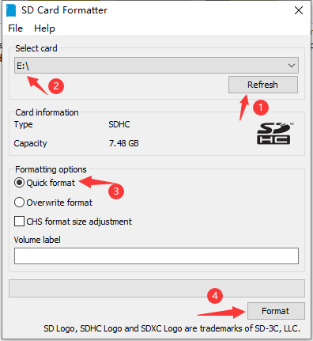
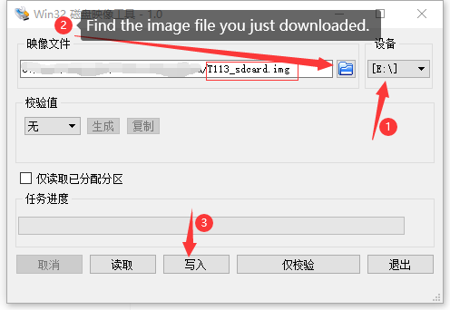

# Getting Started

## Introduction
Here is a T113 development board with LoRaWAN function.


## Setting up your Sufficient IoT Hub


### Make a SD Cards for Sufficient IoT Hub
1. Download [SD_Card_Toolkit.zip]() and unzip it.  

2. Insert the SD card into the computer with the card reader, and the computer will detect the SD card.        

3. Find the **SD Card Formatter** tool, double-click to open it, and select the card to be burned for formatting, as shown in the figure.

         

4. Download [T113_sdcard.img]() locally.  

5. Open the tool **Win32DiskImager** just downloaded, and burn it according to the following steps.



> Note: SD needs at least 2G capacity, 8G memory card is recommended.
### Establish Serial Connection
1. Take the SD card you just burned and insert it into the development board.
2. The development board uses serial port 3 (`PB6`, `PB7`) as the debug output serial port, the baud rate of the serial port is 115200, connect the serial port 3 to the computer above the serial software, you can see the printout.
### Login Sufficient IoT OS
1. You can see the login screen on top of the serial software.
> Username: root
> Password: 123456.

## Configuration

### Manually connect to WiFi

1. Go under the **/etc** directory.
2. Use the following statement for networking.
```sh
bash wlan-connect.sh yourssid  yourpwssd   1
```
### Automatically connect to WiFi

  After the first configuration, it will automatically connect every time it is turned on, and there is no need to configure it again.

1. Configure the ssid and password of WiFi.

```sh
wpa_passphrase  SSID  Password  > /etc/wpa_supplicant/user_wifi.conf 
```

2. Restart the service for networking

```sh
reboot
```

### Ethernet Connection

1. You need to plug in the Internet cable first.
2. Execute the following statement to connect to the Internet.
```sh
udhcpc -i eth0
```
### Illuminate the white light
1. Execute the following statement in any directory:
```sh
 echo 113 > /sys/class/gpio/export
 echo out > /sys/class/gpio/gpio113/direction
 echo 1 > /sys/class/gpio/gpio113/value
```
### I2C scanning
1. If an I2C device is connected, its address will be displayed in the scan.
```sh
echo 1 > /proc/sys/kernel/printk
i2cdetect -y -r 2
#      0  1  2  3  4  5  6  7  8  9  a  b  c  d  e  f
# 00:          -- -- -- -- -- -- -- -- -- -- -- -- -- 
# 10: -- -- -- -- -- -- -- -- -- -- -- -- -- -- -- -- 
# 20: -- -- -- -- -- -- -- -- -- -- -- -- -- -- -- -- 
# 30: -- -- -- -- -- -- -- -- -- -- -- -- -- -- -- -- 
# 40: -- -- -- -- -- -- -- -- -- -- -- -- -- -- -- -- 
# 50: -- -- -- -- -- -- -- -- -- -- -- -- -- -- -- -- 
# 60: 60 -- -- -- -- -- -- -- -- -- -- -- -- -- -- -- 
# 70: -- -- -- -- -- -- -- --
```
