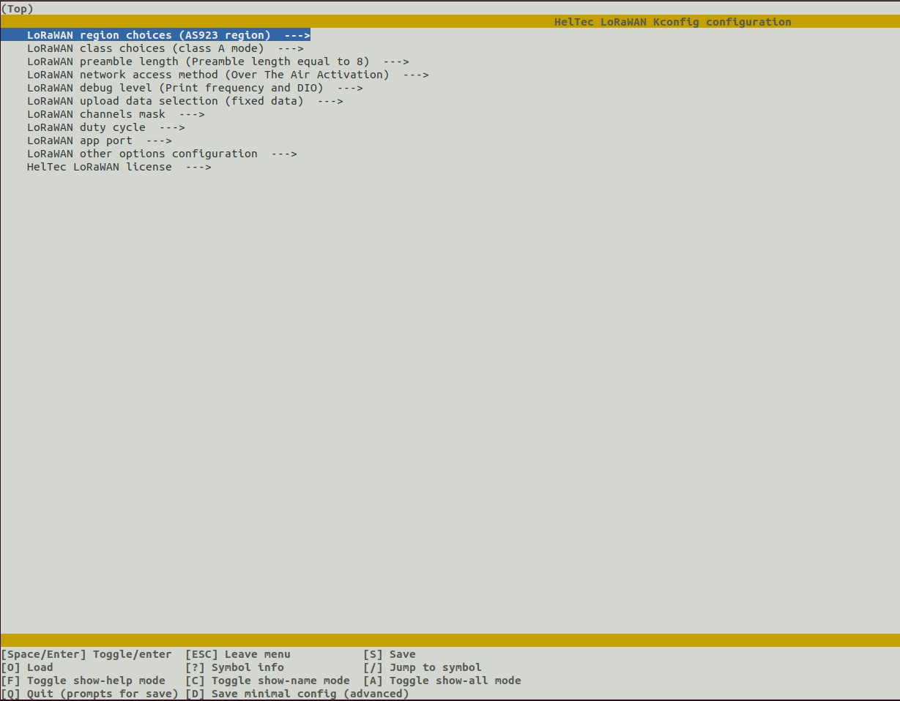
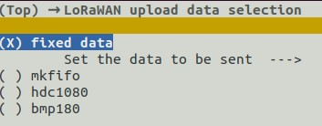
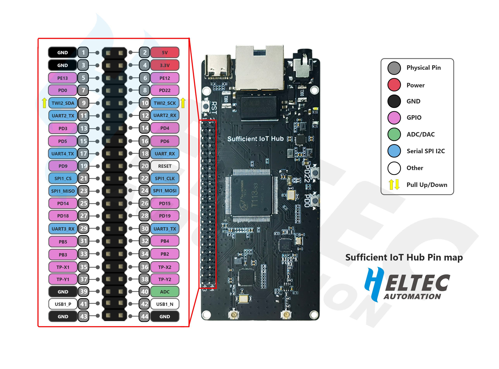
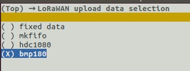

# Sufficient IoT Application


## Introduction


## Use the Sufficient IoT Application

### Configuration
1. Go to the **. /home/lora/linux_lora/build** directory and execute the following statement, which will generate the executable **demo** under the **/home/lora/linux_lora/bin** path, the executable file **demo** will be created.
```
cmake ..
make clean
make 
```
#### LoRaWAN Parameter Configuration
1. In **/home/lora/linux_lora/build** , use the following statement to enter the configuration interface, you can configure the parameters of LoRaWAN.
```
make menuconfig
```
2. The interface is as follows:

3. Here you can configure various parameters of lorawan, such as: front channel code, EUI, appkey, etc.

#### Sensor Configuration
1. In the ***LoRaWAN upload data selection*** option, the data from the optional sensors can be uploaded.
2. The following sensors are currently available：

3. If you choose the I2C sensor, then you need to connect the corresponding sensor to TWI2_SDA and TWI2_SCK.

### Usage Example
1. Configure the frequency band, APP_KEY, APP_EUI, APP_KEY, how to configure see LoRaWAN Parameter Configuration.   
2. Select bmp180 sensor：   
   
3. Go to the **/home/lora/linux_lora/bin** folder and execute **./demo** to upload the sensor data.

## Source Code 

### The development frame work
#### The basic structure of the project
```
|-- bin                #Executable files
|-- build              #Build Files
|-- functional_module  #Function Modules
|   |-- bmp180
|   |-- data_conversion
|   |-- fifo
|   |-- hdc1080
|   `-- lora
|-- hardware_driver   #Drive Module
|   |-- gpio
|   |-- i2c
|   `-- spi
|-- lib              #Intermediate libraries generated during the build process
`-- project          
    |-- config       #Configuration-related files
    `-- main         #Main Functions
```

---------------------------------------
####  Currently supported bands
 >- [x] AS923 region
 >- [x] AU915 region
 >- [x] CN470 region
 >- [x] CN779 region
 >- [x] EU433 region
 >- [x] EU868 region
 >- [x] KR920 region
 >- [x] IN865 region
 >- [x] US915 region
 >- [x] US915_HYBRID region
 >- [ ] AU915 SB2 region
 >- [x] AS923 AS1 region
 >- [x] AS923 AS2 region

---------------------------------------
#### Add your own functional modules
**Take bmp180 as an example**
1. Add a new folder with the file name bmp180 to the functional_module folder.
2. Add the following file to the bmp180 folder    
> bmp180.c     
> bmp180.h  
> CMakeLists.txt   
> README.md
3. Write the source and header file contents.
4. Write CMakeList.txt

```cmake
#Add source files
aux_source_directory(. BMP180)
#Add the header files to be included
include_directories(${PROJECT_SOURCE_DIR}/hardware_driver/i2c)
#Add the path to the linked library
link_directories(${PROJECT_SOURCE_DIR}/lib)
#Adding a library of mathematical calculations
LINK_LIBRARIES(-lm)
#Link generation static library
add_library(bmp180 ${BMP180} )
#Link the i2c library in
target_link_libraries(bmp180 i2c )
#Set the current folder as the search directory for header files that depend on the model1 library
target_include_directories(bmp180 PUBLIC ${CMAKE_CURRENT_SOURCE_DIR})
```
5. Write the `README.md` documentation.
6. In functional_module/CMakeLists.txt add
```cmake
#Add subdirectories and build subdirectories
add_subdirectory(bmp180)
```
7. Add bmp180 to the link library option in project/main/CMakeLists.txt
```cmake
target_link_libraries(${PROJECT_NAME} fifo config lora hdc1080 bmp180 data_conversion)
```
8. You can call the bmp180 function by adding your own bmp180 header file inside main.c.

---------------------------------------
#### Add graphical configuration interface options
1. Find the project's Kconfig file, and in the LORAWAN_APP_DATA menu bar, add
```kconfig
config BMP180_DATA
    bool "bmp180"
```
2. In the LORAWAN_DATA_SELECTION menu bar of project/config/config.ini, add
```ini
;BMP180_DATA=3
```
- The name of this option needs to be the same as the option in Kconfig, which is **BMP180_DATA** 。
-  The value of this option needs to be matched with the option to prepare the data in main.c. The values are equal to **3**
```c。
typedef enum 
{
    fixed_data =0,
    mkfifo_data,
    hdc1080_data,
    bmp180_data
}data_selection_num;
```
3.  In project/config/kconfig_lib/configini_to_kconfig.sh  #Configure LoRaWAN upload data selection add
```sh
elif [ $DATA_SELECTION -eq 3 ];then
    echo "CONFIG_BMP180_DATA=y" >> $K_CONFIGFILE
```
- The above sentence indicates that the C configuration file is synchronized with the GUI configuration file.

4. Add read config.ini file to project/main/main.c.
```c
    data_selection = iniparser_getint(ini,"LORAWAN_DATA_SELECTION:data_selection",-1);
```
5. Use make menuconfig to configure the bmp180 option and save it, then read out data_selection = 3 in main.c.

6. Once added, you can go through the options in man.c to implement the relevant functions.
