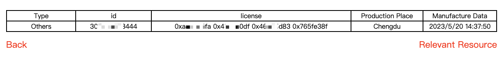
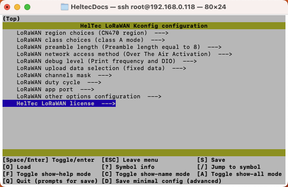
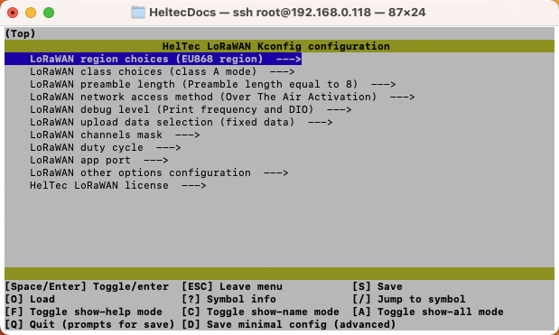
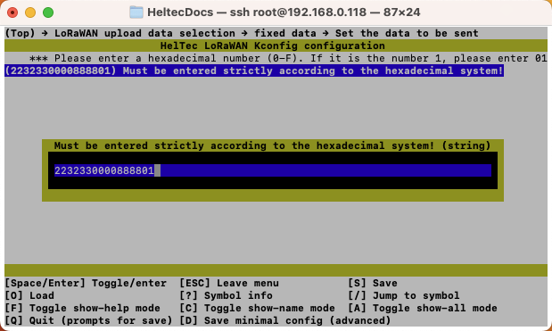
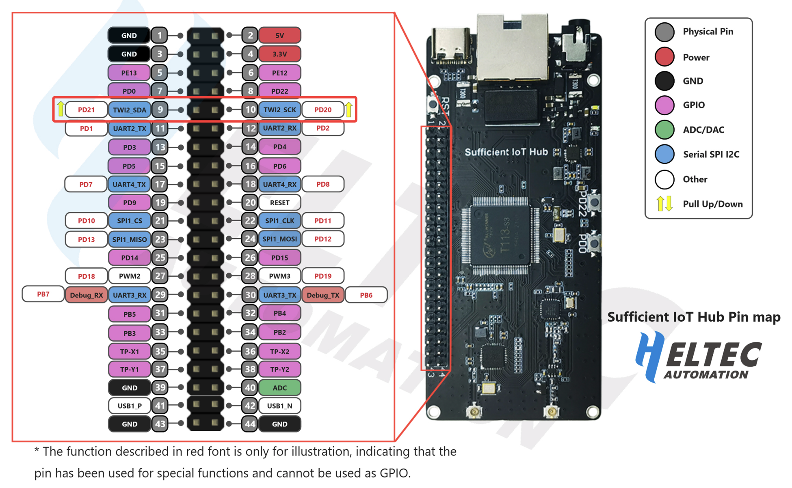

# Sufficient IoT Application

## Introduction

The [Sufficient IoT Application](https://github.com/HelTecAutomation/Sufficient-IoT-Application) is a specially designed application for LoRa/LoRaWAN, it will greatly facilitate users to learn and use LoRa technology.


## Use the Sufficient IoT Application

### Configuration
Go to the `/home/lora/linux_lora/build` directory and execute the following statement, which will generate the executable demo under the `/home/lora/linux_lora/bin` path, the executable file **demo** will be created.

```
cmake ..
make clean
make 
```
### License Validation

When running for the first time, or change a TF card running system, you may need a license to activate the device.

Enter the folder of LoRaWAN executable files.

```sh
cd /home/lora/linux_lora/bin/
```

Execution `./demo`

```shell
Certificate verification failed
Please provide a correct license! For more information:
http://www.heltec.cn/search/
ChipID=303030303337
```

Open the [address](https://resource.heltec.cn/search) connection to obtain the license, enter the **ChipID** of the product obtained in the previous step, and you can obtain the required license.



Use the shell command `make menuconfig` to open the configuration interface, find the license input option, and enter the aforementioned license. Save and exit.



### LoRaWAN Parameter Configuration

When the Sufficient IoT Application is correctly compiled and lincese actived, use the following statement to enter the configuration interface, you can configure the parameters of LoRaWAN.

```
cd /home/lora/linux_lora/build
make menuconfig
```
Then you will see a menu like this:


In the configure menu, there are following options can be set:

- **LORAWAN_REGION** -- LoRaWAN protocol region definition, strictly follow [LoRaWAN™ 1.0.2 Regional Parameters rB](https://resource.heltec.cn/download/LoRaWANRegionalParametersv1.0.2_final_1944_1.pdf).
- **LORAWAN_CLASS** -- Now with `Class A` and `Class C` supported.
- **LoRaWAN preamble length** -- LoRaWAN preamble length can be set to `8` or `16`.
- **LoRaWAN network access method** -- `OTAA` or `ABP`, parameters such as EUI and AppKey in their sub options.
- **LoRaWAN debug level** -- Print uplink/downlink frequency, DIO, error messages.
- **LoRaWAN upload data** -- Custom data or predefined sensor data be sent in LoRaWAN format.
- **LoRaWAN channels mask** -- The maximum number of channels used in LoRaWAN communication is **8**, and the channels must be continuous, such as 0~7,  8~15. For the definition of LoRaWAN channels, please refer to [LoRaWAN™ 1.0.2 Regional Parameters rB](https://resource.heltec.cn/download/LoRaWANRegionalParametersv1.0.2_final_1944_1.pdf).
- **LoRaWAN duty cycle** -- The time interval between each two transmit data.
- **LoRaWAN app port** -- Default app port.
- **LoRaWAN other options configuration** -- Enable/disable `ADR` and `Confirmed data` functions.

#### Send custom test data via LoRaWAN

In the `LoRaWAN upload data selection` option, `fixed data` can set some custom data to be sent in LoRaWAN format as test.



#### Or send predefined sensor data via LoRaWAN

```{Note} This part must work with an external sensor.

```

In the `LoRaWAN upload data selection` option, the data from the optional sensors can be uploaded.

The following sensors are currently available：

- HDC1080 temperature and humidity sensor
- BMP180 air pressure and temperature sensors

At present, all predefined sensor are I2C sensor, then you need to connect the corresponding sensor to `TWI2_SDA` and `TWI2_SCK`.

[Sufficient IoT Hub Pinmap](https://resource.heltec.cn/download/surficient_iot_hub/Sufficient_IoT_Hub_Pinmap.pdf)

### Running the Application

After configuration is completed, use the following commands to run the Sufficient Iot Application:

```shell
cd /home/lora/linux_lora/bin/
./demo
```

```{Tip} Configuration parameters must be in path "/home/lora/linux_lora/build", and the running the Sufficient Iot Application must be in path "/home/lora/linux_lora/bin/".

```

## Source Code

In the downloadable firmware, there already have a Sufficient IoT Application package in the `/home/lora/linux_LoRa` path. But it may not be the latest version, you can obtain the latest version of the code in GitHub:

https://github.com/HelTecAutomation/Sufficient-IoT-Application

### The development frame work

#### The basic structure of the project
```
|-- bin                #Executable files
|-- build              #Build Files
|-- functional_module  #Function Modules
|   |-- bmp180
|   |-- data_conversion
|   |-- fifo
|   |-- hdc1080
|   `-- lora
|-- hardware_driver   #Drive Module
|   |-- gpio
|   |-- i2c
|   `-- spi
|-- lib              #Intermediate libraries generated during the build process
`-- project          
    |-- config       #Configuration-related files
    `-- main         #Main Functions
```

---------------------------------------
####  Currently supported LoRaWAN bands
 >- [x] AS923 region
 >- [x] AU915 region
 >- [x] CN470 region
 >- [x] CN779 region
 >- [x] EU433 region
 >- [x] EU868 region
 >- [x] KR920 region
 >- [x] IN865 region
 >- [x] US915 region
 >- [x] US915_HYBRID region
 >- [ ] AU915 SB2 region
 >- [x] AS923 AS1 region
 >- [x] AS923 AS2 region

---------------------------------------
### Add your own functional modules
**Take bmp180 as an example**

1. Add a new folder with the file name bmp180 to the functional_module folder.
2. Add the following file to the bmp180 folder    
> bmp180.c     
> bmp180.h  
> CMakeLists.txt   
> README.md
3. Write the source and header file contents.
4. Write CMakeList.txt

```cmake
#Add source files
aux_source_directory(. BMP180)
#Add the header files to be included
include_directories(${PROJECT_SOURCE_DIR}/hardware_driver/i2c)
#Add the path to the linked library
link_directories(${PROJECT_SOURCE_DIR}/lib)
#Adding a library of mathematical calculations
LINK_LIBRARIES(-lm)
#Link generation static library
add_library(bmp180 ${BMP180} )
#Link the i2c library in
target_link_libraries(bmp180 i2c )
#Set the current folder as the search directory for header files that depend on the model1 library
target_include_directories(bmp180 PUBLIC ${CMAKE_CURRENT_SOURCE_DIR})
```
5. Write the `README.md` documentation.
6. In functional_module/CMakeLists.txt add
```cmake
#Add subdirectories and build subdirectories
add_subdirectory(bmp180)
```
7. Add bmp180 to the link library option in project/main/CMakeLists.txt
```cmake
target_link_libraries(${PROJECT_NAME} fifo config lora hdc1080 bmp180 data_conversion)
```
8. You can call the bmp180 function by adding your own bmp180 header file inside main.c.

---------------------------------------
#### Add graphical configuration interface options
Find the project's Kconfig file, and in the LORAWAN_APP_DATA menu bar, add

```kconfig
config BMP180_DATA
    bool "bmp180"
```
In the LORAWAN_DATA_SELECTION menu bar of project/config/config.ini, add

```ini
;BMP180_DATA=3
```
- The name of this option needs to be the same as the option in Kconfig, which is **BMP180_DATA** 。
-  The value of this option needs to be matched with the option to prepare the data in main.c. The values are equal to **3**
```c。
typedef enum 
{
    fixed_data =0,
    mkfifo_data,
    hdc1080_data,
    bmp180_data
}data_selection_num;
```
In project/config/kconfig_lib/configini_to_kconfig.sh  #Configure LoRaWAN upload data selection add

```sh
elif [ $DATA_SELECTION -eq 3 ];then
    echo "CONFIG_BMP180_DATA=y" >> $K_CONFIGFILE
```
- The above sentence indicates that the C configuration file is synchronized with the GUI configuration file.

Add read config.ini file to project/main/main.c.

```c
    data_selection = iniparser_getint(ini,"LORAWAN_DATA_SELECTION:data_selection",-1);
```
Use make menuconfig to configure the bmp180 option and save it, then read out data_selection = 3 in main.c.

Once added, you can go through the options in man.c to implement the relevant functions.