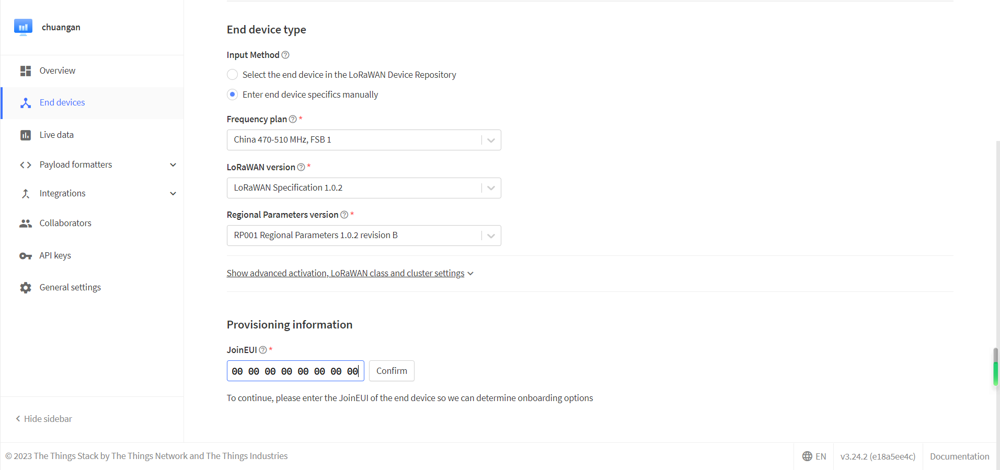
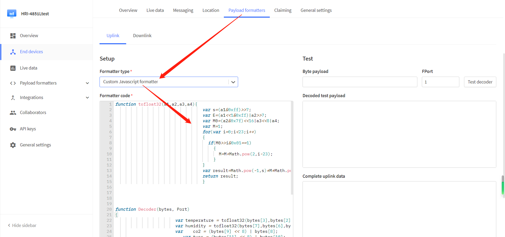
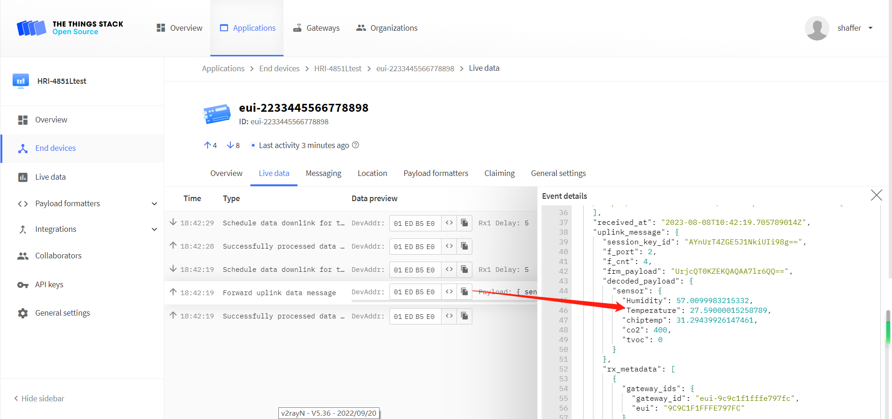

# Connect to LoRaWAN Server
Currently HRU-3601 uses LoRaWAN a communication protocol, and this topic aims to describe how HRU-3601 can be connected to LoRaWAN Server.
## Seting up LoRaWAN Gateway
Before that, make sure there is a LoRa Gateway active in your [TTN](https://console.thethingsnetwork.org/)/[TTS](https://lora.heltec.org/console) account.

## Confirm configuration information
Refer to [Quick Start](https://docs.heltec.org/en/ready2use/hru-3601/quick_start.html) to go to the configuration page of **HRU-3601**.


The details of the introduction of each parameter are as follows:
+ `network access mode` choose `OTAA`.
+ `devEui` Your node ID, you can fill in your own, in this case we'll write "2233445566778898".
+ `appEui` Feel free to fill it out. Here we'll write "0000000000000000".
+ `appKey` Feel free to fill it out. Here we'll write "88888888888888888888888888888888".
+ `appIxDutyCycle unit:S` the transmission interval of the LoRa signal, which is set to 120 seconds at the minimum, in order not to affect the temperature of the chip itself, in order to obtain more accurate data.
+ `appPort` Feel free to fill it out. Here we'll write "1".
+ `channel start` Align with the gateway.
+ `channel end` Align with the gateway.
+ `loraWanClass` The communication mode of LoRaWAN, here we choose `CLASS A`.
+ `isTxConfirmed` Whether to wait for server confirmation after sending the message, choose `true`.
+ `adr` The transmit power is adaptive, choose `true`.

``` {Tip} If you are not familiar with LoRaWAN, try to choose the default and set a simple EUI and KEY.

```

## Registering node on server

Register a new device in TTN or TTS "Applications",choose`Enter end device specifics manually`.


Select the frequency plan, and fill in the corresponding AppEUI, DevEUi, AppKey, and register the device.




``` {Tip} The **joinEui** here is the **AppEui** on the configuration page, which is "0000000000000000".

```

After registration is complete, if all is well, you will see the device active.


Click `payload formatters`, select `Custom Javascript formatter`, and enter decoding at the position in the figure. Download the decoder here: [HRU-3601 Related Resources](https://resource.heltec.cn/download/HRU3601).



Click `Save change` and move the mouse to the uplink data output to view the temperature and humidity, eCO2 and TVOC uploaded by HRU-3601.



## Important Hints

Please double check the following two things:

1. The LoRaWAN parameters is the same as server!
2. The listening frequency of your LoRa Gateway is the same as ESP32 LoRa node's sending frequency. We strictly follow [LoRaWAN™ 1.0.2 Regional Parameters rB](https://resource.heltec.cn/download/LoRaWANRegionalParametersv1.0.2_final_1944_1.pdf);

