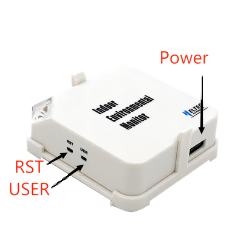
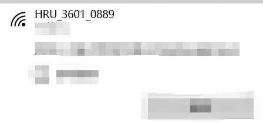
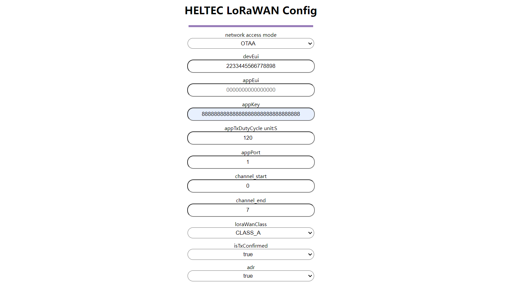

# Quick Start

{ht_translation}`[简体中文]:[English]`

HRU-3601 employs LoRaWAN communication, and utilizes Web for easy configuration via WiFi. The parameters that can monitor include: TVOC, eCO2, temperature and humidity. It has powerful function, light appearance, easy installation, suitable for home life, industrial production and other indoor occasions.

## Power on

Connect the USB cable to the power port through the adapter.

Long press the `USER` button for 3 seconds, and the device indicator turns blue. At this time, find the WIFi named **HRU-3601-XXXX** through PC or mobile phone and connect to it.

Enter**192.168.4.1**in your browser to navigate to the configuration page of HRU-3601.

In the configuration page, you can modify the relevant parameters of LoRa. The current transmission cycle is at least 120 seconds.
Once the configuration is complete, click Submit. The blue light goes off, press the `RST` button to start sending.

## Common problems and solutions
+ The browser will not connect

    If you type "192.168.4.1", the browser will not connect,please check if you are connected to the WiFi of the device you are configuring.
+ Device not working

    After each configuration, you must press the `RST` to put the device into work mode.
+ The temperature data is not accurate.

    Some operations may cause CPU temperature to rise, please disconnect the power and allow HRU-3601 to cool down for a period of time.
