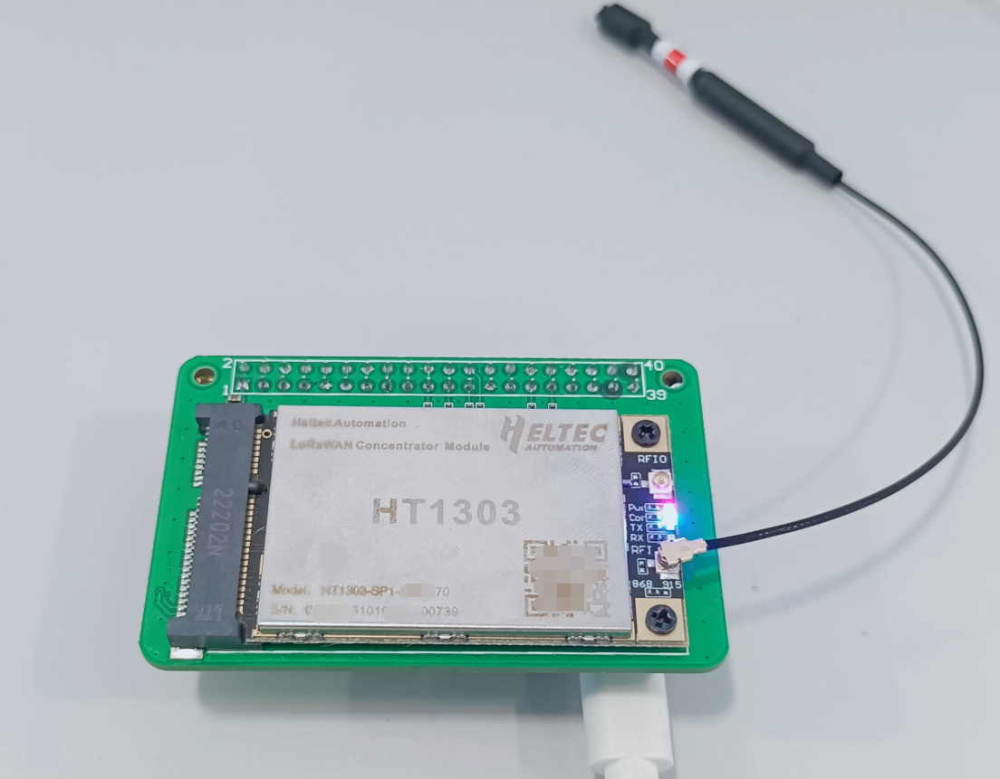

# **HT-1303 LoRa Concentrator Module Linux Drive**

This document is trying to make sense how to drive a  HT-1303 (SX1303 + SX1250) module on Linux. before all the operation you may need basic knowledge of Linux operation system. [this document](https://docs.heltec.org/general/how_to_config_raspberry_pi.html) is a basic manual of Raspberry Pi.

## Preparation

- A [Raspberry Pi]([Raspberry Pi 4 Model B – Heltec Automation](https://heltec.org/project/raspberry-pi4-model-b/)) (ROI3, RPI4, Zero, etc. are also fine)
- [HT-1303 LoRa Concentrator Module]([HT1303 LoRaWAN Concentrator Module – Heltec Automation](https://heltec.org/project/ht1303/))
- [Raspberry Pi Interposer Board](https://heltec.org/project/ht1303-converter/)

## 1.Hardware Connections

Plug the HT-1303 module into the adapter module, and  connect the adapter module to the Raspberry Pi, finally connect it to the Raspberry Pi's power supply, As shown in the figure.



## 2. Configure the HT-1303 Linux (SPI) Drive

On the Linux system `~` path, by running the following commands to install HT-1303 drive.

```shell
git clone https://github.com/HelTecAutomation/Lora-net-sx1302 lora
cd lora/packet_forwarder
cp -f global_conf_EU868.json global_conf.json  //use the corresponding region configure file
nano global_conf.json //edit the config file
```

Now you will see the following content at the end of `global_conf.json` file, modify parameters according to the actual situation.

```shell
"gateway_conf": {
        "gateway_ID": "b827ebFFFEf49e97",  //LoRa gateway ID
        /* change with default server address/ports */
        "server_address": "lora.heltec.org", //LoRa NS address
        "serv_port_up": 1700,    //Packet uplink port, 1700 by default
        "serv_port_down": 1700,  //Packet downlink port, 1700 by default
        /* adjust the following parameters for your network */
        "keepalive_interval": 10,
        "stat_interval": 30,
        "push_timeout_ms": 100,
        /* forward only valid packets */
        "forward_crc_valid": true,
        "forward_crc_error": false,
        "forward_crc_disabled": false
    }
```

``` {Tips}
The gateway_ID will be generated during the lrgateway.service install process, after the installation of the entire service is completed, open globalis_comf.json again and you will get the correct gateway ID.
```

Now the configure process is done, running `make clean all` to build the source code to output executable file.

```shell
cd packet_forwarder
./lora_pkt_fwd
```

If all process goes well, you will see information output like the following figure shown. Now the HT-1303 is success running.


## 3. Create a System Service

The above steps are just to get the program running. We can create a system service to set it boot up enable.

```shell
sudo cp lrgateway.service /etc/system/lrgateway.service  //create a system service named lrgateway
systemctl start lrgateway    //Enable lrgateway service
systemctl enable lrgateway   //Enable auto start for each system boot up
```

Now the `lrgateway.service` is successfully create, by running the `systemctl status lrgateway` to check status.


Now the components can working like a LoRa gateway and able to register on a LoRa NS.

