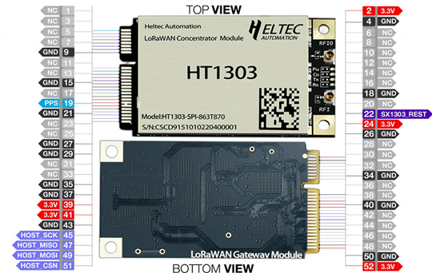
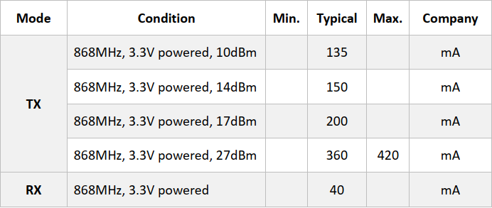

# HT-1303 LoRaWAN concentrator module Quick Start

{ht_translation}`[简体中文]:[English]`

## Summary

The HT1303 LoRaWAN concentrator is a mini-PCIe-based LPWAN concentrator module based on the Semtech SX1303, which enables easy integration into existing routers or other network equipment equipped with LPWAN Gateway capabilities.

## Technical Characteristics

### Pin Definition

### Electrical Characteristics

&nbsp;

## Reference Design

For reference design circuit, please refer to [https://resource.heltec.cn/download/HT-1303/HT-1303_Reference_Design.pdf](For reference design circuit, please refer to https://resource.heltec.cn/download/HT-1303/HT-1303_Reference_Design.pdf).

For reference code, please refer to [https://github.com/Lora-net/sx1302_hal](https://github.com/Lora-net/sx1302_hal).

