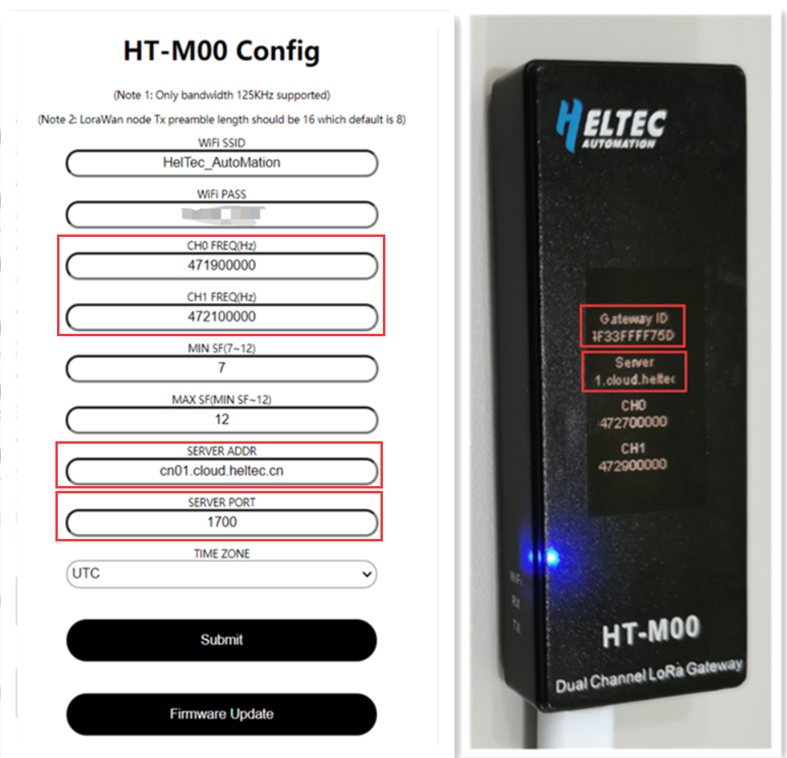
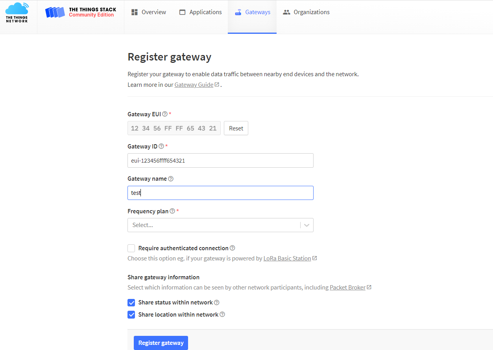
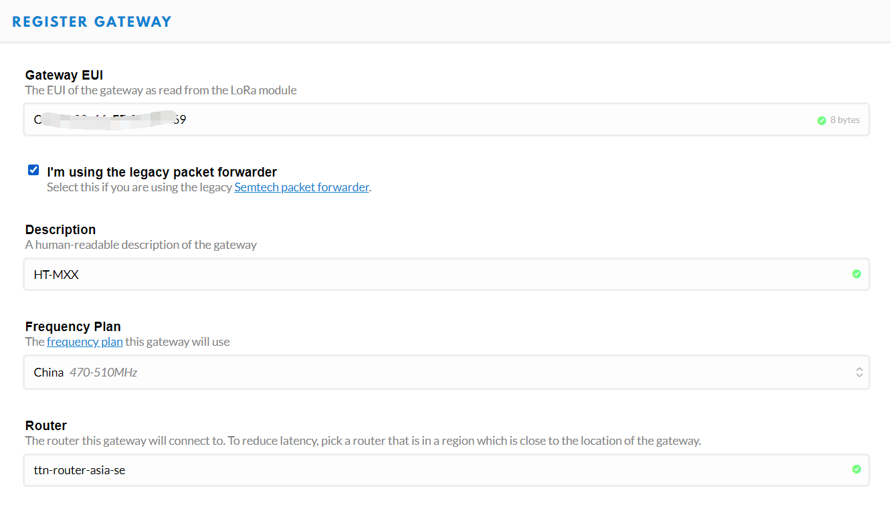
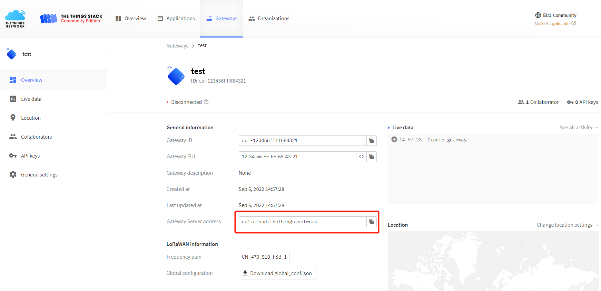
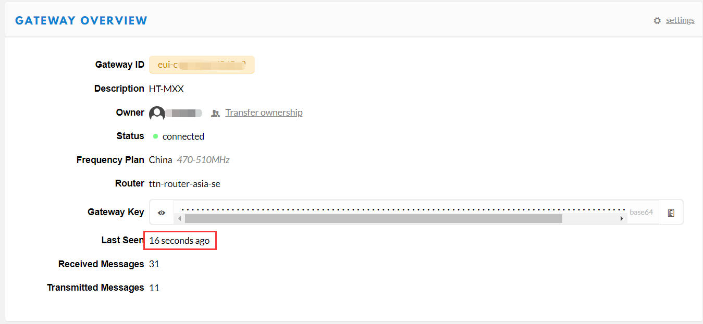

# Connect HT-M00 to LoRa Server
{ht_translation}`[简体中文]:[English]`

## Summary

This article aims to describe how to connect [HT-M00 Gateway](https://heltec.org/project/ht-m00/) to a LoRa server, ssuch as [TTN](https://www.thethingsnetwork.org/)/[TTS](https://lora.heltec.org/), [ChirpStack](https://www.chirpstack.io/), which facilitates secondary development and rapid deployment of LoRa devices.

Before all operation, make sure the HT-M00 is runing well . If not, please refer to this [HT-M00 Quick Start](https://docs.heltec.org/en/gateway/ht-m00/quick_start.html) document.

&nbsp;

## Connect to TTN/TTS

### Register a LoRa gateway in TTN

Select a cluster in the [TTN console](https://console.thethingsnetwork.org/) page to start adding devices and gateways. Or start adding devices and gateways in [TTS console](https://lora.heltec.org/console).

Create a new gateway.

Fill in the HT-M00 information as shown below and complete the addition.

- **Gateway EUI** -- The unique ID of HT-M00 gateway, view from the display screen of the HT-M00 or view through the serial port (the gateway ID will be printed through the serial port when the HT-M00 starts).
- **Gateway ID** -- Generated by default.
- **Gateway name** -- Filled in by the user, can be filled in arbitrarily.
- **Frequency Plan** -- Matches the LoRa band configuration in HT-M00.

### Configure the Gateway

In the HT-M00 gateway, the server address, port, frequency band, and channel need to be configured. The server address, port, frequency band and channel are configured in the "HT-M00 Config" interface, please refer to the [HT-M00 Quick Start](https://docs.heltec.org/en/gateway/ht-m00/quick_start.html) document.

Check the server address in the gateway details.

View gateway status, it is runing:

&nbsp;

## Connect to ChirpStack Server

[ChirpStack](https://www.chirpstack.io/) is the most popular LoRa server open source project, widely used in many fields, and also the best choise for a private LoRa server.

- ChirpStack Installation guide: [https://www.chirpstack.io/overview/](https://www.chirpstack.io/overview/)
- ChirpStack support forum: [https://forum.chirpstack.io/](https://forum.chirpstack.io/)

### ChirpStack Gateway Bridge

**One thing need attention!** the ChirpStack need a special service named `Gateway Bridge`, which converts LoRa® Packet Forwarder protocols into a ChirpStack Network Server common data-format(JSON and Protobuf).

the `Gateway Bridge` service can running on the Raspberry Pi or the ChirpStack server.

Install ChirpStack Gateway Bridge: [https://www.chirpstack.io/gateway-bridge/install/debian/](https://www.chirpstack.io/gateway-bridge/install/debian/)

### Register LoRa Gateway in ChirpStack

Fill in the HT-M00 information as shown below and complete the addition.

- **Gateway ID** -- The unique ID of HT-M00 gateway, view from the display screen of the HT-M00 or view through the serial port (the gateway ID will be printed through the serial port when the HT-M00 starts).

### Connect to ChirpStack Server

In the HT-M00 gateway, the server address, port, frequency band, and channel need to be configured. The server address, port, frequency band and channel are configured in the "HT-M00 Config" interface, please refer to the [HT-M00 Quick Start](https://docs.heltec.org/en/gateway/ht-m00/quick_start.html) document.

View gateway status, it is runing:

