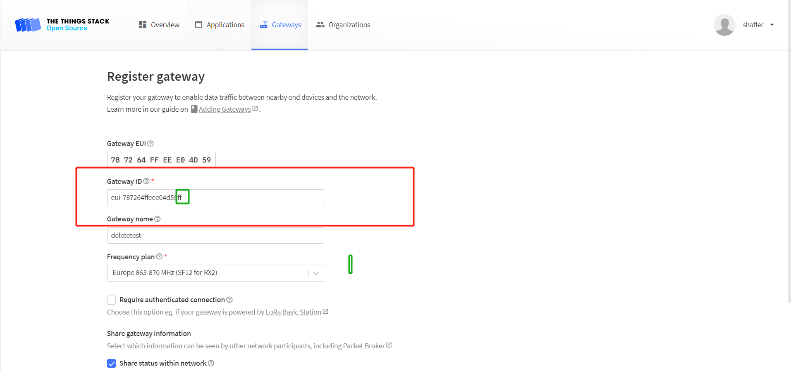

# HT-M00S Frequently Asked Questions
{ht_translation}`[简体中文]:[English]`

This page contains the most frequently questions from user. If this page's detail can't solve your problem, you can also talk in our forum: [community.heltec.cn](http://community.heltec.cn/)

## Cannot re-register on TTS
Due to the architecture of TTS itself, you cannot re-register the ID when you delete your gateway.

Register the gateway normally. Do not submit the information after filling in the information. At this time, the server automatically generates an ID, as shown in the red box in the following figure. Add a suffix to the ID, such as "ff", and the ID will be registered.

