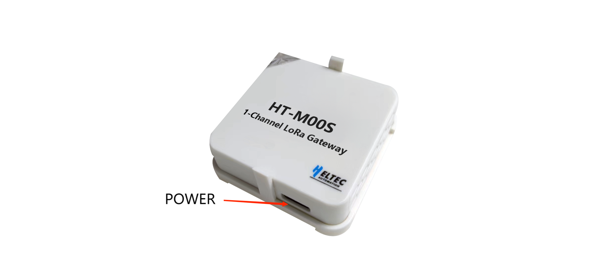
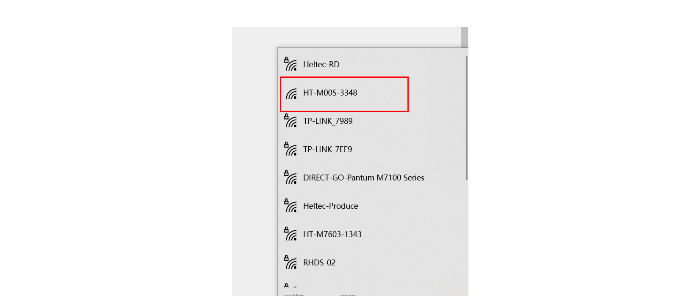
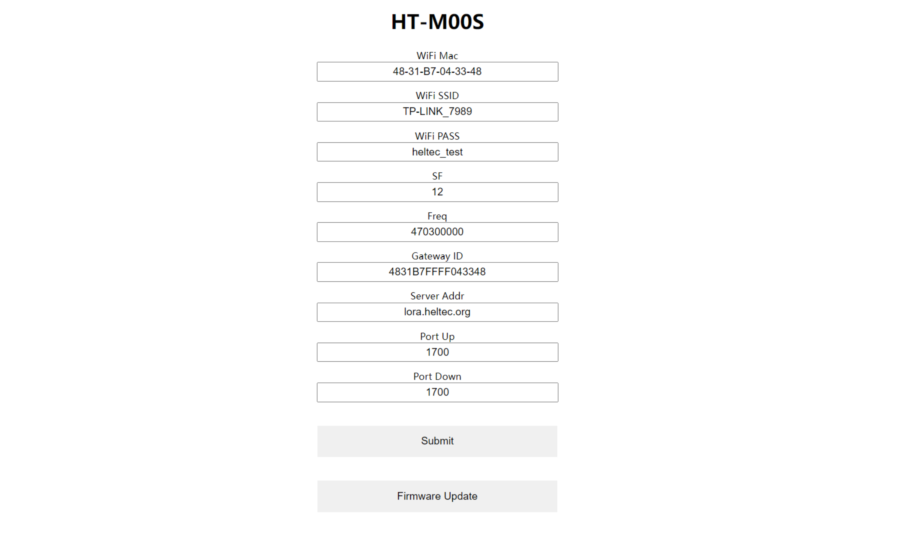

# Quick Start

{ht_translation}`[简体中文]:[English]`

## Power supply

 The HT-M00S is powered by 5V DC, and the interface is USB Type-C.

 

## Configuration
 After the device is powered on, long press the USER key until the device RGB changes to yellow, and release the key.

  

 At this time, find the WiFi named HT-M00S-XXXX through PC or mobile phone , and connect to this WiFi.

  

 After connecting to WiFi, enter 192.168.4.1 in the browser and enter to enter the configuration page.

 

 The configuration page parameters are defined as follows:

  - `WiFi-MAC` MAC address of HT-M00S;
  - `WiFi-SSID` The WiFi account connected to the network;
  - `WiFi-PASS` The WiFi password connected to the network;
  - `SF` Spreading factor, SF is associated with the DR, Please refer to the table below for their correspondence;
 
  - `Freq` Transmitting frequency of gateway LoRa, it must be a frequency point, such as 470300000, which means 470MHz band / 0 channel;
  - `Gateway ID` The ID of the HT-M00S, used for server registration;
  - `Server Addr` HT-M00S needs to connect to the server address;
  - `Port up` `Port down` Server uplink and downlink ports;
  - ` Submit` Submit when the configuration is complete;
  - `Firmware Update` OTA update.

## Common Problems and Solutions

 - Question: A node join request was received, but the node did not successfully join the network.

   Solution: The common reason is that the SF of the gateway does not match the DR Of the device.

 - Question: Nodes no longer work after changing servers or gateways.

   Solution: Please restart your node device, So that the node can rejoin the network.
 
 - After the configuration is completed, the device indicator light is always blue and cannot be connected to the network.
 
   Solution: Please check whether the power supply of the equipment is sufficient, Especially if you have used a USB adapter.
