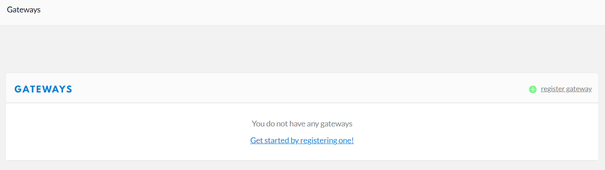
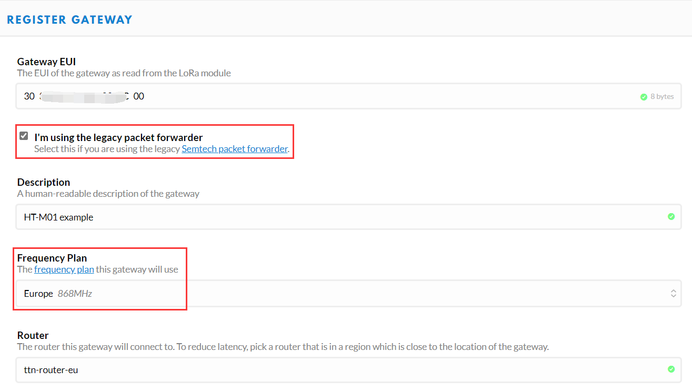
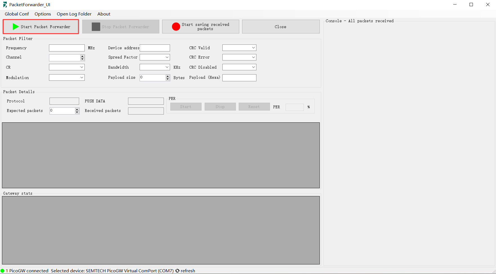
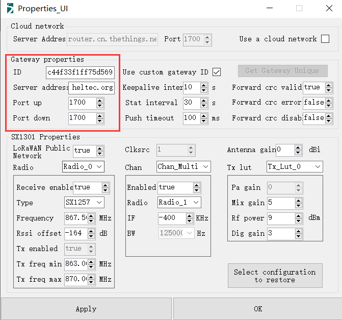
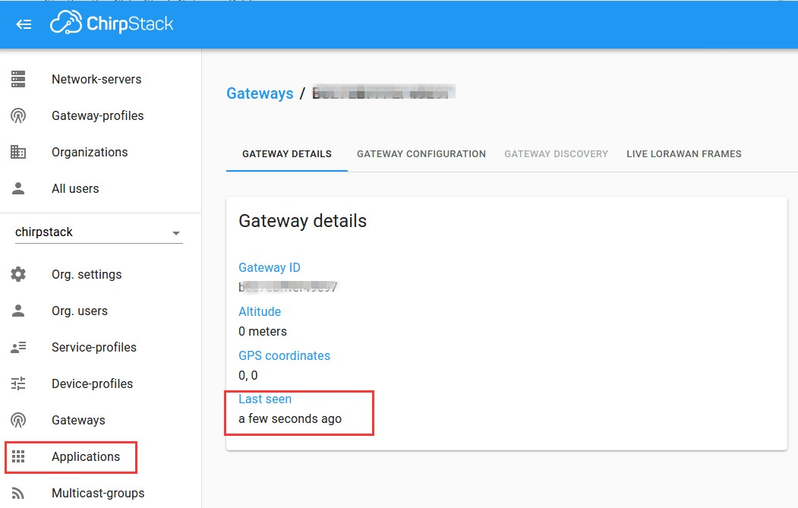

# Connect HT-M01 to a LoRa Server
{ht_translation}`[简体中文]:[English]`
## Summary

This article aims to describe how to connect [HT-M01 Gateway](https://heltec.org/project/ht-m01) to a LoRa server, such as [TTN](https://www.thethingsnetwork.org/), [ChirpStack](https://www.chirpstack.io/), which facilitates secondary development and rapid deployment of LoRa devices.ff

Before all operation, make sure the HT-M01 is runing well with a Raspberry Pi (Linux) or Windows computer. If not, please refer to this [HT-M01 Quick Start](https://heltec-automation-docs.readthedocs.io/en/latest/gateway/ht-m01/quick_start.html) document.

&nbsp;

## Connect to TTN

### Register a LoRa gateway in TTN

Create and active an account in TTN. Select ```Gateway``` in the [console](https://console.thethingsnetwork.org/) page.



Fill in the HT-M01 information as shown below and complete the addition.



- **Gateway EUI** -- The unique ID of HT-M01 gateway;
- **I'm using the legacy packet forwarder** -- Must select this;
- **Frequency Plan** -- Must matach the LoRa band configuration (`global_conf.json`) in HT-M01.
- **Router** -- Must use the default router allocated by TTN system.

``` {Tip} That four points are the key to success connection with TTN.

```

### Connect to TTN

In the HT-M01 gateway, need to configure the gateway ID, server address and port.

The TTN's router addresses for different region:

[https://www.thethingsnetwork.org/docs/gateways/packet-forwarder/semtech-udp.html#router-addresses](https://www.thethingsnetwork.org/docs/gateways/packet-forwarder/semtech-udp.html#router-addresses)


#### HT-M01 in Linux (Raspberry Pi)

Fix parameters in `global_conf.json`:

```shell
  nano /home/pi/lora/packet_forwarder/lora_pkt_fwd/global_conf.json
```

 Configure gateway ID, server address, port. At the end of the `global_conf.json`, make these changes:


  ```json
  "gateway_ID": "XXXXXXXXXXXXXXXX", /*Your gateway ID, 16 characters*/
  "server_address": "router.cn.thethings.network", /*The router addresses need matach your region*/
  "serv_port_up": 1700,
  "serv_port_down": 1700,
  ```

`ctrl + O` to save and `ctrl + X` to exit, and restart the service in Raspberry Pi:

```shell
sudo systemctl restart lrgateway
```

#### HT-M01 in Windows

Select `Use a cloud network`, and fill in correct `server address`, keep `Port` default 1700.


Click `OK` and `Start Packet Forwarder`.



View gateway status, it is runing:


&nbsp;

## Connect to ChirpStack server

[ChirpStack](https://www.chirpstack.io/) is the most popular LoRa server open source project, widely used in many fields, and also the best choise for a private LoRa server.

- ChirpStack Installation guide: [https://www.chirpstack.io/overview/](https://www.chirpstack.io/overview/)
- ChirpStack support forum: [https://forum.chirpstack.io/](https://forum.chirpstack.io/)

### ChirpStack Gateway Bridge

**One thing need attention!** the ChirpStack need a special service named `Gateway Bridge`, which converts LoRa® Packet Forwarder protocols into a ChirpStack Network Server common data-format(JSON and Protobuf).

The `Gateway Bridge` service can running on the Raspberry Pi or the ChirpStack server. We recommend install it on the Raspberry Pi.

Install LoRa-gateway-bridge:

```shell
wget https://artifacts.loraserver.io/downloads/lora-gateway-bridge/lora-gateway-bridge_2.5.1_armhf.deb
#Download the LoRa-gateway-bridge package that supports the Raspberry Pi Zero_W version
sudo dpkg -i lora-gateway-bridge_2.5.1_armhf.deb
#Install LoRa-gateway-bridge
sudo systemctl start lora-gateway-bridge
#Start LoRa-gateway-bridge
sudo systemctl enable lora-gateway-bridge
#Set LoRa-gateway-bridge to boot up
```

Install ChirpStack Gateway Bridge can refer to [https://www.chirpstack.io/gateway-bridge/install/debian](https://www.chirpstack.io/gateway-bridge/install/debian)

Starting the ChirpStack Gateway Bridge:

```shell
sudo systemctl start chirpstack-gateway-bridge
```

### Register LoRa Gateway in ChirpStack

Fill in the HT-M01 information as shown below and complete the addition.


- **Gateway ID** -- The unique ID of HT-M01 gateway。

### Connect to ChirpStack server

In the HT-M01 gateway, need to configure the gateway ID, server address and port.

#### HT-M01 in Linux (Raspberry Pi)

Fix parameters in `global_conf.json`:

```shell
  nano /home/pi/lora/packet_forwarder/lora_pkt_fwd/global_conf.json
```

 Configure gateway ID, server address, port. At the end of the `global_conf.json`, make these changes:


  ```json
  "gateway_ID":"XXXXXXXXXXXXXXXX", /*Your gateway ID, 16 characters*/
  "server_address": "router.eu.thethings.network", /*The router addresses need matach your region*/
  "serv_port_up": 1700,
  "serv_port_down": 1700,
  ```

`ctrl + O` to save and `ctrl + X` to exit, and restart the service in Raspberry Pi:

```shell
sudo systemctl restart lrgateway
```

#### HT-M01 in Windows

Fill in the correct `ID`, `server address`, keep `Port` default 1700.



Click `OK` and `Start Packet Forwarder`.


View gateway status, it is runing:


