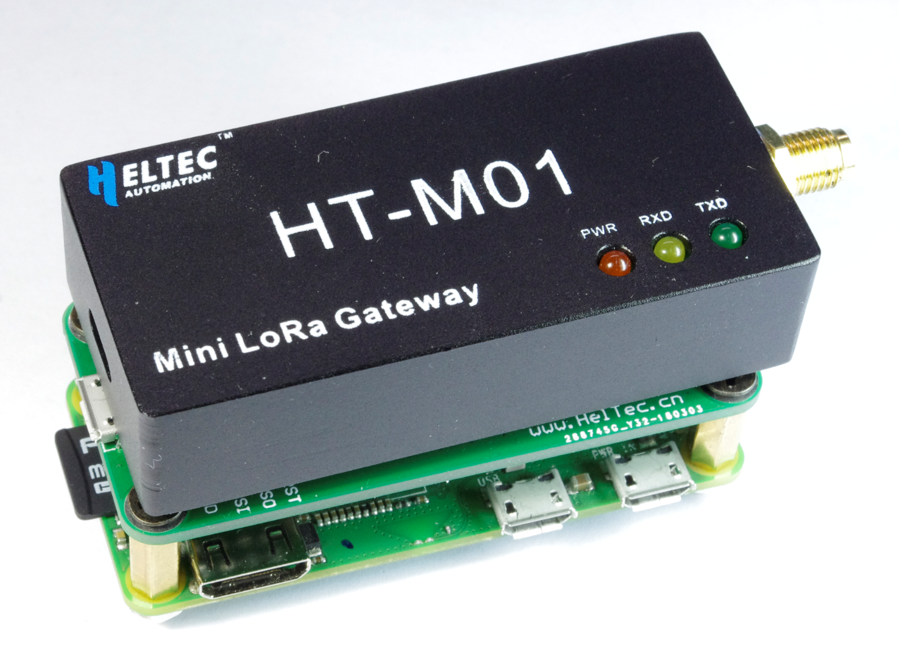
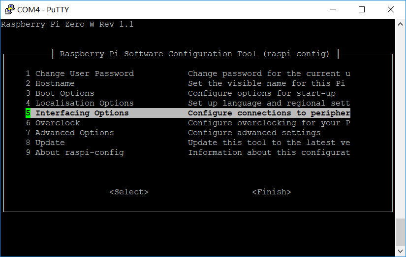

# HT-M01 Mini LoRa Gateway Quick Start
{ht_translation}`[简体中文]:[English]`
## Summary

The HT-M01 LoRa Gateway supports both USB and SPI mode. The SPI mode can only running with Linux systems (Raspberry PI), the USB mode can be used on Linux and Windows<sup>®</sup>. generally speaking, to make HT-M01 running, just chose one of the following three methods:

- **Linux (Raspberry PI)**
  - [SPI mode](spi-mode)
  - [USB mode](usb-mode)
- **Windows<sup>®</sup>**
  - [USB mode for Windows<sup>®</sup>](use-ht-m01-with-windows-sup-sup)


## Use HT-M01 with Linux (Raspberry PI)

Before all operation, make sure you have a Raspberry Pi that works and can connect to Wi-Fi. In this document, we used [Raspberry Pi Zero W](https://www.raspberrypi.org/products/raspberry-pi-zero-w/).

```{Tip} As we tested, Raspberry Pi 2, 3, 3B are also worked.

```

**[Raspberry Pi Configuration]()**

(spi-mode)=
### SPI mode

Have a [PRI to HT-M01 converter](https://heltec.org/product/m01-converter/) will make your operation more easy.



The wiring diagram of the Raspberry Pi and the adapter board is shown in the figure below.


The Raspberry Pi SPI bus is disabled by default. Enter the following command in putty to open the Raspberry Pi configuration interface and enable the SPI bus.

`sudo raspi-config`



Choose `Interfacing Options → SPI → Yes` and may need restart Raspberry Pi.

Install HT-M01 relevant application and services via following commands:

```shell
mkdir lora
cd lora
sudo apt-get update
sudo apt-get install git
git clone https://github.com/Lora-net/lora_gateway.git
# LoRa Gateway drivers
git clone https://github.com/Lora-net/packet_forwarder.git
# packet forwarding software
git clone https://github.com/HelTecAutomation/lorasdk.git
# This package will create a "lrgateway" service in Raspberry Pi
cd /home/pi/lora/lora_gateway
make clean all
cd /home/pi/lora/packet_forwarder
make clean all
cd /home/pi/lora/lorasdk
chmod +x install.sh 
./install.sh
#Run the script. After the script is run, it will create a service named "lrgateway". The purpose is to make the lora driver and data forwarding program run automatically at startup.
sudo cp -f /home/pi/lora/lorasdk/global_conf_EU868.json /home/pi/lora/packet_forwarder/lora_pkt_fwd/global_conf.json
#the "global_conf_EU868.json" may need change to your need.
```

Among them, "global_conf_EU868.json" can be replaced with "global_conf_EU433.json", "global_conf_CN470.json", "global_conf_US915.json", etc., respectively corresponding to the corresponding frequency bands.

(usb-mode)=
### USB mode

Before proceeding with the following operations, use a high-quality Micro USB cable to connect the HT-M01 Gateway to the Raspberry Pi, otherwise it will cause a lot of problems! Enter the following commands:

``` shell
mkdir lora
cd lora
sudo apt-get update
sudo apt-get install git
git clone https://github.com/Lora-net/picoGW_hal.git
git clone https://github.com/Lora-net/picoGW_packet_forwarder.git
git clone https://github.com/HelTecAutomation/picolorasdk.git
cd /home/pi/lora/picoGW_hal
make clean all
cd /home/pi/lora/picoGW_packet_forwarder
make clean all
cd /home/pi/lora/picolorasdk
chmod +x install.sh
./install.sh
#Run this script will create a service named "lrgateway". The purpose is to make the lora driver and data forwarding program run automatically at startup.
sudo cp -f /home/pi/lora/picolorasdk/global_conf_EU868.json /home/pi/lora/picoGW_packet_forwarder/lora_pkt_fwd/global_conf.json
#Put the configuration file on the specified path
```

Among them, "global_conf_EU868.json" can be replaced with "global_conf_EU433.json", "global_conf_CN470.json", "global_conf_US915.json", etc., respectively corresponding to the corresponding frequency bands.

```{Tip} The "global_conf.json" file determines the listening frequency of the gateway, which is the key to a node can successfully communicate with the gateway!

```

Whether it is in SPI or USB mode, when `./install.sh` is executed, if everything goes normal, the unique ID of the current gateway will be printed. **While register a gateway on a LoRa server need this unique ID.**


### Confirm Installation

Run `sudo systemctl status lrgateway` in Raspberry Pi, if all goes well, the service is running:


&nbsp;

(use-ht-m01-with-windows-sup-sup)=
## Use HT-M01 with Windows<sup>®</sup>

### USB mode

Install [PicoGW UI](http://resource.heltec.cn/download/HT-M01/PicoGW_UI_Release_V1.0.3.4.zip) **before** connect HT-M01 to a Windows<sup>®</sup> computer. then with HT-M01 connected, you will see a serial device in Windows<sup>®</sup> device manager.


Open PicoGW_UI and choose suitable region and click `Save my choice`. The default region didn't cover your location? please refer to this document.


Choose `Packet Forwarder`.


### Configuration PicoGW Tools


Click `Global Conf` to open the `Properties_UI` window, the parameters in this window are relative to the `global_conf.json` in `C:\Users\user name\AppData\Roaming\Semtech\PicoGW_UI` path. We just need pay attention to this three parts, others keep default.

1.  **Cloud network/Server Address** and **Port** -- This part is used for TTN only;
2. **Gateway properties/Server Address**, **Port up** and **Port down** -- This part is used for a custom server, it can be cloud server, private or local server, such as [ChripStack](https://www.chirpstack.io/);
3. **Get Gateway Unique ID** -- will generate a unique ID for your HT-M01, it will be used while register a gateway in the LoRa server.

``` {Note} the Unique ID generated by PicoGW UI and Raspberry Pi are different. Because the Unique ID from PicoGW UI is relative to HT-M01's STM32 chip. Raspberry Pi use self's ethernet Mac address.

```