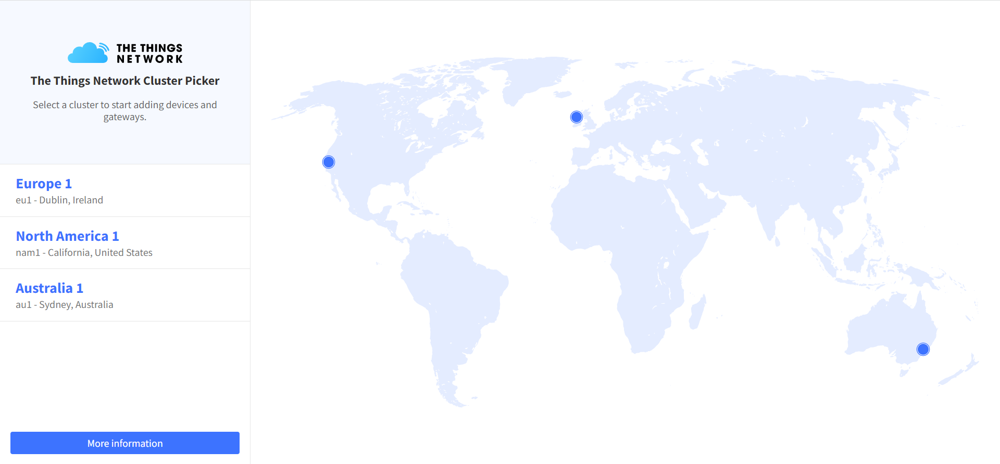
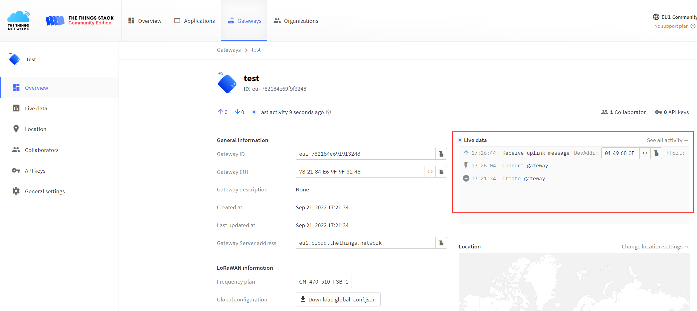
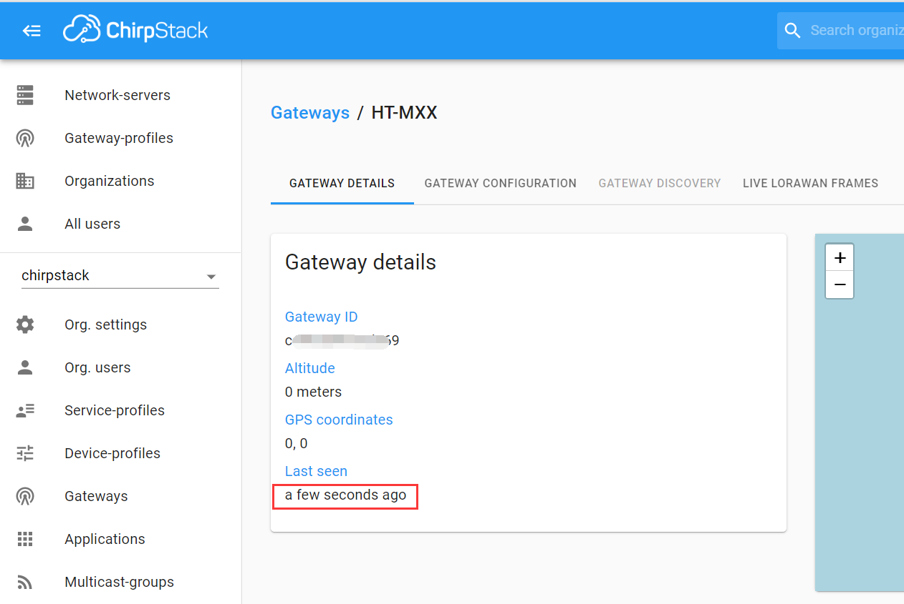

# Connect HT-M01S to LoRa Server
{ht_translation}`[简体中文]:[English]`

## Summary

This article aims to describe how to connect [HT-M01S Gateway](https://heltec.org/project/ht-m01s/) to a LoRa server, such as [TTN](https://www.thethingsnetwork.org/), [ChirpStack](https://www.chirpstack.io/), [Heltec Cloud Server](http://cloud.heltec.org/), which facilitates secondary development and rapid deployment of LoRa devices.

Before all operation, make sure the HT-M01 is runing well . If not, please refer to this [HT-M01S Quick Start](https://heltec-automation-docs.readthedocs.io/en/latest/gateway/ht-m01s/quick_start.html) document.

&nbsp;

## Connect to TTN

### Register a LoRa gateway in TTN

Create and active an account in TTN. Select ```Gateway``` in the [console](https://console.thethingsnetwork.org/) page.



Fill in the HT-M01S information as shown below and complete the addition.


- **Gateway EUI** -- The unique ID of HT-M01S gateway, view from the display screen of the HT-M01S or view through the serial port (the gateway ID will be printed through the serial port when the HT-M01S starts);
- **I'm using the legacy packet forwarder** -- Must select this;
- **Frequency Plan** -- Must matach the LoRa band configuration in HT-M01S；
- **Router** -- Must use the default router allocated by TTN system.

``` {Tip} That four points are the key to success connection with TTN.

```

### Connect to TTN

In the HT-M01S gateway, the server address, port, frequency band, and channel need to be configured. The server address, port, frequency band and channel are configured in the "HT-M01S Config" interface, please refer to the [HT-M01S Quick Start](https://heltec-automation-docs.readthedocs.io/en/latest/gateway/ht-m01s/quick_start.html) document.


The TTN's router addresses for different region:

[https://www.thethingsnetwork.org/docs/gateways/packet-forwarder/semtech-udp.html#router-addresses](https://www.thethingsnetwork.org/docs/gateways/packet-forwarder/semtech-udp.html#router-addresses)


View gateway status, it is runing:



&nbsp;

## Connect to ChirpStack server

[ChirpStack](https://www.chirpstack.io/) is the most popular LoRa server open source project, widely used in many fields, and also the best choise for a private LoRa server.

- ChirpStack Installation guide: [https://www.chirpstack.io/overview/](https://www.chirpstack.io/overview/)
- ChirpStack support forum: [https://forum.chirpstack.io/](https://forum.chirpstack.io/)

### ChirpStack Gateway Bridge

**One thing need attention!** the ChirpStack need a special service named `Gateway Bridge`, which converts LoRa® Packet Forwarder protocols into a ChirpStack Network Server common data-format(JSON and Protobuf).

the `Gateway Bridge` service can running on the Raspberry Pi or the ChirpStack server.

Install ChirpStack Gateway Bridge: [https://www.chirpstack.io/gateway-bridge/install/debian/](https://www.chirpstack.io/gateway-bridge/install/debian/)

### Register LoRa Gateway in ChirpStack

Fill in the HT-M01S information as shown below and complete the addition.


- **Gateway ID** -- The unique ID of HT-M01S gateway, view from the display screen of the HT-M01S or view through the serial port (the gateway ID will be printed through the serial port when the HT-M01S starts).

### Connect to ChirpStack server

In the HT-M01S gateway, the server address, port, frequency band, and channel need to be configured. The server address, port, frequency band and channel are configured in the "HT-M01S Config" interface, please refer to the [HT-M01S Quick Start](https://heltec-automation-docs.readthedocs.io/en/latest/gateway/ht-m01s/quick_start.html) document.


View gateway status, it is runing:


