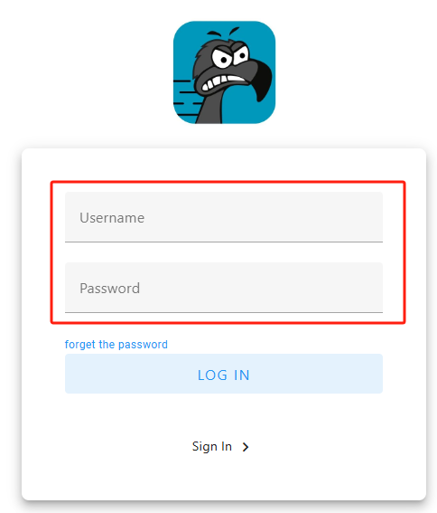

# Heltec HT-M01S Connect to Snapemu

Firstly, users can quickly configure the gateway according to [this document](https://docs.heltec.cn/en/gateway/ht-m01s_v2/quick_start.html).

## Register a LoRa gateway in Snapemu

*User log in to [Snapemu](https://platform.snapemu.com/dashboard/) by using their Heltec website account.*

*User successfully logs in, this interface will be displayed.* 

*Registering the device, click where shown below.*

*Select device type and fill in configuration information on this interface.*

   - `device name` and `description` can be filled in freely, and they will become the name and remark of the device displayed on the platform. 
   - `Group` denotes the grouping of the device on SnapEmu.
   - `device type` This device is a gateway, so choose "LoRaGateway".
   - `Region` Match the frequency band of the gateway.
   - `GatewayEUI` Gateway ID, through device configuration page or scan the device QR code to obtain.

*After filling in the information, click Submit and refresh the page to see the device. Then click here to select the corresponding product image.*

*If everything goes smoothly, it will be as shown in the picture.*

