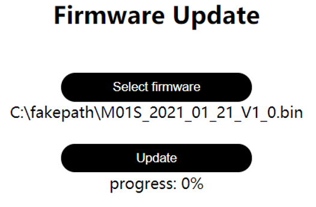
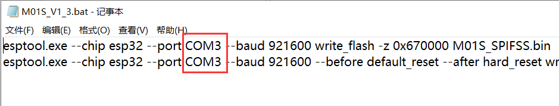
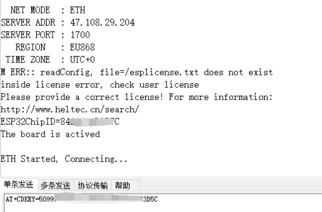

# HT-M01S (Rev. 2.0) Firmware Upgrade

{ht_translation}`[简体中文]:[English]`


## Summary

This article aims to describe how to upgrade the HT-M01S (Rev. 2.0) firmware.

```{Tip} If your gateway ID is occupied, in order to avoid occupying other gateway IDs when modifying the gateway ID, please modify the "FFFF" part in the middle, thank you!

```

&nbsp;

## Firmware Upgrade Logs

- V1.5
  - Initial release(Modified based on the old HT-M01S firmware).
- V1.6
  - Fix a bug in json data parsing that may cause memory overflow, and add serial port to print MAC address.
- V1.7 
  - Add AS923 region detailed frequency points on the configuration page.
- V1.8
  - Add AS923_ 1B region support.

&nbsp;

(upgrade-firmware)=

## Upgrade Firmware

This method is applicable to upgrading the firmware without changing the gateway configuration page. That is, this version of firmware only has the corresponding bin file. If the firmware of this version is a compressed package, please refer to " [Complete Firmware Upgrade](complete-firmware-upgrade) " for firmware upgrade.

Download [HT-M01S (Rev. 2.0) corresponding upgrade firmware](https://resource.heltec.cn/download/HT-M01S_V2/firmware)。


Enter the HT-M01S (Rev. 2.0) gateway configuration interface (can refer to [HT-M01S (Rev. 2.0) Quick Start](https://docs.heltec.org/en/gateway/ht-m01s_v2/quick_start.html))，click "Firmwaer Update"。


Click "Select firmware" to select the corresponding upgrade firmware that has been downloaded, and click "Update" to upgrade.



After the upgrade is complete, a corresponding prompt will pop up and restart the gateway.


(complete-firmware-upgrade)=

## Complete Firmware Upgrade

If the new firmware modifies the gateway's web configuration or the user accidentally overwrites the gateway firmware, it is necessary to burn the complete gateway firmware.

### Download Firmware

Download [HT-M01S (Rev. 2.0) complete firmware](https://resource.heltec.cn/download/HT-M01S_V2/firmware/complete_firmware)。

Open the downloaded file and edit the "M01S_Vx_x.bat" file.


Change the COM port to the corresponding COM port of HT-M01S (Rev. 2.0).



Open the serial port corresponding to the HT-M01S (Rev. 2.0), press the "+" key -> press the "RST" key -> release the "RST" key -> wait for the serial port to print "waiting for download" -> release the "+" key.


Double-click to run "M01S_Vx_x.bat". When running to the interface shown in the figure below, perform the following operations, press "+" key -> press "RST" key -> release "RST" key -> release "+" key. After the window closes automatically, the firmware programming is complete.


### Activate the Gateway

After the firmware download is complete, open the serial port corresponding to the HT-M01S (Rev. 2.0) and read the corresponding ESP32 chip ID of the gateway. Baud rate is 115200.


Enter [https://resource.heltec.cn/search](https://resource.heltec.cn/search), enter the ESP32 chip ID to query the serial number corresponding to the gateway.


Open the serial port corresponding to the HT-M01S (Rev. 2.0), and send the command "AT+CDKEY=xxxxxxxxxxxxxxxxxxxxxxxxxxxxxxxx" through the serial port to activate the gateway. Among them, "xxxxxxxxxxxxxxxxxxxxxxxxxxxxxxxx" is the 32-bit license. For example, if the license is 0x12345678, 0x12345678, 0x12345678, 0x12345678, the activation command is AT+CDKEY=12345678123456781234567812345678



After the screen displays normally, the gateway is activated successfully.

