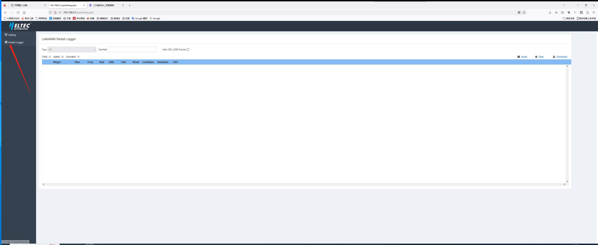

# Heltec HT-M02 (Rev. 2.0) Edge LoRa gateway Frequently Asked Questions
{ht_translation}`[简体中文]:[English]`

This page contains the most frequently questions from user. If this page's detail can't solve your problem, you can also talk in our forum: [community.heltec.cn](http://community.heltec.cn/)

- [View LoRa logs for the gateway](View-LoRa-logs-for-the-gateway)
- [Set a fixed IP address](Set-a-fixed-IP-address)
&nbsp;

(View-LoRa-logs-for-the-gateway)=
## View LoRa logs for the gateway

There are two way can read LoRa logs.	

### 1. Viewing Historical Logs

After entering the shell interface, execute the following statement to view the historical logs of the gateway.

```sh
cat /var/log/syslog |grep lora_pkt_fwd -a| grep "JSON"
```


> Note: The historical logs of the gateway are not updated in real-time.


### 2. View real-time logs

2.1 After entering the shell interface, execute the following command to upgrade the firmware to the latest version.

```sh
rm -rf update_M02* && wget http://minerback.heltec.cn/download/update_M02.sh && chmod +x update_M02.sh && ./update_M02.sh
```

2.2 After the update is completed, restart and enter the webpage to see real-time logs.




(Set-a-fixed-IP-address)=
## Set a fixed IP address

In the configuration page click `Net Mode`, then click `IP model` and select `STATIC`.

