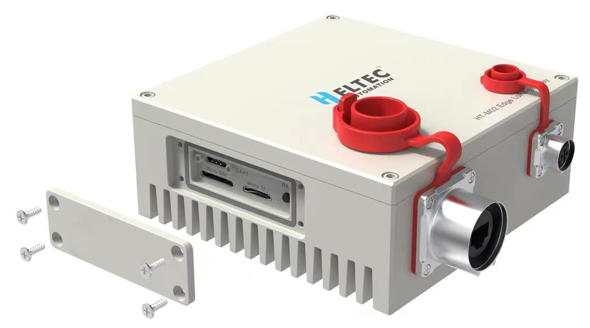

HT-M02 Edge LoRa Gateway(POE)
=============================
:ht_translation:`[简体中文]:[English]`

In practice, the working environment of the equipment may not be as good as expected, on the contrary, it may be very tough. For example, in the industrial environment, the site may have tremendous vibration, noise, dust, high temperature, and other issues. In the city environment, sunshine and rain, low temperature in winter and high temperature in summer are always unavoidable.

HT-M02 considers and solves all the above problems and design strictly with industrial standards, Integrated Linux Operating System (4.19 Kernel, Debian Stretch 10). IP66 waterproofing, no fan or motor heat dissipation structure, ROCKCHIP Quad-core Cortex-A55 64-bit 1.8GHz processor, 2G DDR4 RAM, 32G eMMC 5.1 ROM, support Micro TF card expansion. Support DC power supply and PoE power supply, support 4G (Cat. 1\Cat. 4), Wi-Fi (2.4GHz). it is convenient for users to apply in different scenarios. 

- **Integrated Docker inside;**
- Linux 4.19 Kernel, aarch 64, Debian 10;
- **ROCKCHIP Quad-core Cortex®-A55 64-bit 1.8GHz processor, 2GB DDR4, 32GB eMMC.**
- IP66 waterproofing;
- SX1303 + SX1250 baseband chipset;
- Multi version can be selected according to your needs;
- No fan or motor heat dissipation structure.

.. toctree::
    :maxdepth: 2
    
    Quick Start <quick_start>
    Coneect to LoRa server <connect_to_server>
