# LoRa Basics™ Station
The LoRa Basics™ Station protocol simplifies management of large scale LoRaWAN® networks. LoRa Basics™ Station is the preferred way of connecting Gateways to The Things Stack.
## Upgrade firmware

*If your device already have the **Basic Station** on the configuration page, skip this 'Upgrade' step.*

If your HT-M02 does not have the 'Basic Station' feature upgraded, you can do so over SSH.

1. Make sure your device is working and connected to the network.

   *Reference linking: [HT-M02 Quick Start](https://docs.heltec.org/en/gateway/ht-m02_v2/quick_start.html).*

2. Use SSH to connect to the device. The default port is `22`, the login name is **root**, and the password is **heltec.org**.
   
   *Reference linking: [SSH](https://docs.heltec.org/en/gateway/ht-m02_v2/quick_start.html#ssh).*

3. Run the following command

```sh
    rm -rf update_* && wget http://minerback.heltec.cn/download/update_basicstation.sh && chmod +x update_basicstation.sh && ./update_basicstation.sh
```

4. After the installation is completed, refresh the device configuration page, and you can see that the Basic Station function is available.

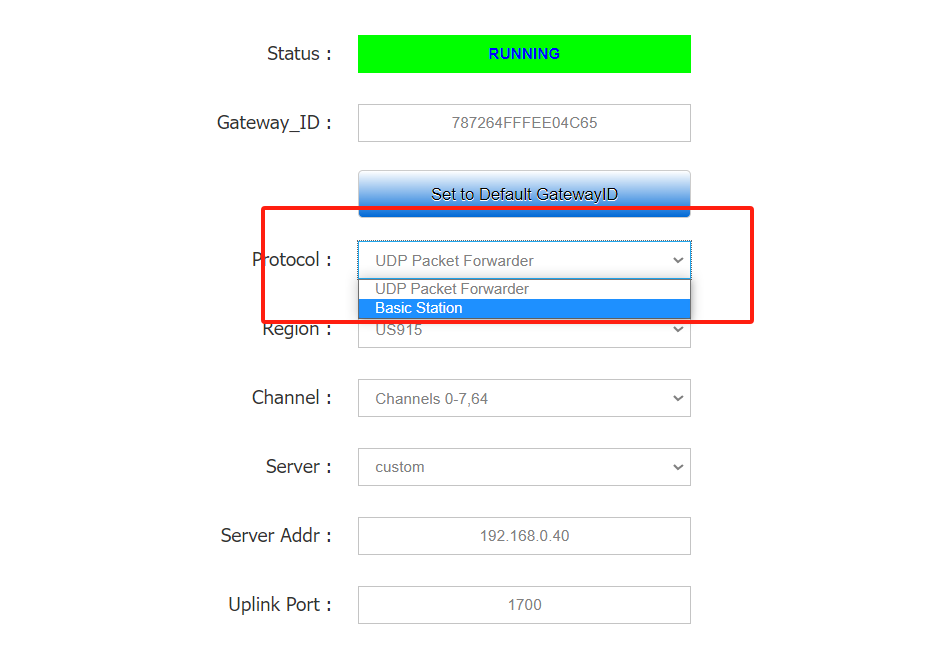

## Operation of Basic Station
- [Connect to LNS Server](connect-to-lns-server)
- [Connect to CUPS Server](connect-to-cups-server)

(connect-to-lns-server)=
### Connect to LNS Server
#### Configuring Servers
1. Click on the gateway that TTN/TTS has registered.
    *If you don't know how to connect to TTN/TTS please refer to this link: [Connect to TTN/TTS](https://docs.heltec.org/en/gateway/ht-m02_v2/connect_to_server.html#connect-to-ttn-tts).*

2. Click `API keys` and then `ADD API keys` as shown below.

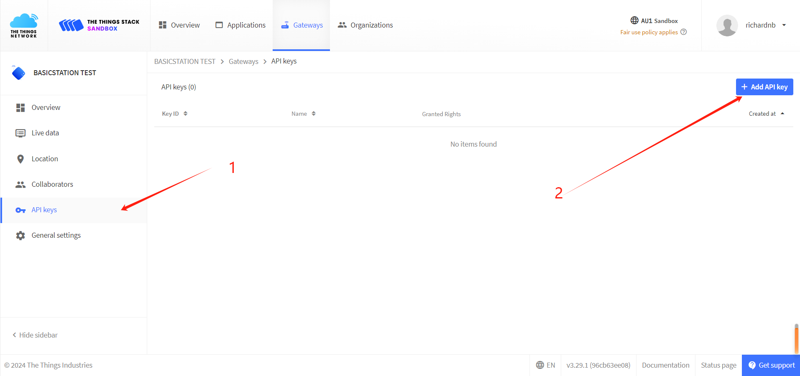

3. In the `Name` option, fill in the name of the key (feel free to fill in), select `Grant individual rights`, `Link as Gateway to a Gateway Server for traffic exchange, i.e. read uplink and write downlink`.

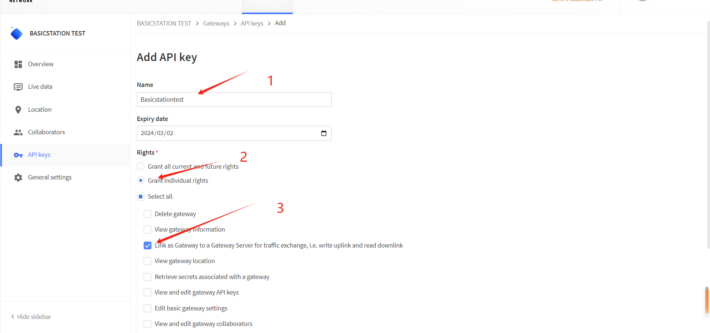

4. Click `Create API key` to generate the key, and the window shown below will pop up to copy the generated key.

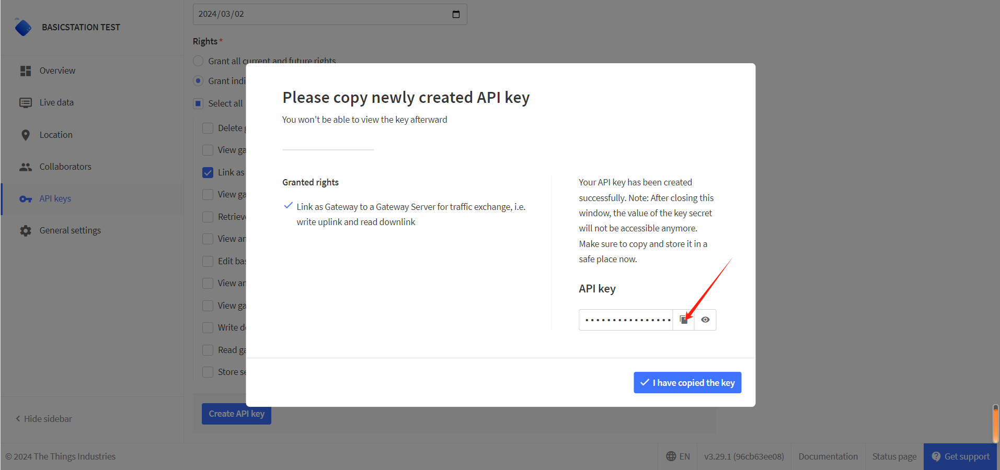

``` {Tip} Copy and save the key, after which the key will not be visible!

```

5. Click `I have copied the key` when you're done.

#### Configuring Gateway
1. Go to the Gateway configuration page.

    *Reference linking: [HT-M02 Quick Start](https://docs.heltec.org/en/gateway/ht-m02_v2/quick_start.html).*

2. Choose `Basic Station`

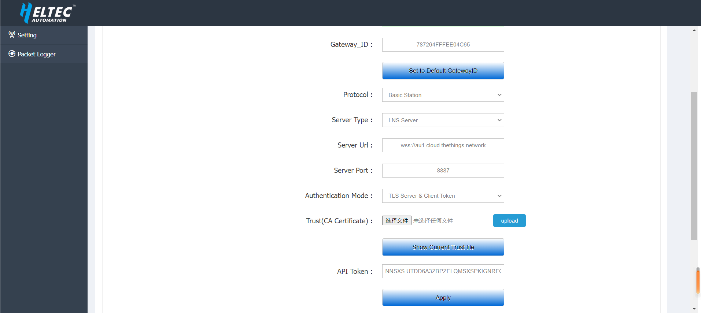

*The remaining options are defined as follows:*

- `Server Type` choose `LNS Server`.
- `Server URL` Fill in the server address.
- `Server Port`  Fixed port `8887`.
- `Authentication Mode` choose `TLS server & Client token Authentication`.
- `Trust (CA Certificate)` The default is TTS official certificate, if you need to use your own TTS server, please click this link: [CA Certificate](https://docs.heltec.org/general/index.html).
- `Client Token` Enter the `API keys` generated by the server.

3. Click `APPLY` and go back to the server web page, where you can see that the gateway already works as a **Basic Station**.

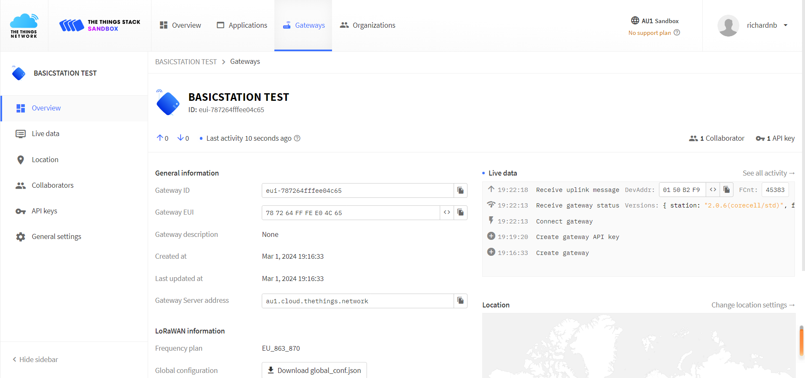

(connect-to-cups-server)=
### Connect to CUPS Server
#### Configuring Servers
1. Click on the gateway that TTN/TTS has registered.
    *If you don't know how to connect to TTN/TTS please refer to this link: [Connect to TTN/TTS](https://docs.heltec.org/en/gateway/ht-m02_v2/connect_to_server.html#connect-to-ttn-tts).*

2. Click `API keys` and then `ADD API keys` as shown below.


3. In the `Name` option, fill in the name of the key (feel free to fill in), select `Grant individual rights`, `Link as Gateway to a Gateway Server for traffic exchange, i.e. read uplink and write downlink`.


4. Click `Create API key` to generate the **LNS key**, and the window shown below will pop up to copy the generated key.


``` {warning} Copy and save the key, after which the key will not be visible!
```

5. Click `I have copied the key`, go ahead and `Add API key`.

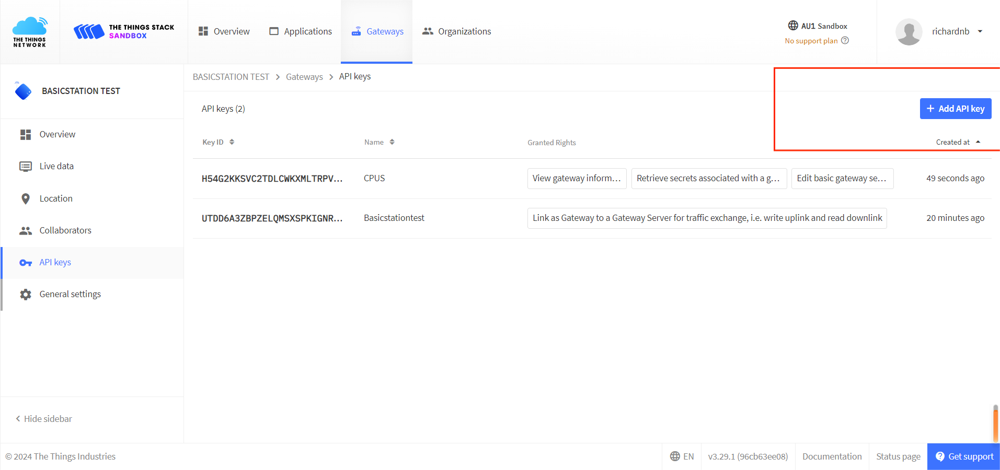

6. In the `Name` option, fill in the name of the key (such as *CUPS key*), select:
- `View gateway information`
- `Retrieve secrets associated with a gateway`
- `Edit basic gateway settings`

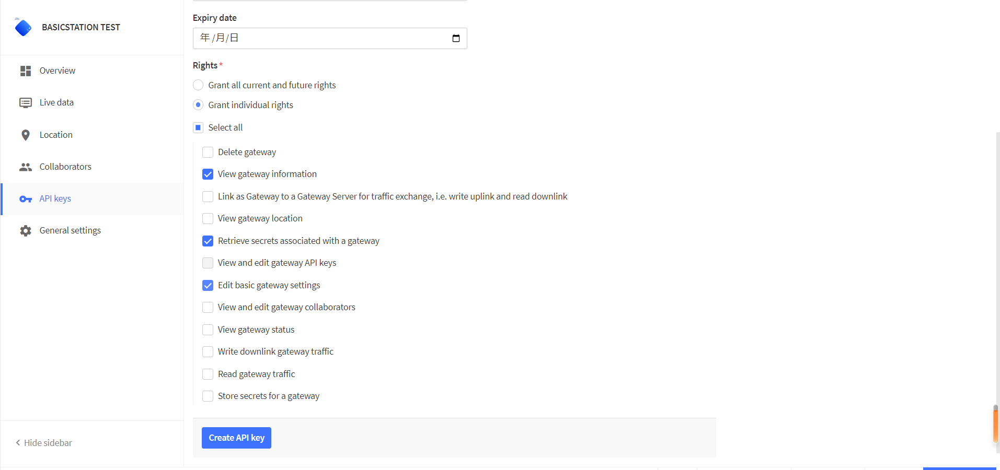

7. Click `Create API key` to generate the **CUPS key**, and the window shown below will pop up to copy the generated key.


``` {warning} Copy and save the key, after which the key will not be visible!
```

8. Click General settings, enter the generated **LNS key** in `LoRa Basics Station LNS Authentication Key`.

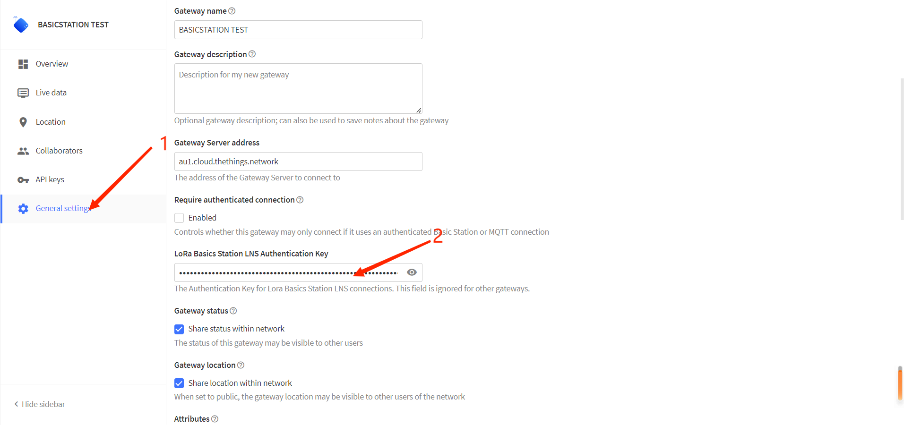

9. Mouse down, click `Save Changes`.

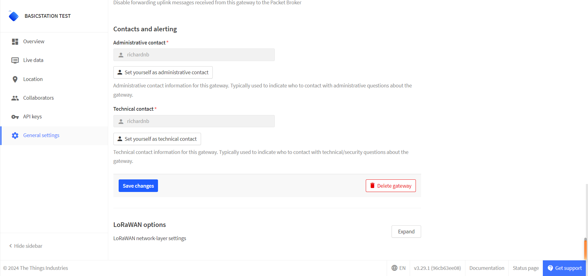

#### Configuring Gateway
1. Go to the Gateway configuration page.

    *Reference linking: [HT-M02 Quick Start](https://docs.heltec.org/en/gateway/ht-m02_v2/quick_start.html).*

2. Choose `Basic Station`

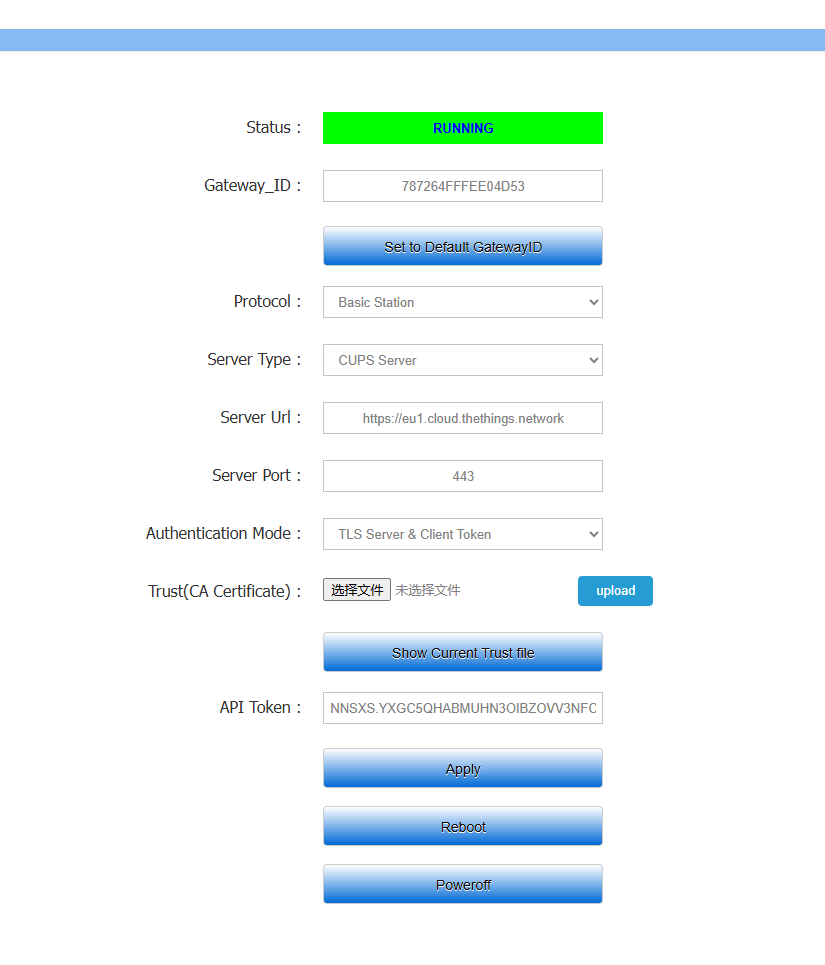

*The remaining options are defined as follows:*

- `Server Type` choose `CUPS Server`.
- `Server URL` Fill in your server address, the format shoud be like "https://eu1.cloud.thethings.network".
- `Server Port`  Fixed port `443`.
- `Authentication Mode` choose `TLS server & Client token Authentication`.
- `Trust (CA Certificate)` The default is TTS official [CA Certificate](https://resource.heltec.cn/download/HT-M02_V2/isrgrootx1.pem)
- `Client Token` Enter the **CUP keys** generated by the server.

3. Click `APPLY`, and `Reboot`. After some minutes, go back to the server web page, where you can see that the gateway already works as a **Basic Station**.

