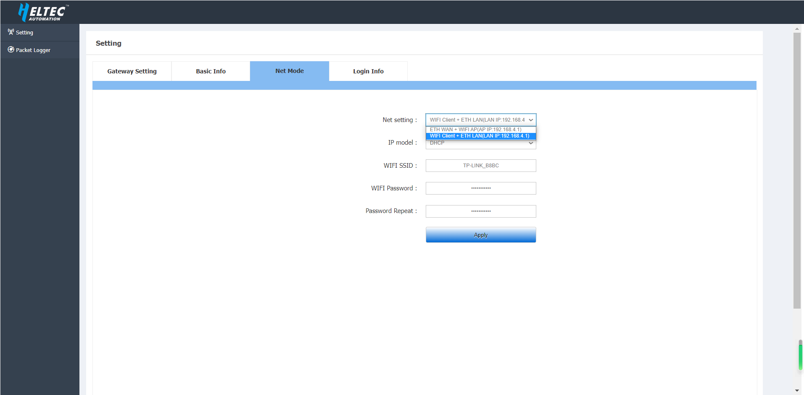
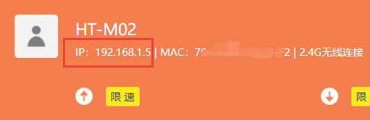
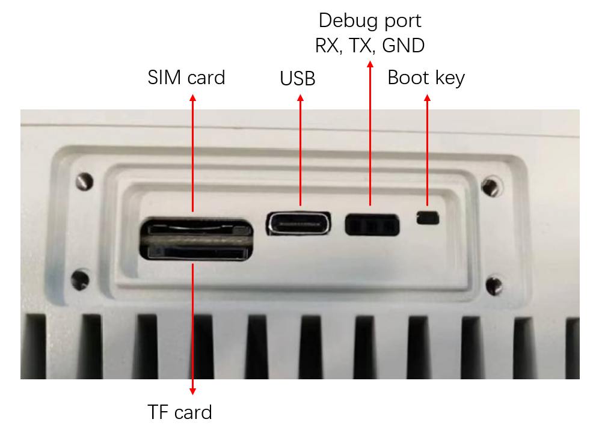
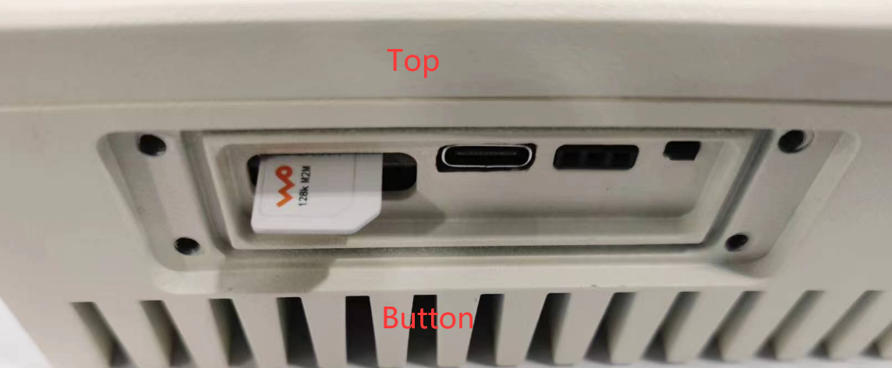

# HT-M02_V2 Edge LoRa Gateway  Quick Start
{ht_translation}`[简体中文]:[English]`
## Summary

HT-M02_V2 has integrated operating system and LoRa related programs, so it can be used directly in applications.  HT-M02_V2  has multiple optional versions, the main difference is the networking mode and power supply mode. The power supply mode is divided into POE mode and 12V DC mode. Different network modes have different gateway configuration methods. Please refer to the corresponding version for specific configuration methods.

- [ETH Version](eth-version)
- [ETH & WIFI Version](eth&wifi-version)
- [ETH & 4G Version](eth&4g-version)
- [ETH & WIFI & 4G versions](eth&wifi&4g-version)

```{Tip} Before you use POE for power supply, please confirm whether your gateway supports POE. If not, you can choose to use a [POE splitter](https://heltec.org/product/miner-poe-splitter).

```

## Basic Gateway Configuration

(eth-version)=

### ETH Version
Connect the antenna and network cable to the gateway, and then connect the gateway power supply. Check the ETH MAC address of the gateway on the gateway label, find it in the router, and log in to the configuration page through its IP address.


Log in to the configuration page through the user name "HT-M02" and password "heltec.org".  The device used to log in to the configuration page needs to be on the same LAN as the gateway. The user can view the basic information of the gateway and configure the gateway on the configuration page.


After configuring the gateway information, click `Apply`.

&nbsp;

(eth&wifi-version)=

### ETH & WIFI Version
This version uses ETH to connect to the network by default.

#### Connect to the network using ETH

##### Access the configuration page through ETH
Connect the antenna and network cable to the gateway, and then connect the gateway power supply. Check the ETH MAC address of the gateway on the gateway label, find it in the router, and log in to the configuration page through its IP address.


Log in to the configuration page through the user name "HT-M02" and password "heltec. org".  The device used to log in to the configuration page needs to be on the same LAN as the gateway. The user can view the basic information of the gateway and configure the gateway on the configuration page.


After configuring the gateway information, click `Apply`.


##### Access the configuration page through WIFI
Connect the antenna to the gateway, and then connect the gateway power supply.  After the gateway is started, WIFI will enter AP mode, find the WIFI named "HT-M02-AP" and connect to this WIFI.


After connecting to WIFI, use this device to open 192.168.4.1, and use the user name "HT-M02" and password "heltec. org" to log in to the configuration page. The user can view the basic information of the gateway and configure the gateway on the configuration page.


After configuring the gateway information, click `Apply`.


#### Connect to the network using WIFI

##### Access the configuration page through ETH
Connect the antenna to the gateway, and then connect the gateway power supply.  Connect the gateway to the computer through the network cable, and use this computer to open 192.168.4.1.   And use the user name "HT-M02" and password "heltec. org" to log in to the configuration page. The user can view the basic information of the gateway and configure the gateway on the configuration page.


Select `Wifi Client` in `Net mode`,  and fill in the SSID and password of the external Wi-Fi you want to connect to.



After configuring the gateway information, click `Apply`.


##### Access the configuration page through WIFI
Connect the antenna to the gateway, and then connect the gateway power supply.  Check the WIFI MAC address of the gateway on the gateway label, find it in the router, and log in to the configuration page through its IP address.



Log in to the configuration page through the user name "HT-M02" and password "heltec. org".  The device used to log in to the configuration page needs to be on the same LAN as the gateway. The user can view the basic information of the gateway and configure the gateway on the configuration page.


Select `Wifi Client` in `Net mode`,  and fill in the SSID and password of the external Wi-Fi you want to connect to.


After configuring the gateway information, click `Apply`.

&nbsp;

(eth&4g-version)=

### ETH & 4G Version
Connect the antenna and network cable to the gateway, and then connect the gateway power supply. Check the ETH MAC address of the gateway on the gateway label, find it in the router, and log in to the configuration page through its IP address.


Log in to the configuration page through the user name "HT-M02" and password "heltec. org".  The device used to log in to the configuration page needs to be on the same LAN as the gateway. The user can view the basic information of the gateway and configure the gateway on the configuration page.


After configuring the gateway information, the user needs to click the `Apply` key to make the changes take effect. If you want to use the **4G** function, select` Enable` under the 4G option in `Net Mode`.

&nbsp;

(eth&wifi&4g-version)=

### ETH & WIFI & 4G Versions
This version uses ETH to connect to the network by default.

#### Connect to the network using ETH

##### Access the configuration page through ETH
Connect the antenna and network cable to the gateway, and then connect the gateway power supply. Check the ETH MAC address of the gateway on the gateway label, find it in the router, and log in to the configuration page through its IP address.


Log in to the configuration page through the user name "HT-M02" and password "heltec. org".  The device used to log in to the configuration page needs to be on the same LAN as the gateway. The user can view the basic information of the gateway and configure the gateway on the configuration page.


After configuring the gateway information, click `Apply`.


##### Access the configuration page through WIFI
Connect the antenna to the gateway, and then connect the gateway power supply.  After the gateway is started, WIFI will enter AP mode, find the WIFI named "HT-M02-AP" and connect to this WIFI.


After connecting to WIFI, use this device to open 192.168.4.1, and use the user name "HT-M02" and password "heltec. org" to log in to the configuration page. The user can view the basic information of the gateway and configure the gateway on the configuration page.


After configuring the gateway information, click `Apply`..


#### Connect to the network using WIFI

##### Access the configuration page through ETH
Connect the antenna to the gateway, and then connect the gateway power supply.  Connect the gateway to the computer through the network cable, and use this computer to open 192.168.4.1.   And use the user name "HT-M02" and password "heltec. org" to log in to the configuration page. The user can view the basic information of the gateway and configure the gateway on the configuration page.


Select `Wifi Client` in `Net mode`,  and fill in the SSID and password of the external Wi-Fi you want to connect to. After configuring the gateway information, the user needs to click the `Apply` key to make the changes take effect.


##### Access the configuration page through WIFI
Connect the antenna to the gateway, and then connect the gateway power supply.  After the gateway is started, WIFI will enter AP mode, find the WIFI named "HT-M02-AP" and connect to this WIFI.


Log in to the configuration page through the user name "HT-M02" and password "heltec. org".  The device used to log in to the configuration page needs to be on the same LAN as the gateway. The user can view the basic information of the gateway and configure the gateway on the configuration page.


Select `Wifi Client` in `Net mode`,  and fill in the SSID and password of the external Wi-Fi you want to connect to.


&nbsp;

#### Connect to the network using 4G

##### Access the configuration page through ETH
Connect the antenna to the gateway, and then connect the gateway power supply.  Connect the gateway to the computer through the network cable, and use this computer to open 192.168.4.1.   And use the user name "HT-M02" and password "heltec. org" to log in to the configuration page. The user can view the basic information of the gateway and configure the gateway on the configuration page.


If you want to use the "4G" function, select Enable under the 4G option in Net Mode.


##### Access the configuration page through WIFI
Connect the antenna to the gateway, and then connect the gateway power supply.  After the gateway is started, WIFI will enter AP mode, find the WIFI named "HT-M02-AP" and connect to this WIFI.


Log in to the configuration page through the user name "HT-M02" and password "heltec. org".  The device used to log in to the configuration page needs to be on the same LAN as the gateway. The user can view the basic information of the gateway and configure the gateway on the configuration page.


If you want to use the "4G" function, select Enable under the 4G option in Net Mode

&nbsp;

## Interface Definition



- SIM card -- Micro SIM card interface.
- TF card -- TF card interface. 
- USB -- Used to update firmware.
- Debug port -- UART debugging serial port. Used to view the system log. UART pins are RX, TX, GND from left to right
- Boot key -- Used to enter the download mode.

## SIM Card Insertion Direction

Please refer to the figure below.



## Establish Serial/SSH Connection

If required, HT-M02_V2 can provide serial/SSH connection.

Default login user name: root

Default login password: heltec.org

### Serial

Because of the waterproof design, the UART interface is not directly exposed outside. If need a serial port connection, need to remove the protective board on the side of the HT-M02_V2, and also a UART-USB bridge is required (CP2102, CP2104, CH340G etc.).

- HT-M02_V2 TXD `<---->` UART-USB bridge RXD
- HT-M02_V2 RXD `<---->` UART-USB bridge TXD
- HT-M02_V2 GND `<---->` UART-USB bridge GND

Select an appropriate serial port debugging tool. Recommended to use [Putty](https://putty.org/). Select the port corresponding to the UART-USB bridge. The default baud rate is 115200. You can refer to the following configuration.


### SSH

Establish SSH connection need make sure the client in a same LAN with HT-M02_V2, SSH use default Port 22. 


