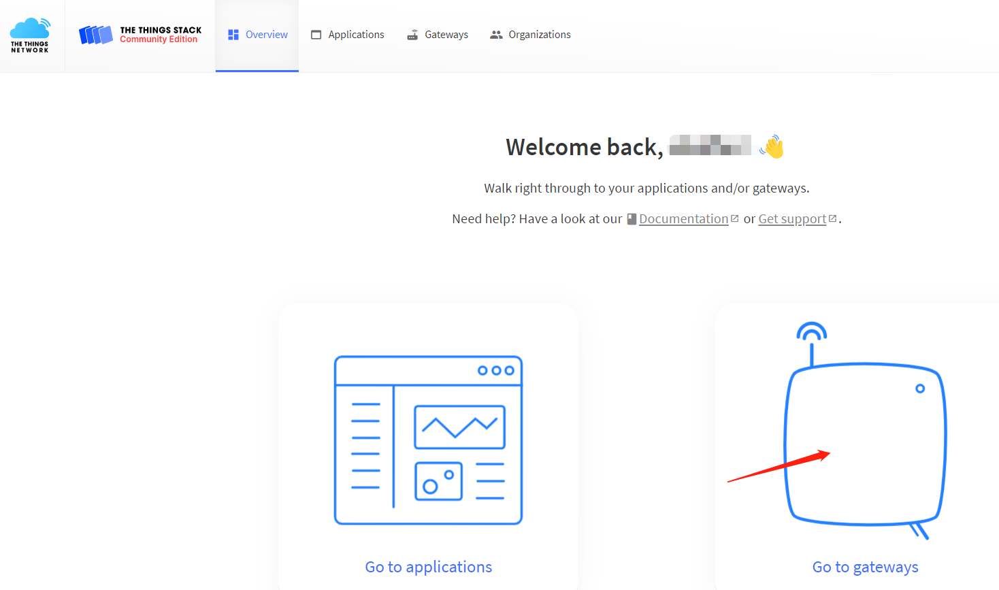

# Connect HT-M2802 to a LoRa Server
{ht_translation}`[简体中文]:[English]`

## Summary

This article aims to describe how to connect [HT-M2802 Gateway](https://heltec.org/project/ht-m2802/) to a LoRa server, such as [TTN](https://www.thethingsnetwork.org/), [ChirpStack](https://www.chirpstack.io/), which facilitates secondary development and rapid deployment of LoRa devices.

Before all operation, make sure the HT-M2802 is runing well . If not, please refer to this [HT-M2802 Quick Start](https://docs.heltec.org/en/gateway/ht-m2802/quick_start.html) document.

&nbsp;

## Connect to TTN/TTS

### Register a LoRa gateway in TTN/TTS

Select a cluster in the [TTN console](https://console.thethingsnetwork.org/) page to start adding devices and gateways. Or start adding devices and gateways in [TTS console](https://lora.heltec.org/console).


Create a new gateway.



Fill in the HT-M2802 information as shown below and complete the addition.


- **Gateway EUI** -- The unique ID of HT-M2802 gateway, view from the display screen of the HT-M2802 or view through the serial port (the gateway ID will be printed through the serial port when the HT-M2802starts).
- **Gateway ID** -- Generated by default.
- **Gateway name** -- Filled in by the user, can be filled in arbitrarily.
- **Frequency Plan** -- Matches the LoRa band configuration in HT-2802.


### Configure the Gateway

&nbsp;

## Connect to ChirpStack server

[ChirpStack](https://www.chirpstack.io/) is the most popular LoRa server open source project, widely used in many fields, and also the best choise for a private LoRa server.

- ChirpStack Installation guide: [https://www.chirpstack.io/overview/](https://www.chirpstack.io/overview/)
- ChirpStack support forum: [https://forum.chirpstack.io/](https://forum.chirpstack.io/)

### ChirpStack Gateway Bridge

**One thing need attention!** the ChirpStack need a special service named `Gateway Bridge`, which converts LoRa® Packet Forwarder protocols into a ChirpStack Network Server common data-format(JSON and Protobuf).

the `Gateway Bridge` service can running on the Raspberry Pi or the ChirpStack server.

Install ChirpStack Gateway Bridge: [https://www.chirpstack.io/gateway-bridge/install/debian/](https://www.chirpstack.io/gateway-bridge/install/debian/)

### Register LoRa Gateway in ChirpStack

Fill in the HT-M2802 information as shown below and complete the addition.


- **Gateway ID** -- The unique ID of the HT-M2802 gateway.

### Connect to ChirpStack server

In the HT-M2802 gateway, only the server address and port need to be configured.

config the `server address` and `port` in `global_conf.json`:

```shell
sudo nano lora/packet_forwarder/lora_pkt_fwd/global_conf.json
```

At the end of this file, make suitable changes:

```json
  "server_address": "router.eu.thethings.network", /*The server IP address or domain*/
  "serv_port_up": 1700,
  "serv_port_down": 1700,
```


`ctrl + O` to save and `ctrl + X` to exit, and restart the service:

```shell
sudo systemctl restart lrgateway
```

Check whether the system running normally:

```shell
sudo systemctl status lrgateway
```


View gateway status, it is runing:


