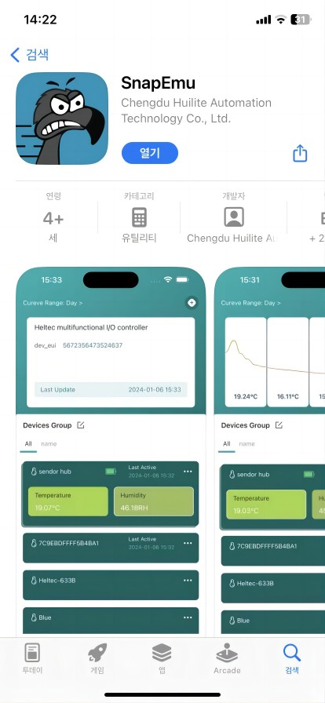
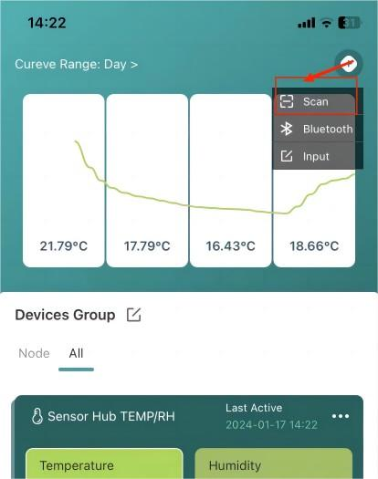
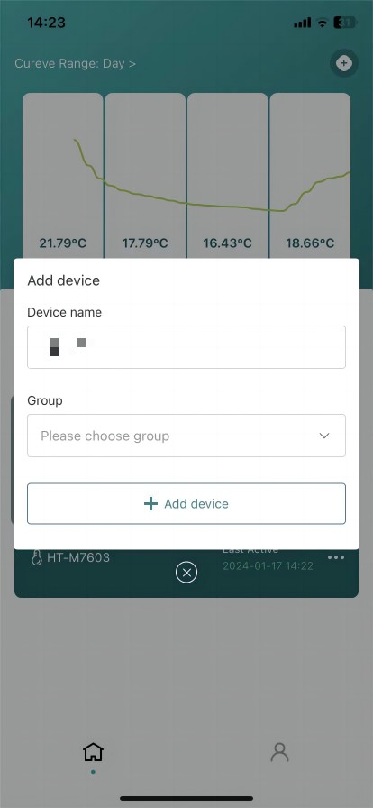
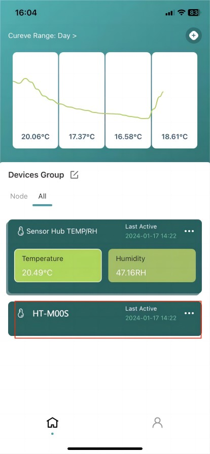
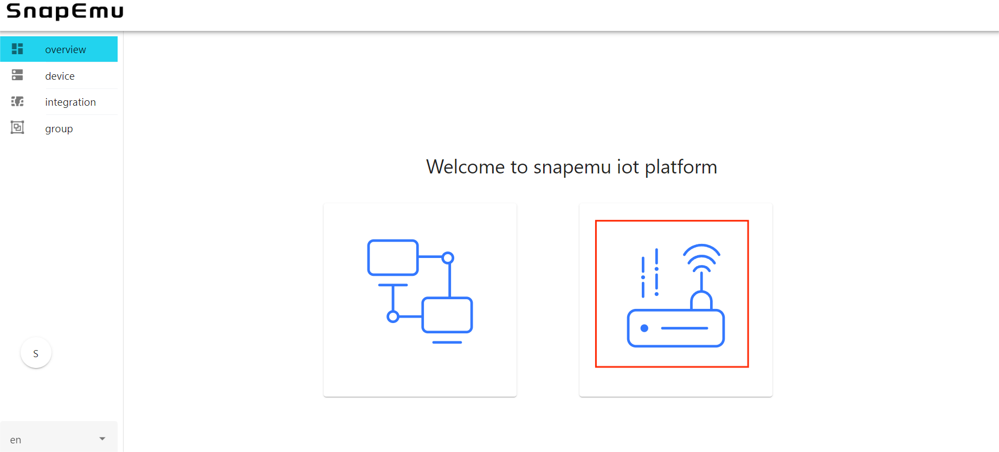
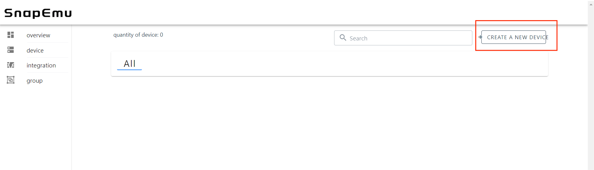
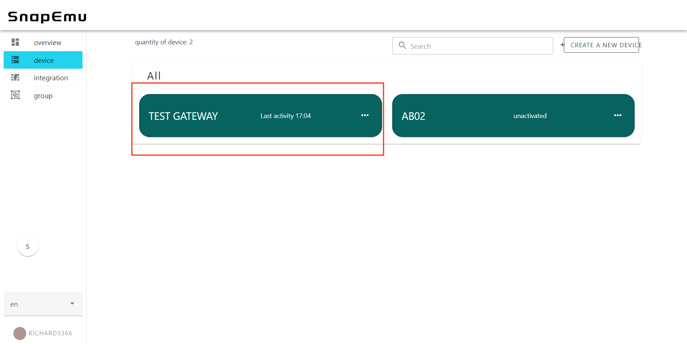

# Connect HT-M2802 to LoRa Server
{ht_translation}`[简体中文]:[English]`

## Summary
Before all operation, make sure the HT-M2802 is runing well . If not, please refer to this [HT-M2802 Quick Start](https://docs.heltec.org/en/gateway/ht-m2802/quick_start.html) document.

[Connect to TTN/TTS](connect-to-ttn)

[Connect to Chirpstack](connect-to-chirpstack)

[Connect to SnapEmu](connect-to-snapemu)

&nbsp;

## Connect to TTN/TTS
### Configure Gateway
Configure your gateway and fill in the server address as the server you want to connect to, please refer to the [HT-M2802 Quick Start](https://docs.heltec.org/en/gateway/ht-m2802/quick_start.html) document.

### Register a LoRa gateway in TTN/TTS

*Select a cluster in the [TTN console](https://console.thethingsnetwork.org/) page to start adding devices and gateways. Or start adding devices and gateways in [TTS console](https://lora.heltec.org/console).*


*Create a new gateway.*


*Fill in the HT-M2802 information as shown below and complete the addition.*


- **Gateway EUI** -- The unique ID of HT-M2802 gateway, view from the display screen of the HT-M2802 or view through the serial port (the gateway ID will be printed through the serial port when the HT-M2802starts).
- **Gateway ID** -- Generated by default.
- **Gateway name** -- Filled in by the user, can be filled in arbitrarily.
- **Frequency Plan** -- Matches the LoRa band configuration in HT-2802.

*View gateway status, it is runing:*


(connect-to-chirpstack)=

## Connect to ChirpStack Server

[ChirpStack](https://www.chirpstack.io/) is the most popular LoRa server open source project, widely used in many fields, and also the best choise for a private LoRa server.

- ChirpStack Installation guide: [https://www.chirpstack.io/overview/](https://www.chirpstack.io/overview/)
- ChirpStack support forum: [https://forum.chirpstack.io/](https://forum.chirpstack.io/)

### Configure Gateway
Configure your gateway and fill in the server address as the server you want to connect to, please refer to the [HT-M2802 Quick Start](https://docs.heltec.org/en/gateway/ht-m2802/quick_start.html) document.

### ChirpStack Gateway Bridge

**One thing need attention!** the ChirpStack need a special service named `Gateway Bridge`, which converts LoRa® Packet Forwarder protocols into a ChirpStack Network Server common data-format(JSON and Protobuf).

the `Gateway Bridge` service can running on the Raspberry Pi or the ChirpStack server.

Install ChirpStack Gateway Bridge: [https://www.chirpstack.io/gateway-bridge/install/debian/](https://www.chirpstack.io/gateway-bridge/install/debian/)

### Register LoRa Gateway in ChirpStack

*Fill in the HT-M2802 information as shown below and complete the addition.*


- **Gateway name**--Freely fill in as the remark name of the device on the server.
- **Gateway description**--Free to fill in, as equipment notes.
- **Gateway ID** -- The unique ID of HT-M2802 gateway, view from the display screen of the HT-M2802 or view through the serial port (the gateway ID will be printed through the serial port when the HT-M2802 starts).
- **Network server**--LoRaWAN frequency band, matched to the device.

*View gateway status, it is runing:*


&nbsp;

(connect-to-snapemu)=
## Connect to SnapEmu

### Register through SnapEmu APP
Search the **App Store** for `SnapEmu`, download and install it.




Open the `Scan` option to scan the Heltec device QR code.

``` {Tip} If the device does not have a QR code, click 'Input' for manual registration. For product information you can refer to the corresponding 'Quick Start'.

```




Fill in the group and add the device.




Registration is completed and the device display is activated.



&nbsp;

### Manual registration through the SnapEmu IoT Platform webpage
Register and log in to SnapEmu: [SnapEmu Web Page link](platform.snapemu.com).

Click where shown below.




Click `CREATE A NEW DEVICE`.




Go to the device registration page.


   - `Name` and `Description` can be filled in freely, and they will become the name and remark of the device displayed on the platform. 
   - `Group` denotes the grouping of the device on SnapEmu.
   - `Device type` This device is a gateway, so choose "LoRaGate".
   - `Region` Match the frequency band of the gateway.
   - `GatewayEUI` Gateway ID, through device configuration page or scan the device QR code to obtain.


After filling in the information, click Submit and refresh the page to see the device.

 

``` {Tips} If the device shows "unactiveted", it means that the device was not successfully connected. Don't worry, it usually takes some time for the server to respond, please wait a minute and refresh the web page again.

```