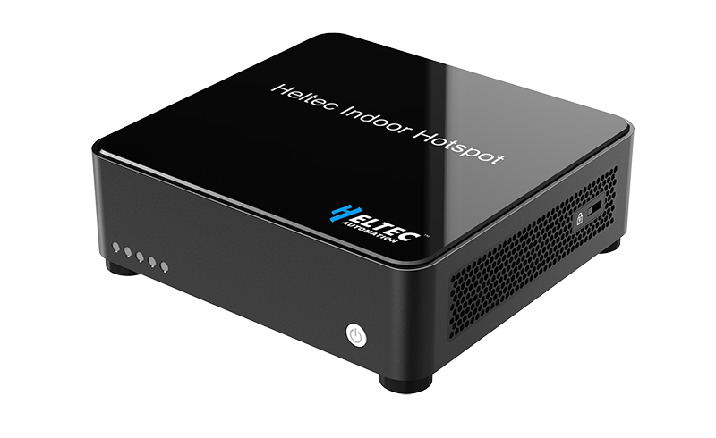

HT-M2802 Indoor LoRa Gateway
============================
:ht_translation:`[简体中文]:[English]`

Heltec offers the most cutting-edge LoRaWAN-supported hotspot available today, the HT-M2802. This high-performance hotspot is specifically designed to provide wireless network coverage to the IoT network. The LoRa technology utilized in this hotspot has an extensive range, allowing for the connection of thousands of IoT devices to a single hotspot. Furthermore, the HT-M2802 allows IoT devices located miles away to connect using LoRa technology, with data transmission occurring over distances much greater than Wi-Fi. In addition, the hotspot boasts a sleek and modern design, which enables it to be placed conveniently anywhere. The HT-M2802 is also ready-to-use right out of the box.

The HT-M2802 has the following features:
-----------------------------------------------
- CPU: Quad-core Cortex-A55 64-bit 1.8GHz;
- RAM: 2G DDR4;
- ROM: 32G eMMC 5.1;
- LoRa baseband: SX1303 + SX1250 chipset.
- Wi-Fi: 2.4GHz/5GHz
- Bluetooth: BT V4.0 (HS) and BLE
- Ethernet: 10/100/1000M

.. toctree::
    :maxdepth: 2
    
    Quick Start <quick_start>
    Coneect to LoRa server <connect_to_server>
    Connect to Snapemu <connect_to_snapemu>
    M2802 Install TTS through Docker <tts-docker>
    Frequently Asked Questions <frequently_asked_questions>
    -->[General Docs]<-- <https://docs.heltec.org/general/index.html>

