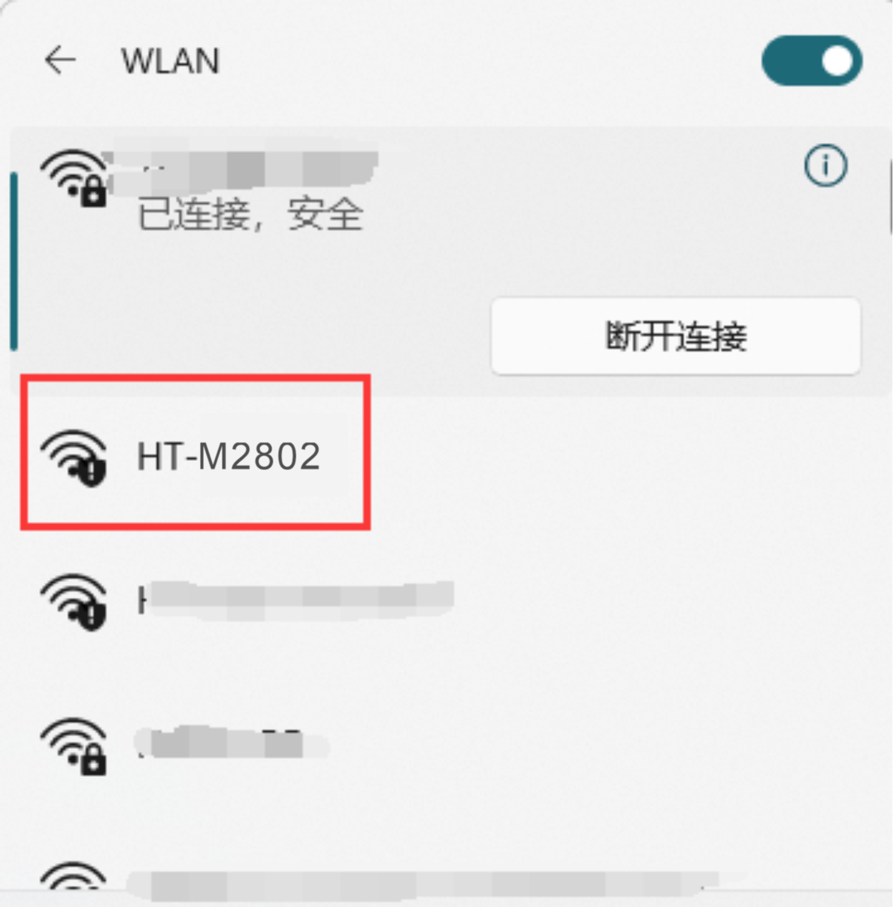

# HT-M02_V2 Edge LoRa Gateway  Quick Start
{ht_translation}`[简体中文]:[English]`

## Connect to the network using ETH

### Access the configuration page through ETH
Connect the antenna and network cable to the gateway, and then connect the gateway power supply. Check the ETH MAC address of the gateway on the gateway label, find it in the router, and log in to the configuration page through its IP address.

Log in to the configuration page through the user name "HT-M02" and password "heltec. org".  The device used to log in to the configuration page needs to be on the same LAN as the gateway. The user can view the basic information of the gateway and configure the gateway on the configuration page.

After configuring the gateway information, click `Apply`.

### Access the configuration page through WIFI
Connect the antenna to the gateway, and then connect the gateway power supply.  After the gateway is started, WIFI will enter AP mode, find the WIFI named "HT-M02-AP" and connect to this WIFI.

After connecting to WIFI, use this device to open 192.168.4.1, and use the user name "HT-M02" and password "heltec. org" to log in to the configuration page. The user can view the basic information of the gateway and configure the gateway on the configuration page.

After configuring the gateway information, click `Apply`.

## Connect to the network using WIFI

### Access the configuration page through ETH
Connect the antenna to the gateway, and then connect the gateway power supply.  Connect the gateway to the computer through the network cable, and use this computer to open 192.168.4.1.   And use the user name "HT-M02" and password "heltec. org" to log in to the configuration page. The user can view the basic information of the gateway and configure the gateway on the configuration page.

Select `Wifi Client` in `Net mode`,  and fill in the SSID and password of the external Wi-Fi you want to connect to.

After configuring the gateway information, click `Apply`.

### Access the configuration page through WIFI
Connect the antenna to the gateway, and then connect the gateway power supply.  Check the WIFI MAC address of the gateway on the gateway label, find it in the router, and log in to the configuration page through its IP address.

Log in to the configuration page through the user name "HT-M02" and password "heltec. org".  The device used to log in to the configuration page needs to be on the same LAN as the gateway. The user can view the basic information of the gateway and configure the gateway on the configuration page.

Select `Wifi Client` in `Net mode`,  and fill in the SSID and password of the external Wi-Fi you want to connect to.

After configuring the gateway information, click `Apply`.

&nbsp;

## Establish SSH Connection

If required, HT-M2802 can provide SSH connection.

Default login user name: root

Default login password: heltec.org

### SSH

Establish SSH connection need make sure the client in a same LAN with HT-M2802, SSH use default Port 22. 

