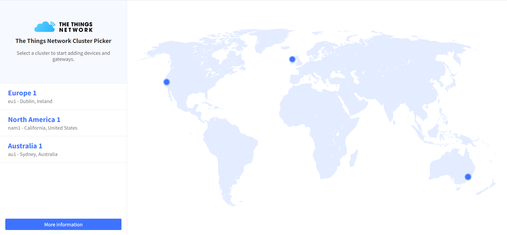
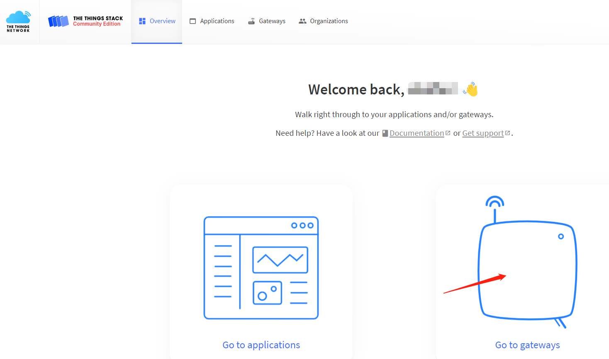
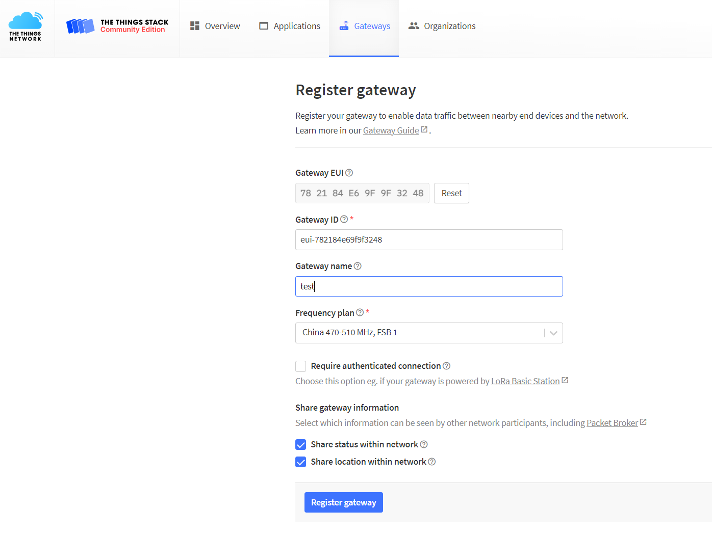
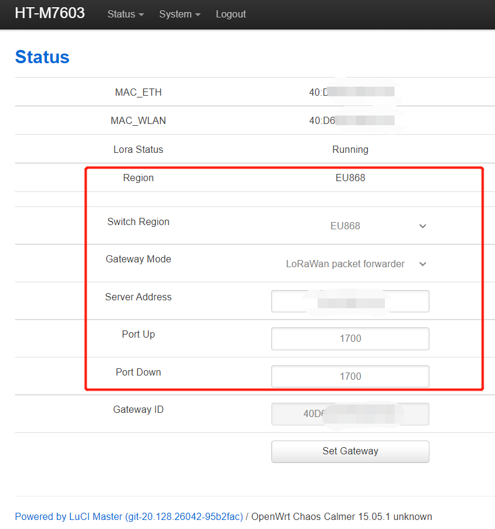
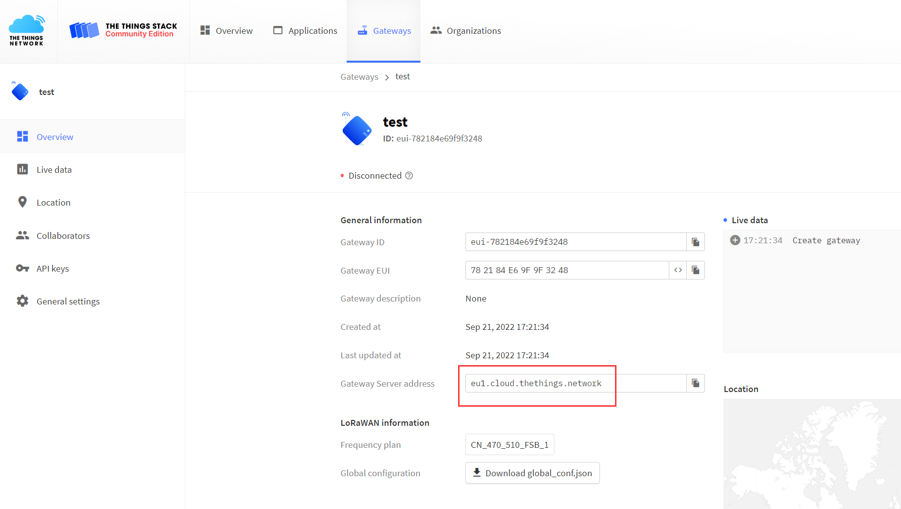
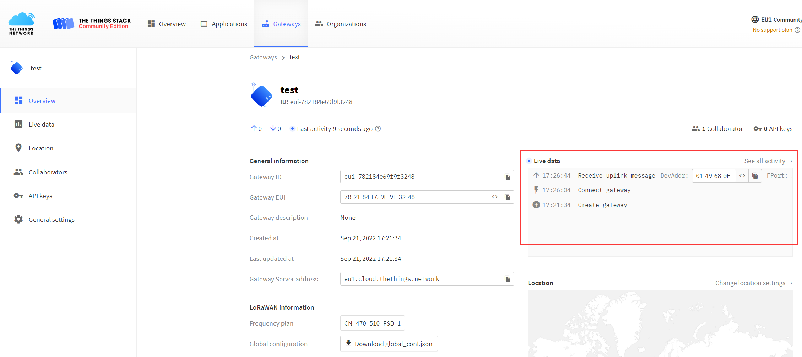
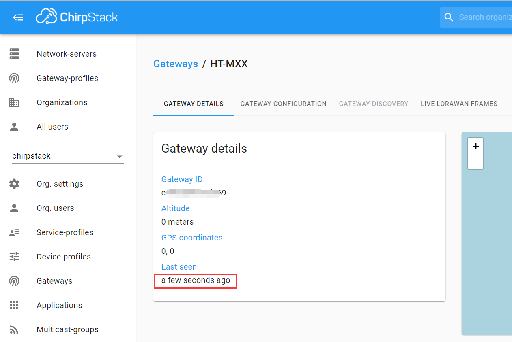

# Connect HT-M7603 to LoRa Server
{ht_translation}`[简体中文]:[English]`

## Summary

This article aims to describe how to connect [HT-M7603](https://heltec.org/project/ht-m7603/) to a LoRa server, such as [TTN](https://www.thethingsnetwork.org/)/[TTS](https://lora.heltec.org/), [ChirpStack](https://www.chirpstack.io/), which facilitates secondary development and rapid deployment of LoRa devices.

Before all operation, make sure the HT-M7603 is runing well . If not, please refer to this [HT-M7603_Quick Start](https://docs.heltec.org/en/gateway/ht-m7603/quick_start.html) document.

&nbsp;

## Connect to TTN/TTS

### Register a LoRa gateway in TTN/TTS

Select a cluster in the [TTN console](https://console.thethingsnetwork.org/) page to start adding devices and gateways. Or start adding devices and gateways in [TTS console](https://lora.heltec.org/console).

Create a new gateway.

Fill in the HT-M7603 information as shown below and complete the addition.

- **Gateway EUI** -- The unique ID of HT-M7603 gateway, view from configuration page.
- **Gateway ID** -- Generated by default.
- **Gateway name** -- Filled in by the user, can be filled in arbitrarily.
- **Frequency Plan** -- Matches the LoRa band configuration in HT-M7603.

### Configure the Gateway

In the HT-M7603 gateway, the server address, port, switch region,gateway mode need to be configured in the "HT-M7603 Config" interface, please refer to the [HT-M7603](https://docs.heltec.org/en/gateway/ht-m7603/quick_start.html) document.

Check the server address in the gateway details.

View gateway status, it is running:

&nbsp;

## Connect to ChirpStack Server

[ChirpStack](https://www.chirpstack.io/) is the most popular LoRa server open source project, widely used in many fields, and also the best choise for a private LoRa server.

- ChirpStack Installation guide: [https://www.chirpstack.io/overview/](https://www.chirpstack.io/overview/)
- ChirpStack support forum: [https://forum.chirpstack.io/](https://forum.chirpstack.io/)

### ChirpStack Gateway Bridge

**One thing need attention!** the ChirpStack need a special service named `Gateway Bridge`, which converts LoRa® Packet Forwarder protocols into a ChirpStack Network Server common data-format (JSON and Protobuf).

the `Gateway Bridge` service can running on the Raspberry Pi or the ChirpStack server.

Install ChirpStack Gateway Bridge: [https://www.chirpstack.io/gateway-bridge/install/debian/](https://www.chirpstack.io/gateway-bridge/install/debian/)

### Register LoRa Gateway in ChirpStack

Fill in the HT-M7603 information as shown below and complete the addition.

- **Gateway ID** -- The unique ID of HT-M7603 gateway, view from configuration page.

### Connect to ChirpStack server

In the HT-M7603 gateway, the server address, port, switch region,gateway mode need to be configured in the "HT-M7603 Config" interface, please refer to the [HT-M7603](https://docs.heltec.org/en/gateway/ht-m7603/quick_start.html) document.

View gateway status, it is running:

