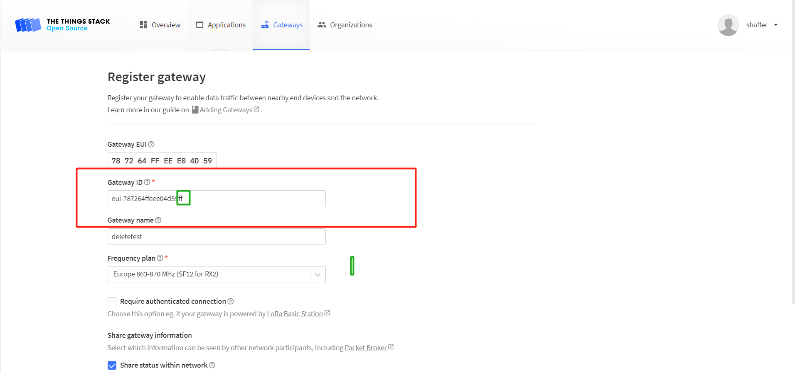

# HT-M7603 Frequently Asked Questions
{ht_translation}`[简体中文]:[English]`

This page contains the most frequently questions from user. If this page's detail can't solve your problem, you can also talk in our forum: [community.heltec.cn](http://community.heltec.cn/)

## Cannot re-register on TTS
Due to the architecture of TTS itself, you cannot re-register the ID when you delete your gateway.

Register the gateway normally. Do not submit the information after filling in the information. At this time, the server automatically generates an ID, as shown in the red box in the following figure. Add a suffix to the ID, such as "ff", and the ID will be registered。

## MQTT functionality Removal

The MQTT functionality of HT-M7603 has been removed in the latest firmware. This is because the feature requires a specific data upload format, which means that enabling MQTT service also necessitates redeveloping the node code. If you still require this functionality, please execute the following command in SSH to revert the device to the original version.
command: `rm -rf reset_M7603_V105* && wget http://minerback.heltec.cn/download/reset_M7603_V105.sh && chmod +x reset_M7603_V105.sh && ./reset_M7603_V105.sh`