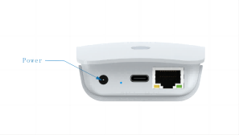
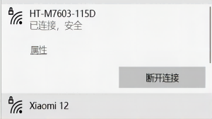
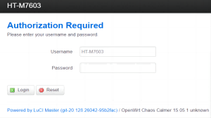
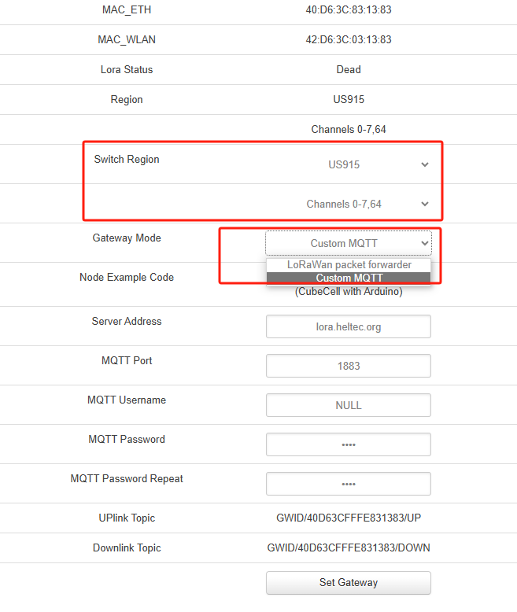
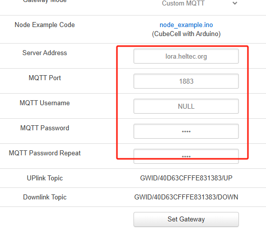
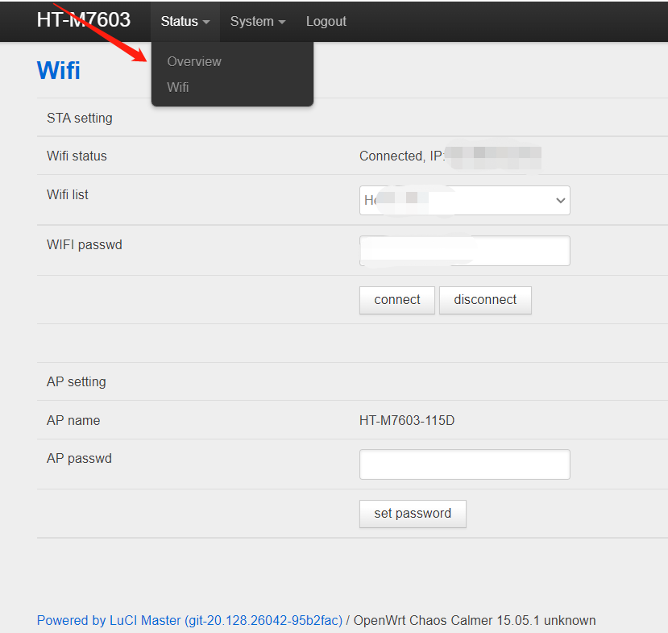
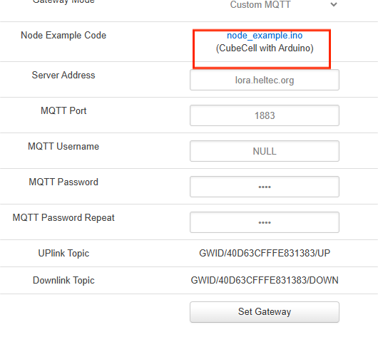
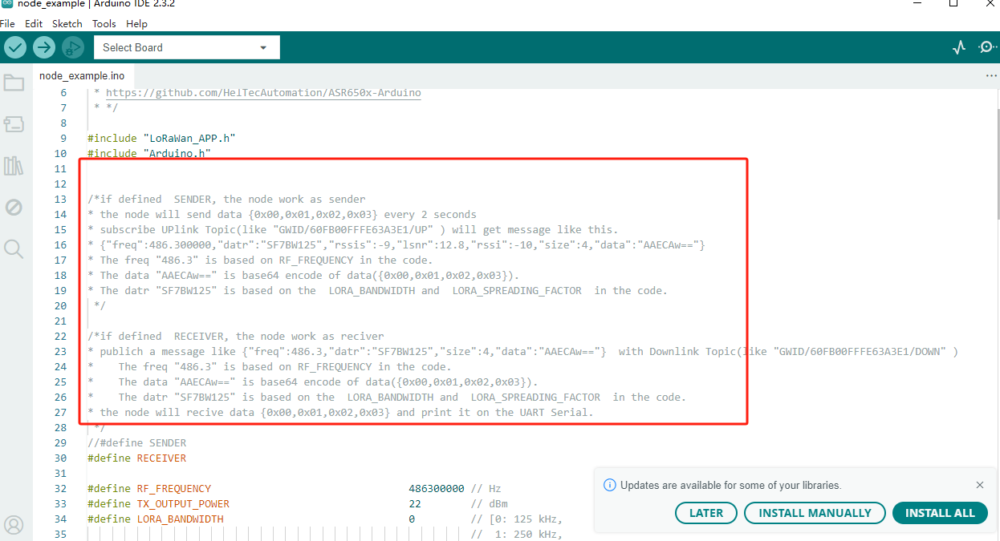

# MQTT Function
{ht_translation}`[简体中文]:[English]`

This document describes how to use the MQTT capabilities of the HT-M7603.

To summarize, you need three things to make this work:

- MQTT server

- [Enable Gateway MQTT mode](gateway)

- [Node enables private MQTT protocol](node)

(gateway)=

## Enable Gateway MQTT mode

1. Power on, find the WiFi named "HT_M7603_xxxx", connect to this WiFi, the password is "**heltec.org**". 

    

2. Visit "**192.168.8.1**" via the browser, the user name "HT-M7603" and password "heltec.org".

   

3. In **Switch Region** option, select the appropriate band and channel, which should correspond to the transmit frequency of your node.

      In **Gateway Mode** option, select "Custom MQTT".

    

4. In the pop-up window, fill in the server address port and other information. Click the `Set Gateway` button when you're done.

      

5. Connect to network

    + **Via Ethernet**: Insert the cable directly into the interface, after a successful connection, the device LED will change from blue to green.

    + **Via WiFi**: Click the "Status "option at the top left, click "WiFi". Select the WiFi you want to connect to in "WIFI list", enter password of this WiFi, click "connect". It usually takes 10~30 seconds for the HT-M7603 to connect to the WiFi, and the device LED will change from blue to green.

     

(node)=

## Node enables private MQTT protocol

1. When your gateway is running MQTT mode, you can see this option on its configuration page:

   

2. Click "**node exmple.ino**" to download this file.

3. This file contains a demo code based on Heltec Cubecell, and the comments in the code explain the data format in detail.

   

