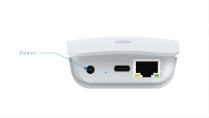
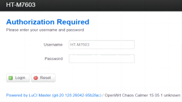
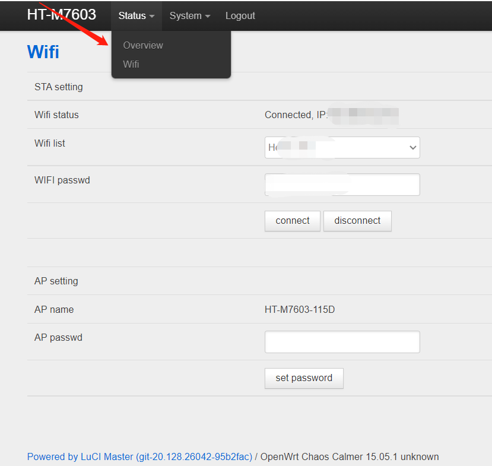

# HT-M7603 Quick Start

{ht_translation}`[简体中文]:[English]`

## Summary

HT-M7603 is positioned as a low-cost standard gateway for indoor use. LoRa part based on the SX1303 + 1250 structure,  we innovatively use ESP32 as the main control chip, and completely transplant the hardware driver, data forwarding and message queue of SX1303 to the ESP32 platform. There is no need to run the Linux operating system separately. With simple configuration, it allows you to bridge  to IP networks and different network servers via Wi-Fi or Ethernet. 

&nbsp;

## Configure the gateway

The HT-M7603 gateway has already downloaded the relevant program when it leaves the factory, and it can be used with only a few simple operations.

  

After the gateway is powered on, find the WiFi named "HT_M7603_xxxx", password "heltec.org". connect to this WiFi, and enter "192.168.8.1" through the browser, and log in to the gateway configuration page with the user name "HT-M7603" and password "heltec.org".

### First Configuration via WiFi

Configure the HT-M7603 gateway information on the page shown in the figure above, such as gateway mode, server address and port, regional frequency band. Click "Set Gateway" after the configuration is complete.

### Connect to Network

+ **Using Ethernet**: insert the cable directly into the interface, after a successful connection, the device LED will change from blue to green.
+ **Using WiFi**: Click the "Status "option at the top left, click "WiFi". Select the WiFi you want to connect to in "WIFI list", enter password of this WiFi, click "connect". It usually takes 10-30 seconds for the HT-M7603 to connect to the WiFi, and the device LED will change from blue to green.

&nbsp;

## Common Problems and Solutions

- Question: After the WiFi configuration is complete, Web is not responding.

  Solution: The WiFi connection takes some time (usually under 30 seconds), please refresh the page after the LED turns green.
  
- Question: The gateway is unable to access the network.

  Solution: Check your configuration information, Such as WiFi password, server address.