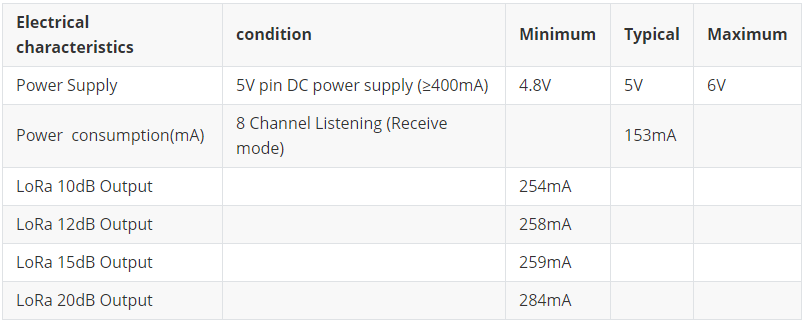

# SX1301/8 LoRa Gateway Module Quick Start

{ht_translation}`[简体中文]:[English]`

## Summary

For SX1301 and SX1308, their performance, drivers, interface packaging, and functions are completely the same. The difference is the operating temperature range. SX1301 is positioned as an outdoor type, and SX1308 is positioned as an indoor type. Cooperate with suitable driver hardware and Linux operating system (such as Raspberry Pi), then it can work as a LoRa gateway.

## Technical Characteristics

### Pin Definition


### Electrical characteristics



## Running SX130x module with SPI mode (Raspberry Pi)

The Raspberry Pi SPI bus is disabled by default. Enter the following command in putty to open the Raspberry Pi configuration interface and enable the SPI bus.

`sudo raspi-config`


Choose `Interfacing Options → SPI → Yes` and may need restart Raspberry Pi.

Install SX1301 module relevant application and services via following commands:

```shell
mkdir lora
cd lora
sudo apt-get update
sudo apt-get install git
git clone https://github.com/Lora-net/lora_gateway.git
# LoRa Gateway drivers
git clone https://github.com/Lora-net/packet_forwarder.git
# packet forwarding software
git clone https://github.com/HelTecAutomation/lorasdk.git
# This package will create a "lrgateway" service in Raspberry Pi
cd /home/pi/lora/lora_gateway
make clean all
cd /home/pi/lora/packet_forwarder
make clean all
cd /home/pi/lora/lorasdk
chmod +x install.sh 
./install.sh
#Run the script. After the script is run, it will create a service named "lrgateway". The purpose is to make the lora driver and data forwarding program run automatically at startup.
sudo cp -f /home/pi/lora/lorasdk/global_conf_EU868.json /home/pi/lora/packet_forwarder/lora_pkt_fwd/global_conf.json
#the "global_conf_EU868.json" may need change to your need.
```

```{Tip} The "global_conf.json" file determines the listening frequency of the gateway, which is the key to a node can successfully communicate with the gateway!

```

When `./install.sh` is executed, if everything goes normal, the unique ID of the current gateway will be printed. While register a gateway on a LoRa server need this unique ID.


### Confirm Installation

Run `sudo systemctl status lrgateway` in Raspberry Pi, if all goes well, the service is running:


&nbsp;

## Connect to LoRa Server

SX130x module working with Raspberry Pi is most similar with [HT-M01](https://heltec.org/project/ht-m01/) gateway with Raspberry Pi in SPI mode. Steps to connect to a LoRa server, please refer to this document:

[https://heltec-automation-docs.readthedocs.io/en/latest/gateway/ht-m01/connect_to_server.html](https://heltec-automation-docs.readthedocs.io/en/latest/gateway/ht-m01/connect_to_server.html)