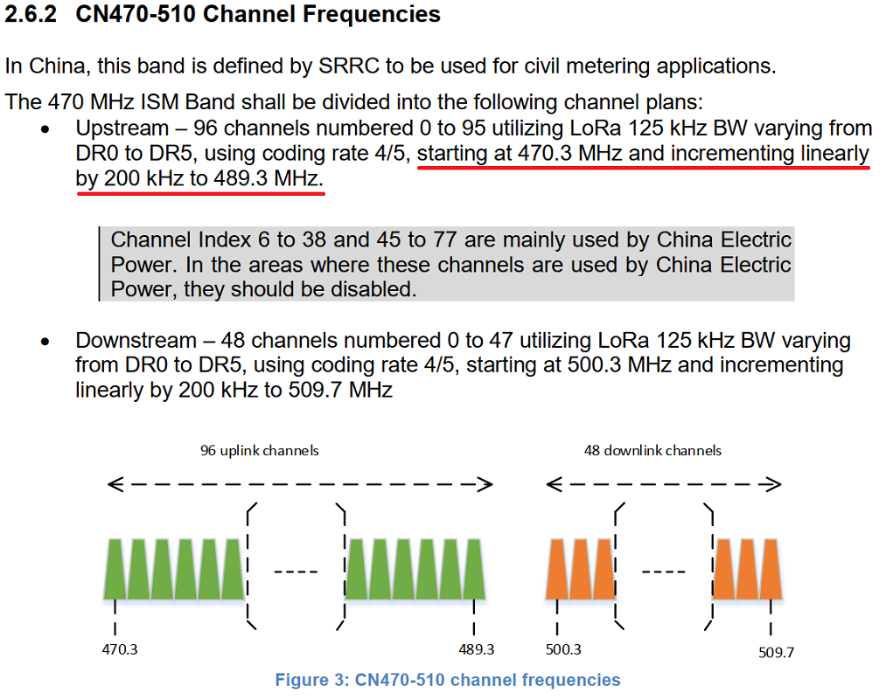

#  	LoRa Node Connect to a Single/Dual Channel Gateway

{ht_translation}`[简体中文]:[English]`

## Summary

This article aims to describe how to connect nodes to a non-standard gateway less than 8 channels (such as a sigle channel gateway and [Heltec HT-M00 Dual Channel Gateway](https://heltec.org/project/ht-m00/)). The key to a succcess communication between the node and the gateway: **The sending/listenig frequency between the gateway and Node must match!!!**

This document have a detailed introduction to the channel mask, highly recommend read it carefully and that will make sense: [LoRaWAN example Sub-Band usage (AU915)](https://heltec-automation-docs.readthedocs.io/en/latest/general/sub_band_usage.html).

```{Tip} If the node channel is more than the gateway channel and the gateway channel is included, then the node channel can only enter the network when the node channel matches the gateway channel. If the node channel does not include the gateway channel, the node cannot enter the network.

```

&nbsp;

## Communication Channels and Frequencies

In the LoRaWAN protocol, the uplink and downlink frequencies of each band are defined in detail. These frequencies used are called channels. For reference, we have intercepted the description of the CN470-510 channel definition in the protocol document.



CN470 corresponds to a total of 96 channels from 470.3MHz to 489.3MHz. For every 200kHz increase in frequency, the channel code increases by 1, namely:

`freq(MHz)=470.3+0.2*N`

In the code of loramac-node, the content in the `userChannelsMask` array corresponds to the communication channel. A bit set to 1, means that the channel is enabled.

In the [Heltec ESP32 LoRa](https://heltec.org/proudct_center/lora/lora-node/) and [CubeCell](https://heltec.org/proudct_center/lora/cubecell/) example code, we had moved the `ChannelsMask` definition to the `.ino` files.


In the default definition had enabled channels 0~7, and if node use band CN470, that means the node send date will use 470.3~471.7 MHz, and lestenning downlink message will use 500.3~501.7 MHz.

If the code become to this, what  channels will be?

`uint16_t userChannelsMask[6]={ 0x0000,0xFFF0,0x0000,0x0000,0x0000,0x0000 };`

The answer is **Channels 21~32**.

&nbsp;

## Instructions for Use

Generally speaking, to connect a node to a Single/Dual-channel gateway, we need to make the channel used by the node correspond to the channel of the Single/Dual-channel gateway!

- Example 1 -- Connect to [Heltec HT-M00 Dual-Channel Gateway](https://heltec.org/project/ht-m00/)

If the HT-M00 is setted to 472. 1 and 472.3 (channels 10, 11), the `ChannelsMask` should be:

`uint16_t userChannelsMask[6]={ 0x0600,0x0000,0x0000,0x0000,0x0000,0x0000 };`

- Example 2 -- Connect to a single channel gateway

The single channel getaway is setted to 470.7 MHz (channel 3), the `ChannelsMask` should be;

`uint16_t userChannelsMask[6]={ 0x0004,0x0000,0x0000,0x0000,0x0000,0x0000 };`


## Relevant Resources

- [Fix Preamble Length to Fit HT-M00 Dual-Channel Gateway](https://heltec-automation-docs.readthedocs.io/en/latest/gateway/frequently_asked_questions.html#fix-preamble-length-to-fit-ht-m00-dual-channel-gateway)
