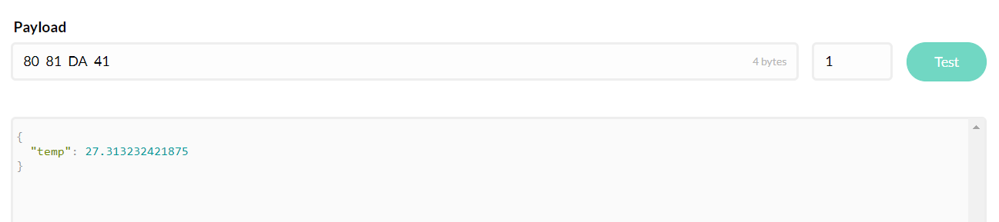
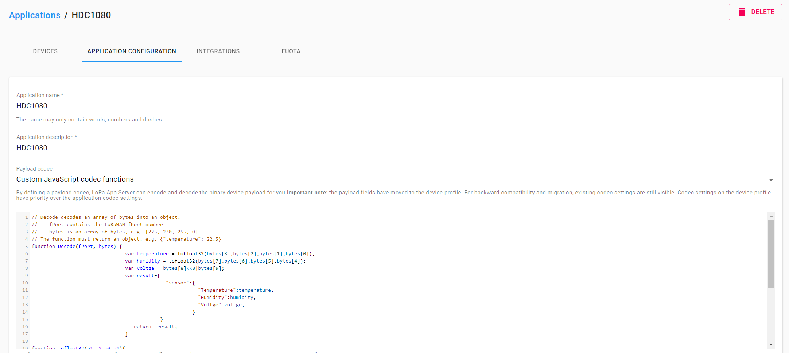

# How to Decode Payload Data
{ht_translation}`[简体中文]:[English]`
## Why need decode messages?

Suppose you have a very high accurate sensor, for example, the measured data is 27.313232421875, if send this data via string like `char data[] = "27.313232421875"`, Has the following disadvantages:

- It spends more bytes *(in this example, it will spend 15 bytes)*;
- Convert float to char process consumes a lot of computing resources.

Everyone knows that `float` data occupies 4 bytes in memory, and `unsigned int` data occupies 2 bytes. If transmit in byte `80 81 DA 41`, only spend 4 bytes! It can perfectly avoid the above disadvantages. But the data in byte format is hard to read for people, this may cause a lot of trouble for the debugging process. So we need to restore byte data to float.

## Decode payload data in TTN

In the `Applications -> Node name -> Payload Formats -> decoder` section, add following `js` script:

```js
function Decoder(bytes, port) {

  function bytesToFloat(bytes) {
    //LSB Format (least significant byte first).
    var bits = bytes[3]<<24 | bytes[2]<<16 | bytes[1]<<8 | bytes[0];
    var sign = (bits>>>31 === 0) ? 1.0 : -1.0;
    var e = bits>>>23 & 0xff;
    var m = (e === 0) ? (bits & 0x7fffff)<<1 : (bits & 0x7fffff) | 0x800000;
    var f = sign * m * Math.pow(2, e - 150);
    return f;
  }  

  return {
    temp: bytesToFloat(bytes.slice(0, 4))
  };
}
```


Now, we can have a try if this decoder running:



That's it!

## Decode payload data in ChripStack

Similar with TTN, add relevant decode script in the `Applications -> Node name -> APPLICATION CONFIGURATION` section:



## Some decode JS examples

Some decode examples are available here: [Decode JS](https://resource.heltec.cn/download/tools/DecodeJS)
