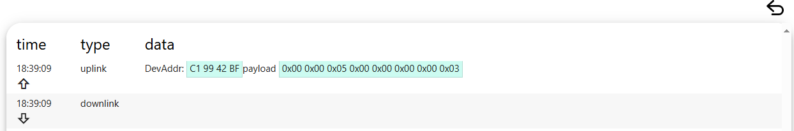
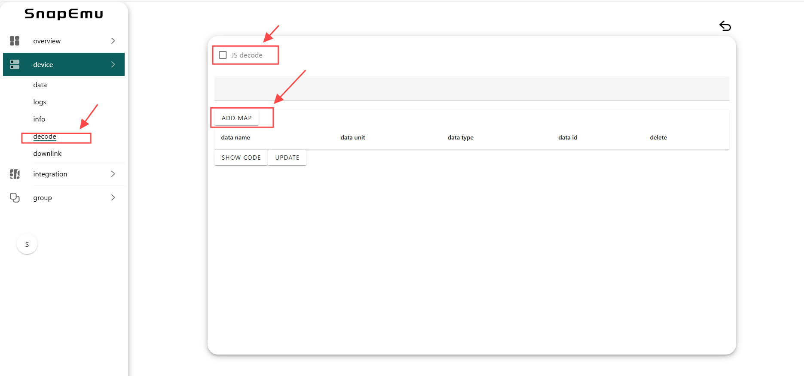
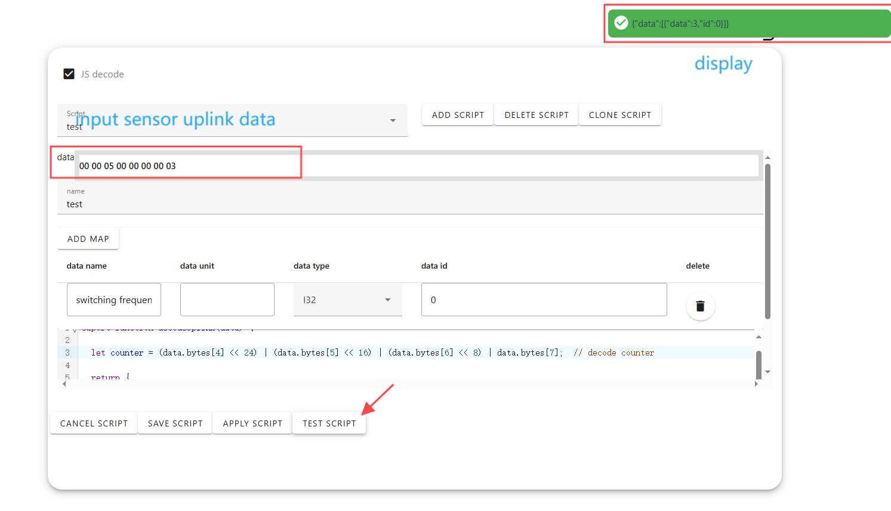
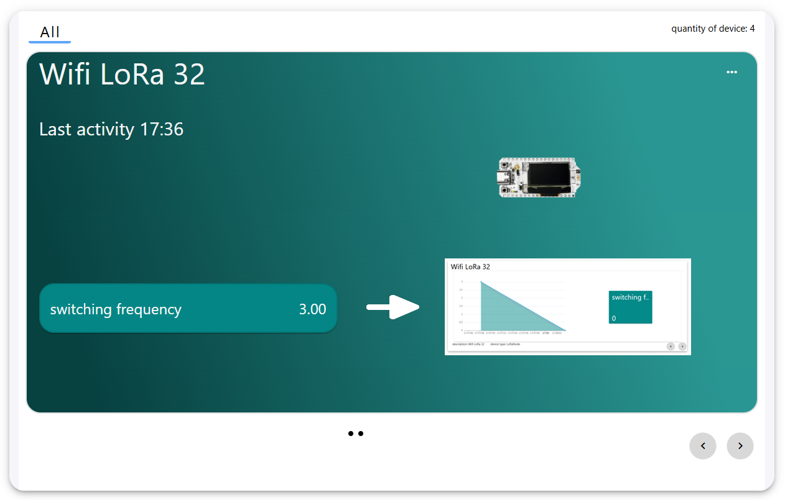

# Custom Sensor Decoding on Snapemu

**The Snapemu platform can automatically decode specified sensors. For sensors that are not within the specified range, it is necessary to encapsulate the data into a [specified format](https://docs.heltec.cn/general/data_format_document.html) and define decoding functions on the platform in order to decode the data.**

Taking Hall sensors as an example.

If the sensor data is successfully encapsulated, the uplinkdata sent can be seen in the device's log.



Add decoding script to the device.



- data name: The data names displayed on the application interface can be customized.
- data unit: The unit of data can be customized.
- data type: Sensor data type.
- data id: It needs to be consistent with the ID returned by the decoding function.

**Note:** *The data name, type, and ID are all required, and the unit is optional.*

The decoding script only needs to define the decoding function. Note that it should be read based on the format of the upstream data packet returned, and the returned ID should be consistent with the above data ID. The code is as follows.

```
export function decodeUplink(data) {
  
  let counter = (data.bytes[4] << 24) | (data.bytes[5] << 16) | (data.bytes[6] << 8) | data.bytes[7];  // decode counter

  return {
    data: [
      { data: counter, id: 0 }  // Return the count value and identifier
    ]
  };
}
```

`Input sensor uplink data` and `Click TEST SCRIPTt`. Decoding successful, the return value will be output in the upper right corner.



`Click APPLY SCRIPT` The data will be displayed on the application interface, and clicking on the data will also bring up the corresponding line chart as shown in the figure.

