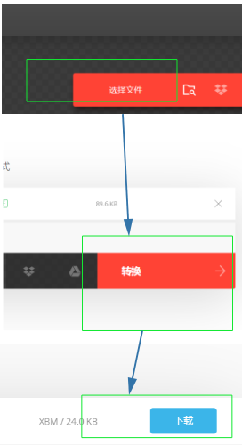
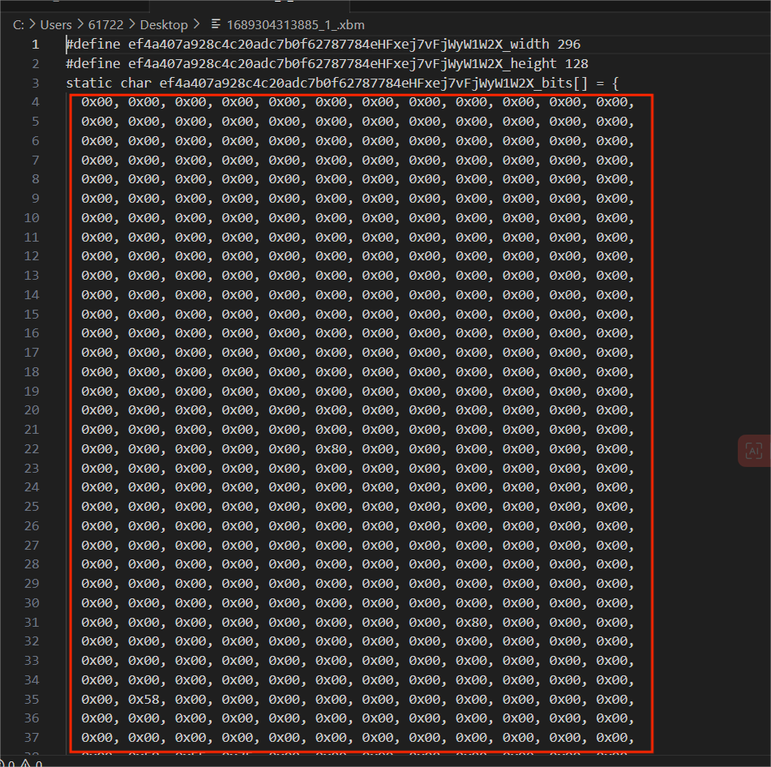
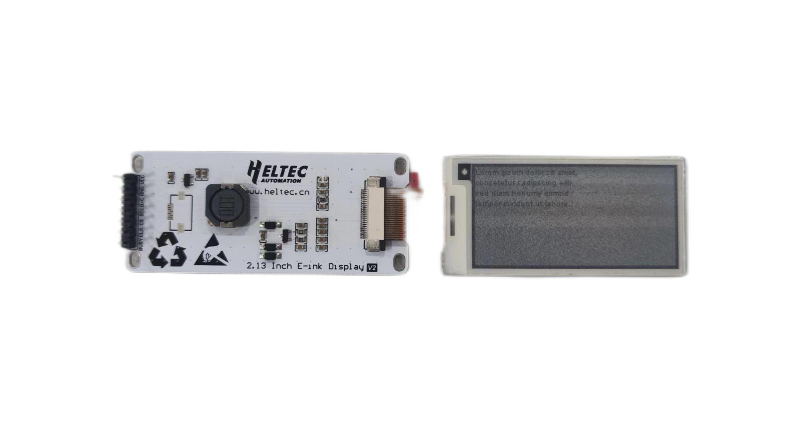
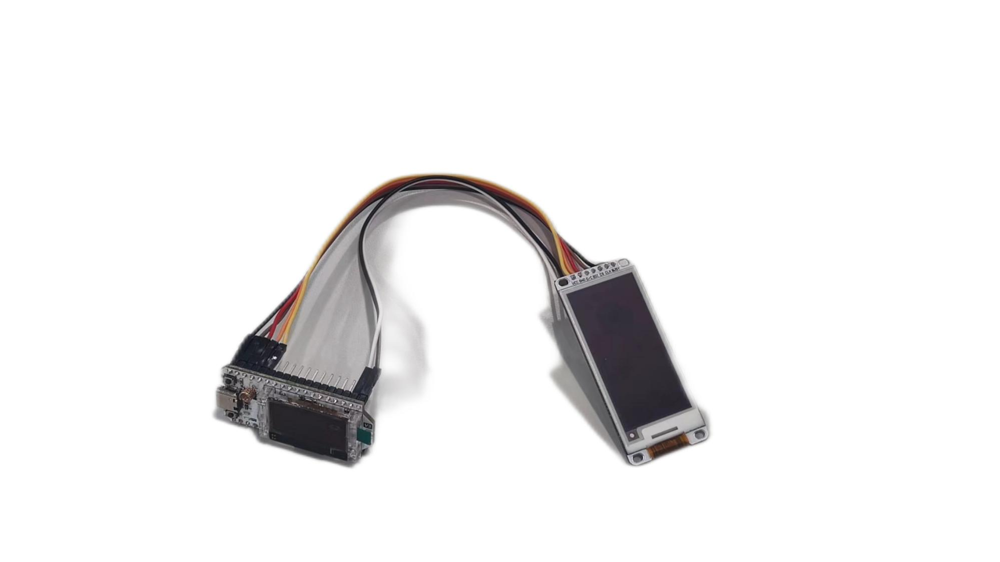
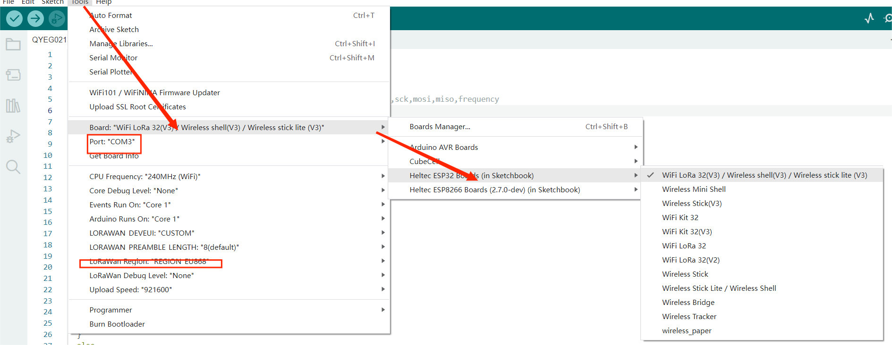
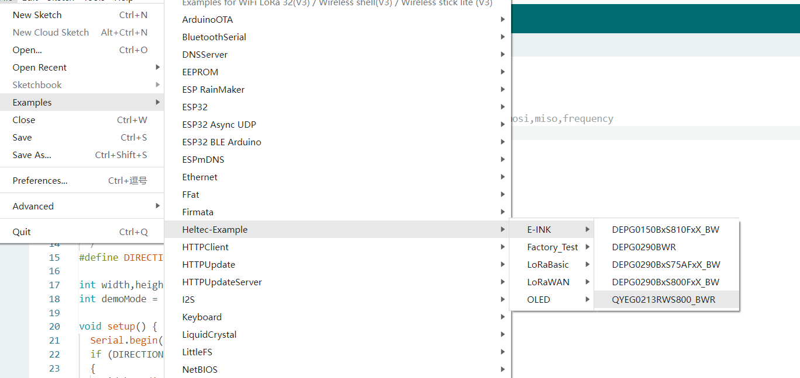
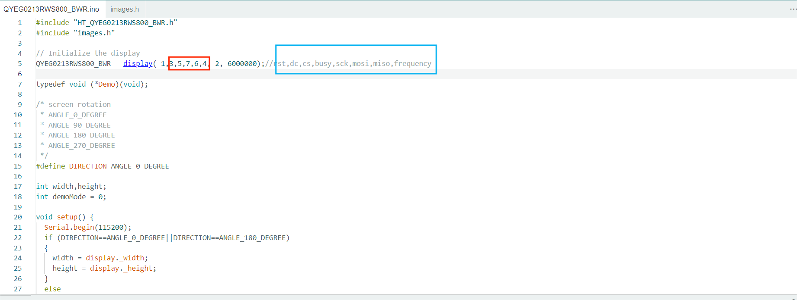
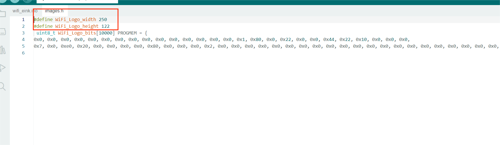

# How to Refresh E-ink

{ht_translation}`[简体中文]:[English]`

## Summary

This topic aims to describe refreshing the E-ink with Arduino and the code provided by us.


## Image coding
```{Tip} Some screen does not support grayscale, so when making the image, you will need to convert it to a pure black and white image, the image resolution cannot be larger than the screen resolution.

```
Using code refresh E-ink, you'll need a tool for image transcoding, in this case [**Convertio**](https://convertio.co/zh/xbm-converter/).

+ Open **Convertio**: https://convertio.co/zh/xbm-converter/, and select the image that needs to be taken, 



+   Copy and save the code in the red box you get as shown below.



## Connect the development board with E-ink
Here, take [WiFi LoRa 32 V3](https://heltec.org/project/wifi-lora-32-v3/) and [2.13 inch black and white red E-ink](https://heltec.org/project/213-e-ink/) as an example.
### Connect the driver board with E-ink
The development board with E-ink needs to pass through the driver board. [Heltec](https://heltec.org/product_center/e_inkpaper/) has a number of Einks already integrated with driver boards.



### Connect the development board with driver board

Connect the `BUSY`, `CLK`, `CS`, `SDI`, `D/C`, `GND`, `VCC` pins on driver board to the `GPIO7`, `GPIO6`, `GPIO5`,` GPIO4`, `GPIO3`, `GND`, `3V3` pins of development board, respectively.



## Downloading the code

### Install development environment
 Install our development environment, `WiFi LoRa 32` was used in the example，go to:[Esp32 Quick start](https://docs.heltec.org/en/node/esp32/index.html).

### Opening the example code
+ Connect `WiFi LoRa 32` to the computer using a TYPE-C wire.
+ Click 'tool' and select board and port.



+ Open the example we provided as shown below.



### Set the pin
+ According to the prompts of the blue box, fill in the pins connected on the development board in the red box section. 'rst' and 'MISO' will not be used in this example, set these two pins to '-1' and '-2'. 
+ Fill in the red box: 3,5,7,6,4.



```{Tip} Do not write '3,5,7,6,4' as GPIO3~GPIO4.

```
### Setting image information
Replace the contents of `image.h` with the file **Convertio** generated earlier, as shown below.

```{Tip} Be careful to fill in the data of Weight and Hight in the red box part of the figure, rather than copying this part directly.

```



Click upload, when the program is uploaded, the image is displayed on E-Ink.