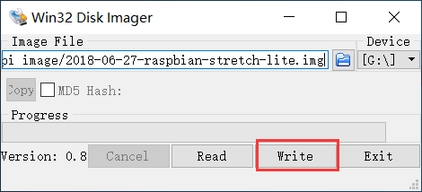
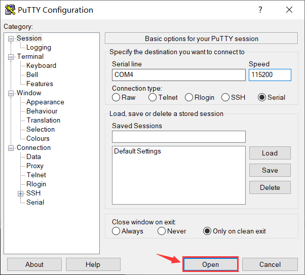
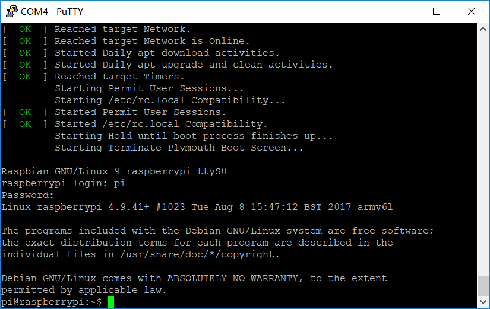
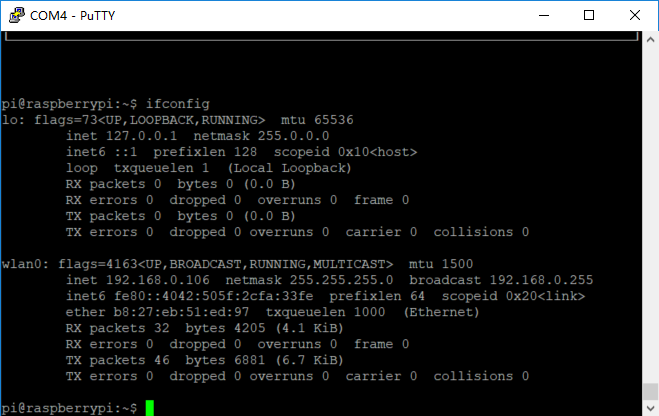
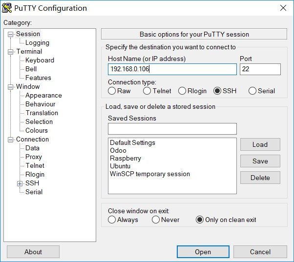

# How to Upload the TF Card Image of Raspberry Pi, Configure Wi-Fi Access, SSH Connection
{ht_translation}`[简体中文]:[English]`

Users can also refer to [Raspberry Pi official quick start manual](https://projects.raspberrypi.org/en/projects/raspberry-pi-setting-up/2).

## Prepare Related Tools
- [SD Formatter](http://resource.heltec.cn/download/tools/SD_Formatter.zip) *(It's not necessary，If you need to format the TF card with an existing Raspberry Pi image, You need this tool.)*
- [Win32DiskImager](http://resource.heltec.cn/download/tools/Win32DiskImager.zip) *(Image upload tool)*
- [Raspberry Pi image file](https://www.raspberrypi.org/downloads/raspbian) *(It is recommended to use the "Raspbian Buster Lite" version, it has no graphical interface, can save resources better.)*
- [Putty](https://www.chiark.greenend.org.uk/~sgtatham/putty/latest.html) (System connection tool of Raspberry Pi)
- Micro TF card with more than 4G memory, card reader.


## Upload Raspberry Pi Image

Using `Win32DiskImager` to upload Raspberry Pi image.



The speed of image upload depends on the performance of TF card. After uploading, You can see a `boot` letter of about 42.5MB in "my computer", open the `config.txt` file and add the following line at the end(Open serial port to print log) :

`enable_uart=1`

&nbsp;

## Start Raspberry Pi

Configure putty as shown in the following picture. The port number (COM1) should correspond to the serial port number in the device manager. The default baud rate is 115200:

]()

Before starting Raspberry Pi, lead out the serial port of Raspberry Pi, connect to the computer through USB serial port module(If you have already purchased [Raspberry Pi - - HT-M01 special adapter board](https://heltec.org/product/m01-converter), you do not need additional USB serial port module)


If everything is normal, you can see the log information of Raspberry Pi startup in putty serial port.

Default user name and password:

user name：`pi`

password：`raspberry` *（In Linux system, the process of entering password through command line can not see any change）*




## Connect to WIFI

Enter the following command in putty:

`sudo nano /etc/wpa_supplicant/wpa_supplicant.conf`

Add WiFi configuration information at the end of it:

```shell
network={
  ssid="Your WiFi name"
  psk="Your WIFI password"
}
```

`ctrl + O` -- Preservation，`ctrl + X ` -- Sign out. Restart Raspberry Pi. If everything is normal, Raspberry Pi will automatic connect to the corresponding WiFi after restart, and will print the IP address in the startup log.




## Configure SSH to Realize LAN Login

`sudo raspi-config` Open the Raspberry Pi configuration menu；

`Interfacing Options --> SSH --> YES` Activate the SSH login option. At this point, we can log in to Raspberry Pi through the network in the LAN environment :




