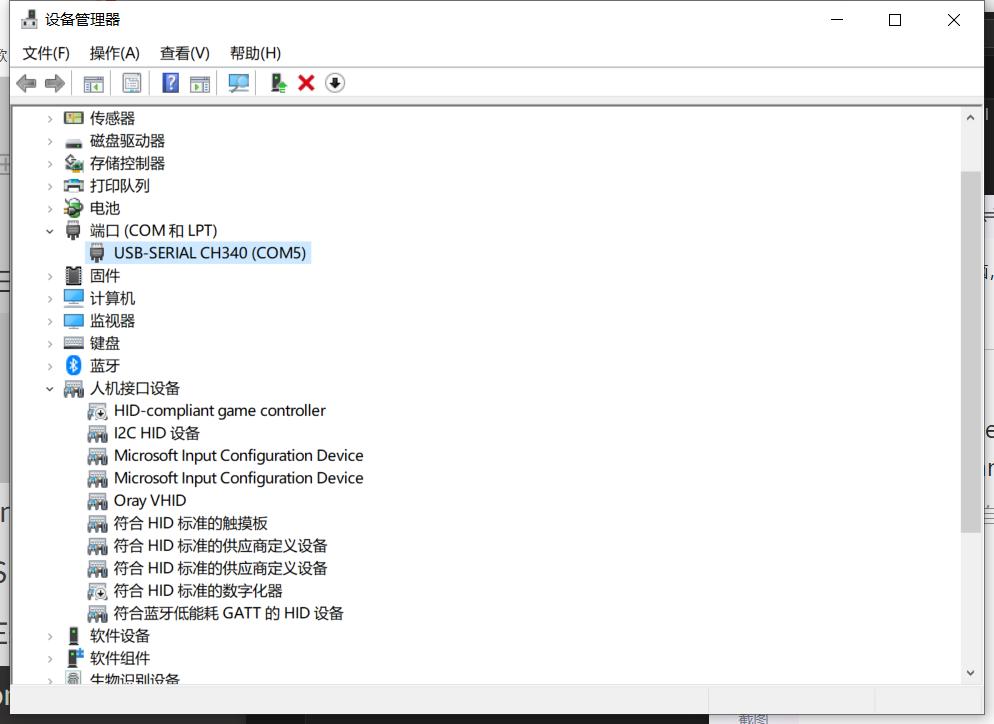

# How to install MicPython Firmware Via Thonny
{ht_translation}`[简体中文]:[English]`

Download the firmware from the [MicPython](https://micropython.org/download/) official website according to the chip model，Be careful to select the `bin` file.


Connect the development board to the computer, and open the device Manager --> port, confirm the port number of your device.



```{Tip} To make sure your device is visible to the computer, you may need to install a driver or use some tools. If you have any questions, please contact us: support@heltec.cn.
```

Please go to [Thonny](https://thonny.org/) website to download and install the software.


To run Thonny, follow the image below:


Select the firmware you just downloaded


