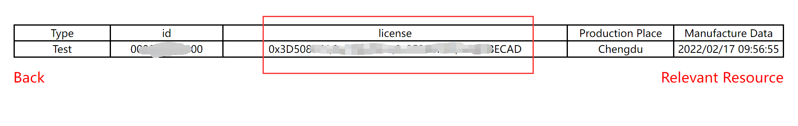

# How to Use License

## Summary

The license is generated by the chip ID through a special algorithm and used for the LoRa code related to HelTec.

During the factory test, we have written the corresponding license to FLASH. Generally, we do not need to write the license again. When you use LoRa code, if the following occurs, you need to write the license again. When the LoRa code is downloaded, the code does not run successfully, and the chip ID appears on the serial port and stops here. 

&nbsp;

## How to Obtain License

- Refer to [this document](https://docs.heltec.org/general/view_limited_technical_data.html#how-to-get-chip-id) to get the chip ID.
- Enter“ https://resource.heltec.cn/search ", enter your 12-digit chip ID in the box, and click" Confirm ".

- Save the 32-bit license in the figure.

&nbsp;

## Write the License to FLSAH

In some LoRa codes, the interface of license is reserved. Please copy the license into the code in the following format and upload the code to the development board.

In some LoRa codes, the license interface is not reserved. You can send corresponding instructions through the serial port. After the serial port prints the chip ID, send the command "AT+CDKEY=xxxxxxxxxxxxxxxxxxxxxxxxxxxxxxxx" through the serial port to activate the gateway. Where, "xxxxxxxxxxxxxxxxxxxxxxxxxxxxxxxx" is a 32-bit license. For example, if the license is “0x12345678, 0x12345678, 0x12345678, 0x12345678”, the activation command is “AT+CDKEY=12345678123456781234567812345678”. 

When the serial port prints "The board is active", it indicates that the development board is activated successfully.