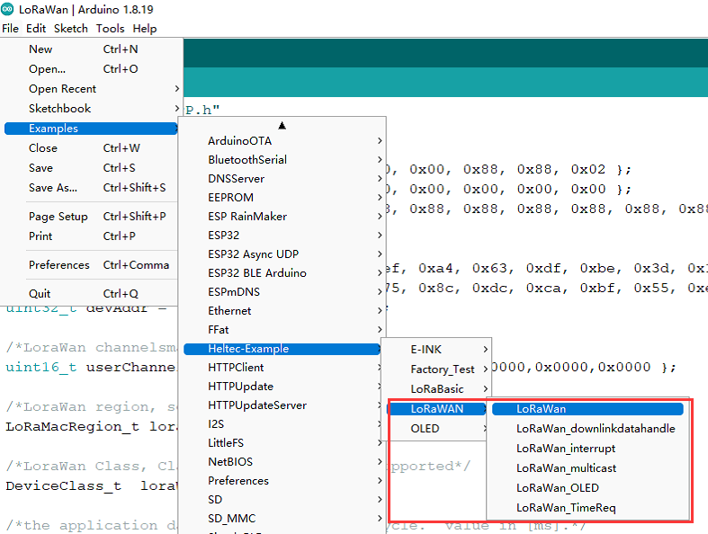
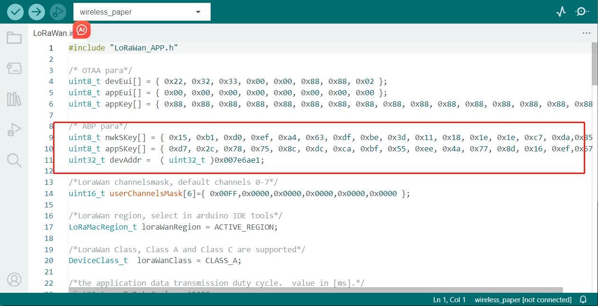
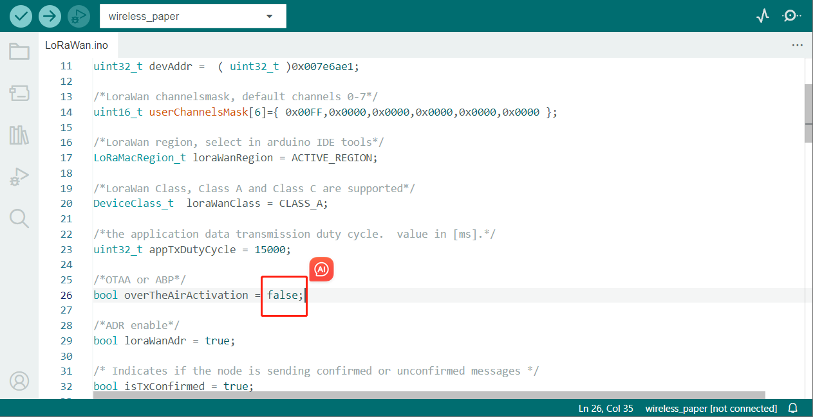

Config Parameter
================
{ht_translation}`[简体中文]:[English]`

## Preparation

The configuration of LoRaWAN is detailed in various series of instructions, so make sure you read the following links, In this topic, we will focus on the difference between ABP and OTAA.

[ESP32 Series LoRaWAN](https://docs.heltec.org/en/node/esp32/esp32_general_docs/lorawan/index.html);

[ASR650x LoRaWAN](https://docs.heltec.org/en/node/asr650x/asr650x_general_docs/lorawan/index.html);

[STM32 Series LoRaWAN](https://docs.heltec.org/en/node/stm32/general_docs/lorawan/index.html);

[Sufficent IoT LoRaWAN](https://docs.heltec.org/en/node/sufficient_iot_hub/sufficient_iot_application.html).

```{TIP} HT-AT62 and HT-RA62 please refer to [STM32 Series LoRaWAN](https://docs.heltec.org/en/node/stm32/general_docs/lorawan/index.html)

```

## Configure Parameters
Let's take `File -- Examples -- Heltec-Example -- LoRaWAN -- LoRaWAN` as an example.



Enter the parameters to be configured for ABP in the positions marked in the following figure.



Enter `false` as shown below, which means that the code selects ABP.



## other options
There are some options in the Arduino Tools menu.

```{Tip} This section is the same as OTAA, please refer to the link given at the beginning of this topic depending on your device.

```

