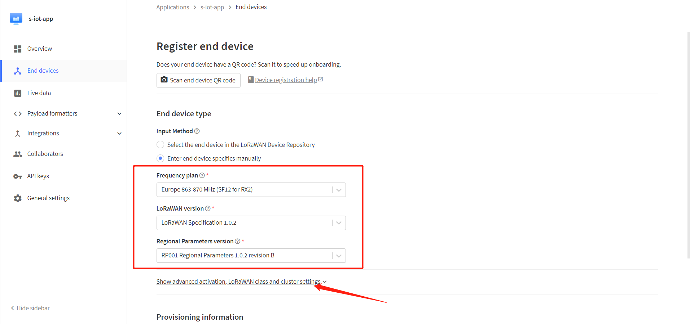
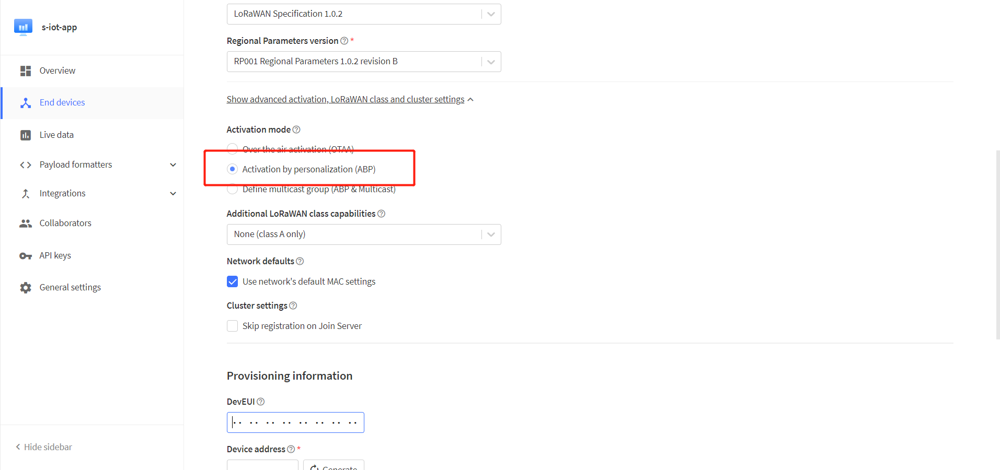
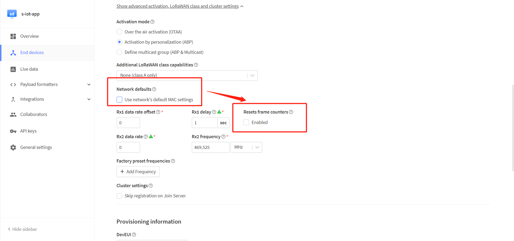
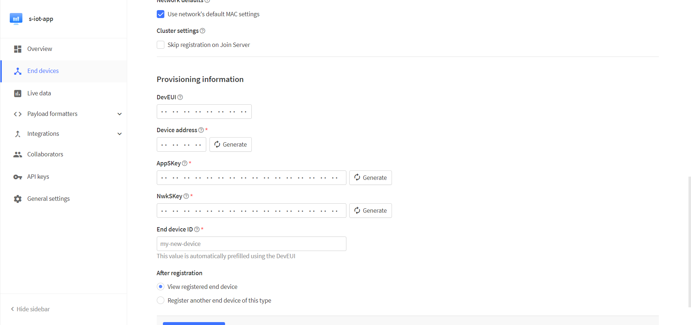
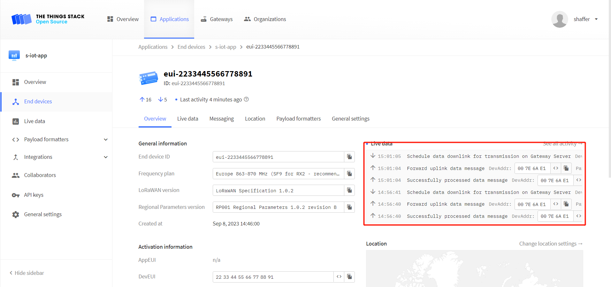

# Connect to TTN/TTS

Before that, make sure there is a LoRa Gateway active in your [TTN](https://console.thethingsnetwork.org/)/[TTS](https://lora.heltec.org/console) account.

## Register a device

Register a new device in TTN or TTS “Applications” page. Select the frequency plan and LoRaWAN version.At this point, click the location shown in the image below



Select ABP mode.



Notice the option `Network defaults`. The `Resets frame counters` is not enabled by default, which will cause your device to need to be re-registered with the server after power failure, so we recommend you select `Enable`.



Fill in the corresponding parameters in the pop-up options.

```{tip} DevEui is free to fill in the code is not affected, but we recommend that you use the ID provided by the device, so as not to cause confusion.
```



After registration is complete, if all is well, you will see the device active.



## Important Hints

Please double check the following two things:

1. The LoRaWAN parameters is the same as server!
2. The listening frequency of your LoRa Gateway is the same as ESP32 LoRa node's sending frequency. We strictly follow [LoRaWAN™ 1.0.2 Regional Parameters rB](https://resource.heltec.cn/download/LoRaWANRegionalParametersv1.0.2_final_1944_1.pdf);

