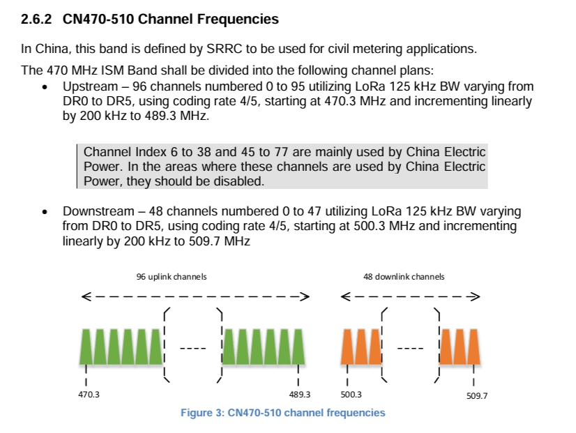

#  LoRaWAN System Parameter Description
{ht_translation}`[简体中文]:[English]`

LoRaWAN is a complete set of encrypted wireless communication protocol, and the operating status of the system is directly related to its parameter configuration.

## 1. Parameters on the Arduino Tools Menu
If you had correctly installed Heltec ESP32 Arduino development framework, you can see the following options on the tools menu.


- **LoRaWAN DevEUI** – You can recognize this is the unique ID (Mac address) of a LoRaWAN node device, this option determines where the `DevEUI` of the device comes from.
  - `CUSTOM` -- Use the value defined in the devEui array, which is in the .ino file, Can be any value, but it may conflict with other device, not recommend use in a public LoRaWAN NS.
  - `Generate by ChipID` -- Generated based on the ESP32's unique Chip ID.
  
- **LoRaWAN Preamble Length** – The length of the preamble in LoRaWAN communication. Just keep the default 8-bit, 16 bit is for Heltec's single/dual channel gateway.

- **LoRaWAN Region** – LoRaWAN protocol region definition, strictly follow [LoRaWAN™ 1.0.2 Regional Parameters rB](https://resource.heltec.cn/download/LoRaWANRegionalParametersv1.0.2_final_1944_1.pdf), the [LoRaWAN Frequency Plans and Regulations by Country/Region](https://docs.heltec.org/general/lorawan_frequency_plans_by_country.html) also make sense to you.

- **LoRaWAN Debug Level** – LoRaWAN relevant logs print by serial port.
  
  - `None` -- Default.
  
  - `Freq` -- Sending/receiving frequency.
  
  - `Freq && DIO` -- Sending/receiving frequency, and DIO pin interrupt information.
  - `Freq && DIO && PW` -- Sending/receiving frequency, DIO pin interrupt information, and low power status.
  
- **Slow Clk Type (only for LoRaWAN)** – The clock source of LoRaWAN timer.
  - `Internal (default)` -- Use ESP32's internal RTC crystal oscillator.
  - `External 32K` -- Use external 32.768 KHz crystal oscillator as the timer source, it's more friendly for low power features.

## 2. Some Parameters on the Code

You may see some parameters on the application source code like this.


- **LoRaWAN Net mode** – OTAA (Over The Air Activation)
  
  - `DevEUI` -- 8 bytes, device's **unique** ID, like a Mac address.
  
  - `AppEUI` -- 8 bytes, also called `JoinEUI` on some NS, the identifying of the join server during the OTAA process, devices in the same group can be set to be the same.
  
  - `AppKey` -- 16 bytes, whenever an end device joins a network via OTAA, the `AppKey` is used to derive the session keys `NwkSKey` and `AppSKey` specific for that end device to encrypt and verify network communication and application data.
  
- **LoRaWAN Net mode** – ABP (Activation By Personalization)
  
  - `DevAddr` -- A 32-bit device address assigned by the Network Server to identify the end device within the current network.
  - `NwkSKey` -- 16 bytes, used to encrypt data, verify data integrity, and establish secure network sessions.
  - `AppSKey` -- 16 bytes, used to encrypt and decrypt application payloads in data messages for ensuring message confidentiality.
  
- **LoRaWAN User Channel Mask** – The LoRaWAN node protocol had defined the uplink/downlink frequency for each channel (*Please refer to [LoRaWAN regional regulations](https://resource.heltec.cn/download/LoRaWANRegionalParametersv1.0.2_final_1944_1.pdf)*), because the LoRa Gateway often comes with 8 channels, so the LoRa Node should working on the same 8 contiguous frequency channel. Such as the `CN470` frequency channel definition.
  
  
  
  - Example 1 -- In `CN470`, there are 96 up link channels, there are 6 x 16-bit data in the `userChannelsMask` array, which is corresponding to 0 ~ 95 channels, match from **left to right** and **low to high**. Set 1 to be valid and 0 to be invalid. If you want to set the channel 0 ~ 7, the array should be set like following.
  
    ```
    uint16_t userChannelsMask[6]={ 0x00FF,0x0000,0x0000,0x0000,0x0000,0x0000 };
    ```
  
  - Example 2 -- In `CN470`, If you want to set the channel from 16 to 23, the array should be set like following.
  
    ```
    uint16_t userChannelsMask[6]={ 0x0000,0x0000,0x00FF,0x0000,0x0000,0x0000 };
    ```
  
  - Example 3 -- In `CN470`, If you want to set the channel from 88 to 95, the array should be set like following.
  
    ```
    uint16_t userChannelsMask[6]={ 0x0000,0x0000,0x0000,0x0000,0x0000,0xFF00 };
    ```
  
    
  
- **LoRaWAN Class** –Now with Class A and Class C supported. 
  
  - `Class A` -- Only opens two receiving windows after the uplink to receive the downlink from the gateway, and the low power consumption characteristics are better.
  -  `Class C` -- The receiving window is always open, and the real-time and flexibility of the communication mode are better, but the low power consumption is not good.
  
- **LoRaWAN AppTxDutyCycle** – Used to limit how often a device can send data within a certain time window.

- **LoRaWAN ADR** – The Adaptive Data Rate is related to the distance of communication, and the shorter the distance, the higher the rate.

- **LoRaWAN isTxConfirmed** – Used to indicate whether the device has sent an acknowledgment of data. If this parameter is set to `true`, the node will receive acknowledge from gateway, as shown in the figure. 

  
  
  
  
   


