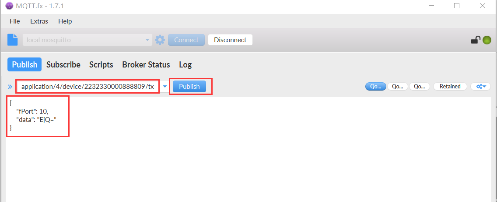
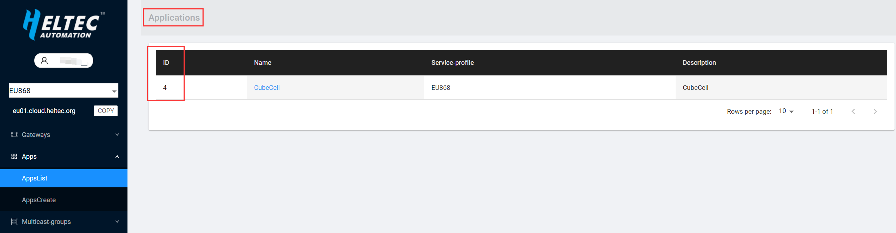

# Publish MQTT Message
{ht_translation}`[简体中文]:[English]`

Before operation, make sure that the gateway and node are connected, and the gateway and node can work normally.

&nbsp;

## MQTT Connect to Cloud Server

- Open "MQTT.fx" and click the Settings button to configure the connection information.


- Configure related information as shown in the figure below. Among them, "Broker Address" is the address of the server connected by the gateway, "Broker Port" is 1883 by default, and "Client ID" can be randomly generated by clicking "Generate". And configure the login account and password.


- After the configuration is complete, click "Connect" to connect.


- After the connection is successful, you can see a green dot on the right.


&nbsp;

## Publish MQTT Message

- Configure topic information.

  

  - Among them, "application/4/device/2232330000888809/tx" correspond to "application/[application ID]/device/[DevEUI]/[event type]" respectively.

  

  

  - The published data is as follows:

    ```shell
    {
        "fPort": 10,    //Port used(fPort > 0)
        "data": "EjQ="  //Published data
    }
    ```

  - The published data needs to use Base64 encoding. As shown below.


- After editing the published data, click "Publish", and you can see the published data in the serial port print of the node.

