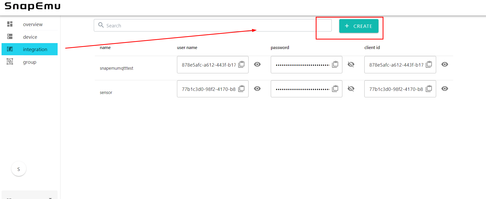
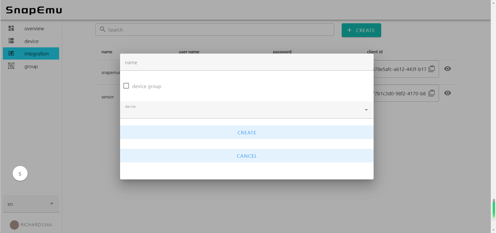
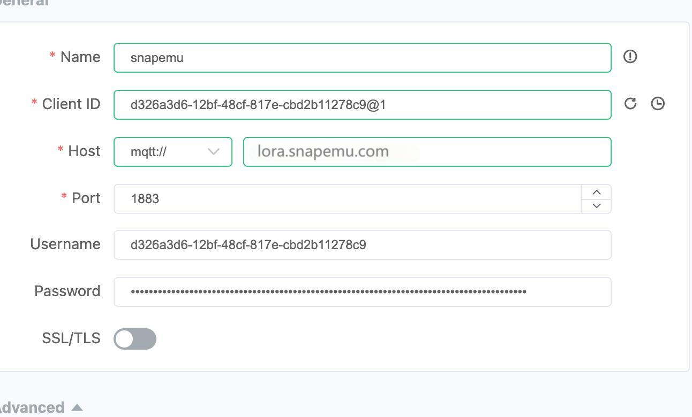

# Subscribe MQTT Messages from SnapEmu
{ht_translation}`[简体中文]:[English]`

## Create Topics
Open the integration screen, create authentication information.



Enter the custom name and select which device to receive data from (if device group is checked, the device group will be selected, and all device data in the device group can be received).



Fill in the authentication information on the mqtt client side.



``` {Note} The client id is separated by an @, and the information after the @ at the end can be customized.
```

## Subscribe to Topics
For all data: device theme /v1/device/{username}/decode, device group theme
/v1/group/{username}/decod 

```
{
	"bytes": "BAAKAmMQo0EStVIJQgAAAgU8",
	"device": "d326a3d6-12bf-48cf-817e-cbd2b11278c9",
	"battery": 66,
	"eui": "FFFFFFFFFFFFFFFF",
	"charge": false,
	"data": [
		{
 		"data": 34.44215774536133,
 		"data_id": 65,
 		"v_type": "F32",
 		"v_unit": "°C",
 		"v_name": "Temperature"
		}
 	]
}
```

For data in a prescribed format, There are themes: ' /v1/device/{username}/data/{data_id}'

```
	data_id = (sensor_id << 4) | pk_id ;
```

sensor id is the sensor id and pk id is the packet id

```
{
 	"bytes": "xcQJQg==",
	"data": 34.44215774536133,
	"data_id": 65,
 	"device": "d326a3d6-12bf-48cf-817e-cbd2b11278c9",
	"pk_id": 1,
	"s_id": 4,
 	"v_type": "F32"

}
```

