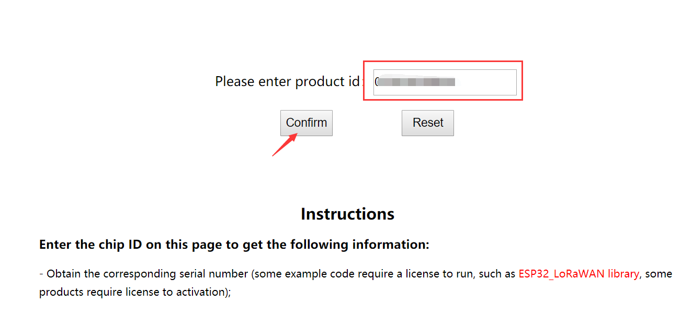
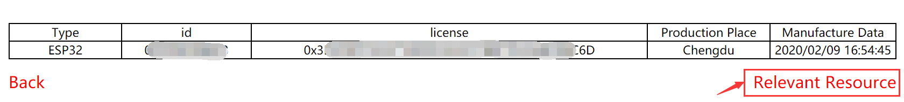
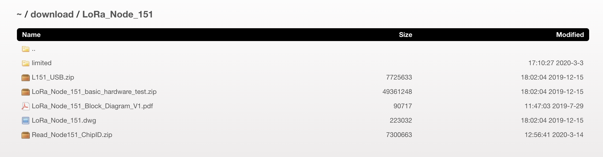
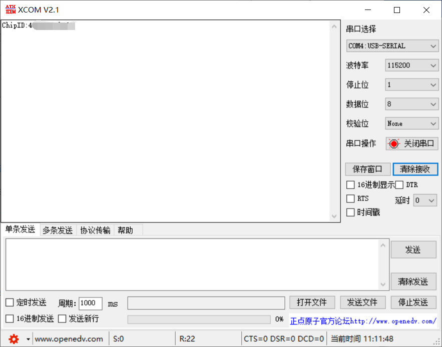
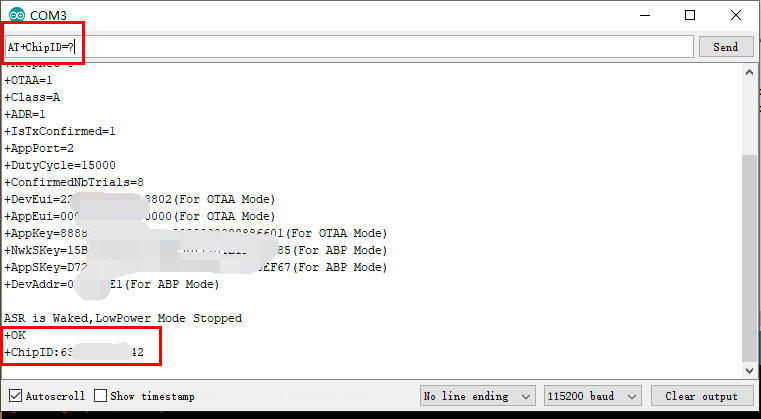
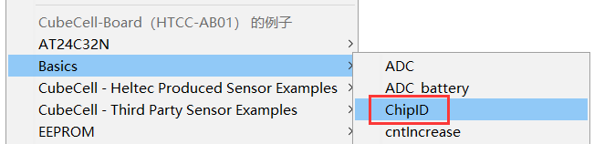

# Get Limited Technical Resources
{ht_translation}`[简体中文]:[English]`

We released all relevant resources in [GitHub](https://github.com/HelTecAutomation) or [Resource Page](http://resource.heltec.cn/).

Some technical data ara special for Heltec produced products, it's not shown public, these relevant resources will become downloadable with the products' Chip ID. At the same time, the Chip ID can also be used to identify authenticity

## Get Limited Resources via Chip ID

Limited resources will become downloadable with products' Chip ID, that's an unique ID.

Input the Chip ID in [http://resource.heltec.cn/search](http://resource.heltec.cn/search), and click `Confirm` .



&nbsp;

There with show some basic informations about this board, click `Relevant Resource`.

``` {Tip) The license in this page is also useful, such as ESP32 + LoRa series, the ESP32_LoRaWAN library need this license to active.

```




Now, will be bring to the products' download page. the files in the limited folder will become downloadable.



**About in the winter of 2018, we began to not fully manage the chip ID. Some previous product Chip ID has not been synchronized to this database. Anyway, users can mail to [support@heltec.cn](mailto:support@heltec.cn), we will regenerate one for you.**


## How to Get Chip ID

The products' Chip ID is relative to the onboard MCU, each MCU have an unique ID.

- [ESP32 Core](esp32-lora-series)
- [STM32 Core](stm32-series)
  - [LoRa Node 151](lora-node-151)
  - [Turtle Board](turtle-board)
- [CubeCell Series (ASR650x Core)](cubecell-series)

(esp32-lora-series)=
### ESP32 (+ LoRa) Series

Make sure you have already installed the [Heltec ESP32 Library](https://github.com/HelTecAutomation/Heltec_ESP32). The library relies on the [Heltec ESP32 Framework](https://github.com/Heltec-Aaron-Lee/WiFi_Kit_series) or the [Espressif-Arduino framework](https://github.com/espressif/arduino-esp32).

Demo code: [Chip ID read example](https://github.com/HelTecAutomation/Heltec_ESP32/tree/master/examples/ESP32/GetChipID).


After uploading this sample code, the Chip ID will be printed via serial port:


(stm32-series)=
### STM32 series

This [Heltec STM32+LoRa Series Quick Start](https://heltec-automation-docs.readthedocs.io/en/latest/stm32/quick_start.html) maybe helpful for the following operations.

(lora-node-151)=
#### LoRa Node 151

[How to Download Firmware to LoRa Node 151](https://heltec-automation-docs.readthedocs.io/en/latest/stm32/lora_node_151/download_firmware.html)

[LoRa Node 151](https://heltec.org/project/lora-node-151/) use STM32L151CCU6, download this firmware into the LoRa Node 151:

[http://resource.heltec.cn/download/LoRa_Node_151/L151_Read_ID.zip](http://resource.heltec.cn/download/LoRa_Node_151/L151_Read_ID.zip)

Then the Chip ID will be printed via the virtual serial port (USB CDC).



&nbsp;

(turtle-board)=
#### Turtle Board

[How to Download Firmware to Turtle Board](https://heltec-automation-docs.readthedocs.io/en/latest/stm32/turtle_board/download_firmware.html)

[Turtle Board](https://heltec.org/project/turtle-board/) use STM32L432KC, download this firmware into Turtle Board:

Then the Chip ID will be printed via the virtual serial port (USB CDC).

&nbsp;

(cubecell-series)=
#### CubeCell Series

Almost all resources for CubeCell are open source. Anyway, users can query the Chip ID via AT command:

```shell
AT+ChipID=?
```



Or via [Get ChipID](https://github.com/HelTecAutomation/ASR650x-Arduino/blob/master/libraries/Basics/examples/ChipID/ChipID.ino) example code: 

