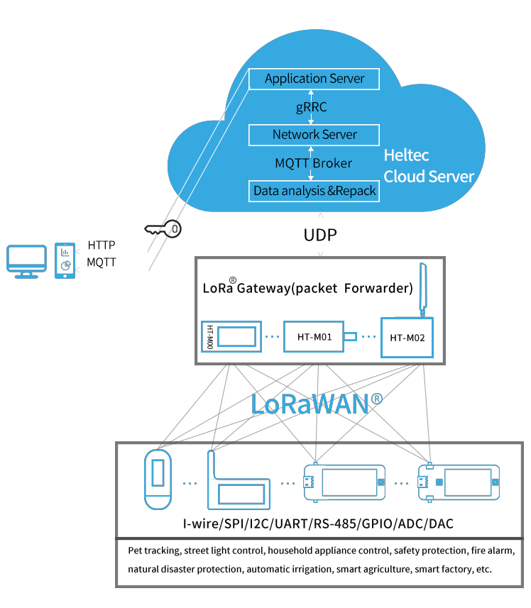

.. main documentation master file, created by
   sphinx-quickstart on Wed Sep 14 09:58:03 2022.
   You can adapt this file completely to your liking, but it should at least
   contain the root `toctree` directive.

Heltec Product Documention
--------------------------

This is the documentation for `Heltec Automation <https://heltec.org>`_ products.

Nodes
-----

==================  ==================  ==================
|CubeCell|_         |ESP32+LoRa|_       |STM32+LoRa|_
------------------  ------------------  ------------------
`CubeCell`_         `ESP32+LoRa`_       `STM32+LoRa`_
------------------  ------------------  ------------------
|ESP32+Arduino|_    |ESP8266+Arduino|_
------------------  ------------------  ------------------
`ESP32+Arduino`_    `ESP8266+Arduino`_
==================  ==================  ==================

.. _CubeCell: /en/node/cubecell/index.html

.. |ESP32+LoRa| image:: img/02.png
.. _ESP32+LoRa: /en/node/esp32/index.html

.. |STM32+LoRa| image:: img/03.png
.. _STM32+LoRa: /en/node/stm32/index.html

.. |ESP32+Arduino| image:: img/04.png
.. _ESP32+Arduino: /en/node/esp32_arduino/index.html

.. |ESP8266+Arduino| image:: img/05.png
.. _ESP8266+Arduino: /en/node/esp8266_arduino/index.html

Gateways
--------

==================  ==================  ==================
|HT-M00|_           |HT-M01|_           |HT-M01S|_
------------------  ------------------  ------------------
`HT-M00`_           `HT-M01`_           `HT-M01S`_
------------------  ------------------  ------------------
|HT-M02_4G/LTE|_    |HT-M02_POE|_
------------------  ------------------  ------------------
`HT-M02_4G/LTE`_    `HT-M02_POE`_
==================  ==================  ==================

.. |HT-M00| image:: img/10.png
.. _HT-M00: /en/gateway/ht-m00/index.html

.. |HT-M01| image:: img/07.png
.. _HT-M01: /en/gateway/ht-m01/index.html

.. |HT-M01S| image:: img/11.png
.. _HT-M01S: /en/gateway/ht-m01s/index.html

.. |HT-M02_4G/LTE| image:: img/08.png
.. _HT-M02_4G/LTE: /en/gateway/ht-m02_4g/index.html

.. |HT-M02_POE| image:: img/09.png
.. _HT-M02_POE: /en/gateway/ht-m02_poe/index.html

General Docs
------------

==================  ==================  ==================
|General Docs|_
------------------  ------------------  ------------------
`General Docs`_
==================  ==================  ==================

.. |General Docs| image:: img/06.png
.. _General Docs: general/index.html

.. toctree::
   :maxdepth: 2
   :caption: LoRa Gateway

   HT-M00 Dual Channel LoRa Gateway <https://docs.heltec.org/en/gateway/ht-m00/index.html>
   HT-M01 Evaluation LoRa Gateway <https://docs.heltec.org/en/gateway/ht-m01/index.html>
   HT-M01S Indoor LoRa Gateway <https://docs.heltec.org/en/gateway/ht-m01s/index.html>
   HT-M01S-V2 Indoor LoRa Gateway <https://docs.heltec.org/en/gateway/ht-m01s_v2/index.html>
   HT-M02 Edge LoRa Gateway <https://docs.heltec.org/en/gateway/ht-m02_poe/index.html>
   SX1301 Module <https://docs.heltec.org/en/gateway/sx1301module/index.html>

.. toctree::
   :maxdepth: 2
   :caption: LoRa Nodes

   CubeCell Series <https://doc-test-vx.readthedocs.io/en/node/cubecell/>
   ESP32 + LoRa <https://docs.heltec.org/en/node/esp32/index.html>
   STM32 + LoRa <https://docs.heltec.org/en/node/stm32/index.html>

.. toctree::
   :maxdepth: 2
   :caption: General Docs

   /general/index

