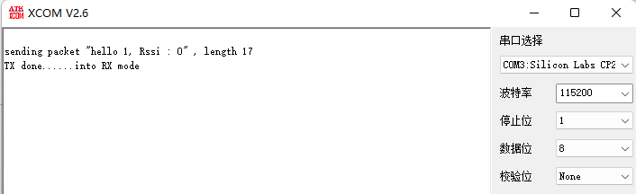
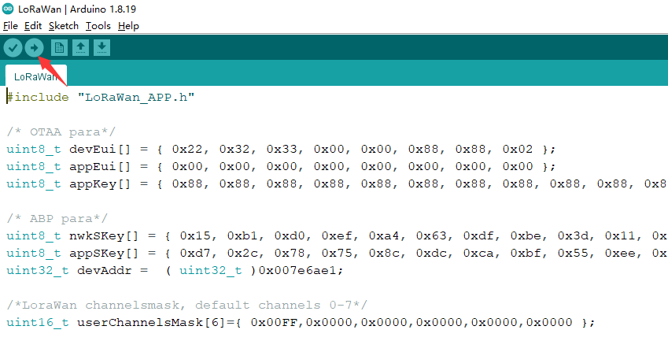

# How to programming a ESP32 Module
{ht_translation}`[简体中文]:[English]`

This document uses Wireless_ Shell as an example.

Wireless_ Shell only have ESP32 and RF relevant circute inside. In order to program it, need connect to a external UART-USB bridge. CH340G, CP2102 etc.

&nbsp;

## 1. Recommend Circuit

Please refer to the recommended circuit design for your circuit.

- **[Recommend circuit ](https://resource.heltec.cn/download/Wireless_Shell/wireless_shell_reference_hardware_design.pdf)**
  - This circuit have an auto boot circuit, can running into bootloader mode automatically.

## 2. Preparation

- Install the ESP32 development framework correctly ([Reference resources](https://docs.heltec.org/en/node/esp32/quick_start.html));
- Connect your redesigned board to a computer, make sure useing a high quality Micro USB cable;
- Use the serial port debugging assistant to open the serial port and check whether the serial port can print information normally.

## 3. Program via Arduino IDE

Open Arduino, select "Tools" ->"Board" ->"Wireless Stick Lite", click "Upload" to start uploading the program. Since the core circuits of Wireless_ Shell and Wireless_Stick_Lite are the same, they can use the same development environment.

