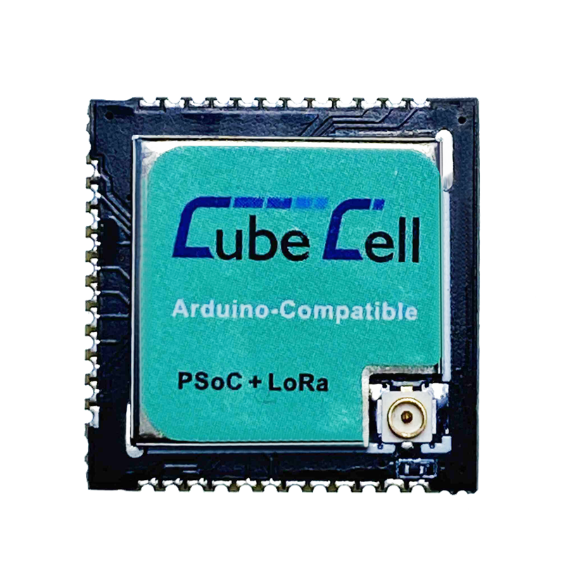

# Hardware Update Logs
{ht_translation}`[简体中文]:[English]`

## HTTC - AM01 Hardware Update Logs

**HTCC-AM01 only have ASR6501 and RF relevant circuit inside. In order to program it, need connect to an external UART-USB bridge. CH340G, CP2102 etc.**

### V1

- First release
- 2017-6-1 public sale
- [Pinout diagram of V1](http://resource.heltec.cn/download/CubeCell/HTCC-AM01_Module/HTCC-AM01_PinoutDiagram.pdf)

### V2

- 2022-09-15  public sale
- MCU is changed from ASR6501 to ASR6502. Specific differences of MCU are shown in：[https://products.espressif.com/#/product-comparison](https://products.espressif.com/#/product-comparison).
- The size, appearance, pin layout and GPIO pins remain unchanged, only the ADC pin definition is changed, and ADC is changed from P2_3 to P2_1.
- [Pinout diagram of V2](https://resource.heltec.cn/download/CubeCell/HTCC-AM01_V2/HTCC-AM01_V2.png).

&nbsp;

## HTTC - AM02 Hardware Update Logs

**HTCC-AM02 only have ASR6502 and RF relevant circuit inside. In order to program it, need connect to an external UART-USB bridge. CH340G, CP2102 etc.**

### V1

- First release
- 2020-04-30 public sale
- [Pinout diagram of V1](http://resource.heltec.cn/download/CubeCell/HTCC-AM02_Module/HTCC-AM02_PinoutDiagram.pdf)

