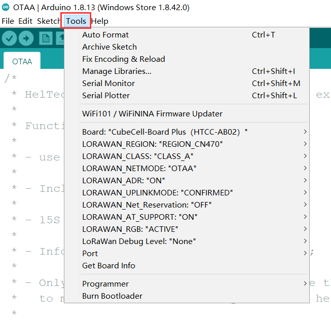
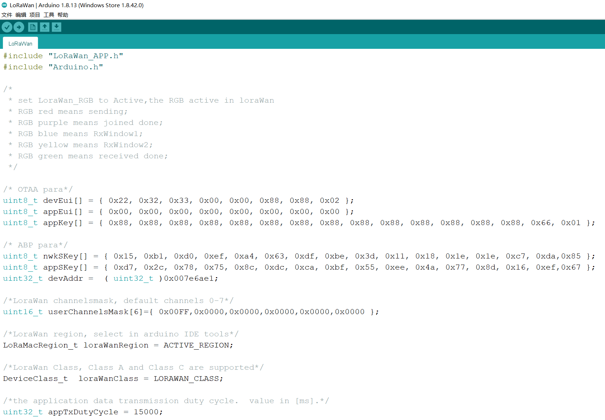

# Config LoRaWAN Networking Parameters for CubeCell (Dev EUI, App Key, etc.)
{ht_translation}`[简体中文]:[English]`
## Summary

No matter what LoRa management platform is used, DevEui, AppKey, etc. parameters are must needed. And ensure that it is consistent with the relevant settings on the server.

- **The following parameters are essential for OTAA mode:**
  - [DevEui](deveui) -- Mote device IEEE EUI (big endian), 8 bytes;
  - [AppEui](appeui) -- Application IEEE EUI (big endian), 8 bytes;
  - [AppKey](appkey) -- AES encryption/decryption cipher application key, 16 bytes;
- **The following parameters are essential for ABP mode:**
  - [NwkSKey](nwkskey) -- AES encryption/decryption cipher network session key, 16 bytes;
  - [AppSKey](appskey) -- AES encryption/decryption cipher application session key, 16 bytes;
  - [DevAddr](devaddr) -- Device address on the network (big endian), uint32_t;

``` {Tip} There are three methods to configuration LoRaWAN networking parameters, choose one of them.

```

- [Via Modify Code](via-modify-code)
- [Via AT Command](via-at-command)
- [Via CubeCell Configurator](via-cubecell-configurator)

```{Tip} Parameters such as frequency band need to be modified in "Tools".

```



&nbsp;

(via-modify-code)=
## Via Modify Code

The relevant parameters of the LoRaWAN network are in the corresponding `.ino` file:



Change the code and Compile/Upload again.

&nbsp;

``` {Note} The follows two methods need AT-Command enable.

```

(via-at-command)=
## Via AT Command

In order to use AT command, need enable AT command in the "Tools" menu before upload.


### Serial Port Settings

- Baud rate: 115200
- Stop bit: 1
- Data bits: 8
- DTR, RTS requirement: **None**
- Ending characters: **None**

``` {Note} Make sure there is NO ending characters or new line in you serial monitor config!

```

With AT command support, the CubeCell is sleeping by default. Any content through the serial port will wake it up. It means the First command via serial port only wake up system.

For example, if send any contents such as `hello`, you will get this reply:

`ASR is Waked,LowPower Mode Stopped`

(deveui)=
### DevEui

``` {Tip} We take all zero just for example

```

Config DevEui to "0000000000000000", send following command via serial port:

`AT+DevEui=0000000000000000`

Command running success will print feedback: 

```
+OK
+DevEui=0000000000000000(For OTAA Mode)
```

(appeui)=
### AppEui

Config AppEui to "0000000000000000", send following command via serial port:

`AT+AppEui=0000000000000000`

Command running success will print feedback: 

```
+OK
+AppEui=0000000000000000(For OTAA Mode)
```

(appkey)=
### AppKey

Config AppKey to "00000000000000000000000000000000", send following command via serial port:

`AT+AppEui=00000000000000000000000000000000`

Command running success will print feedback: 

```
+OK
+AppEui=00000000000000000000000000000000(For OTAA Mode)
```

(nwkskey)=
### NwkSKey

Config NwkSKey to "00000000000000000000000000000000", send following command via serial port:

`AT+NwkSKey=00000000000000000000000000000000`

Command running success will print feedback: 

```
+OK
+NwkSKey=00000000000000000000000000000000(For ABP Mode)
```

(appskey)=
### AppSKey

Config AppSKey to "00000000000000000000000000000000", send following command via serial port:

`AT+AppSKey=00000000000000000000000000000000`

Command running success will print feedback: 

```
+OK
+AppSKey=00000000000000000000000000000000(For ABP Mode)
```

(devaddr)=
### DevAddr

Config DevAddr to "00000000", send following command via serial port:

`AT+DevAddr=00000000`

Command running success will print feedback: 

```
+OK
+DevAddr=00000000(For ABP Mode)
```

### Duty Cycle

LoRa Node's default sending data period is 15 seconds, change this period to 60 seconds:

`AT+DutyCycle=60000`

### Reset CubeCell

LoRaWAN parameters need reset to active, CubeCell can reset via three methods:

- Push the RST key;
- Use AT command: `AT+RESET=1`
- Provide a ≥10ms LOW signal to RST pin.

Looking for more AT commands? Please refer to **[CubeCell AT Command list](https://resource.heltec.cn/download/CubeCell/AT_Command_list/CubeCell_Series_AT_Command_User_Manual_V0.4.pdf)**.


(via-cubecell-configurator)=
## Via CubeCell Configurator

Special thanks [WASN](https://github.com/wasn-eu) made a configurator for CubeCell, now it's only have Windows<sup>®</sup> support.

[https://github.com/wasn-eu/CubeCell_Getting_Started](https://github.com/wasn-eu/CubeCell_Getting_Started)


